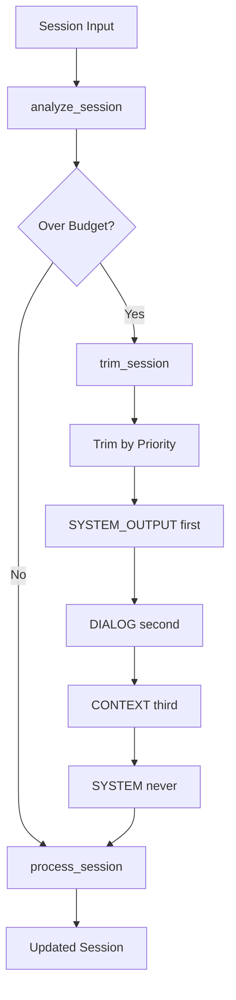
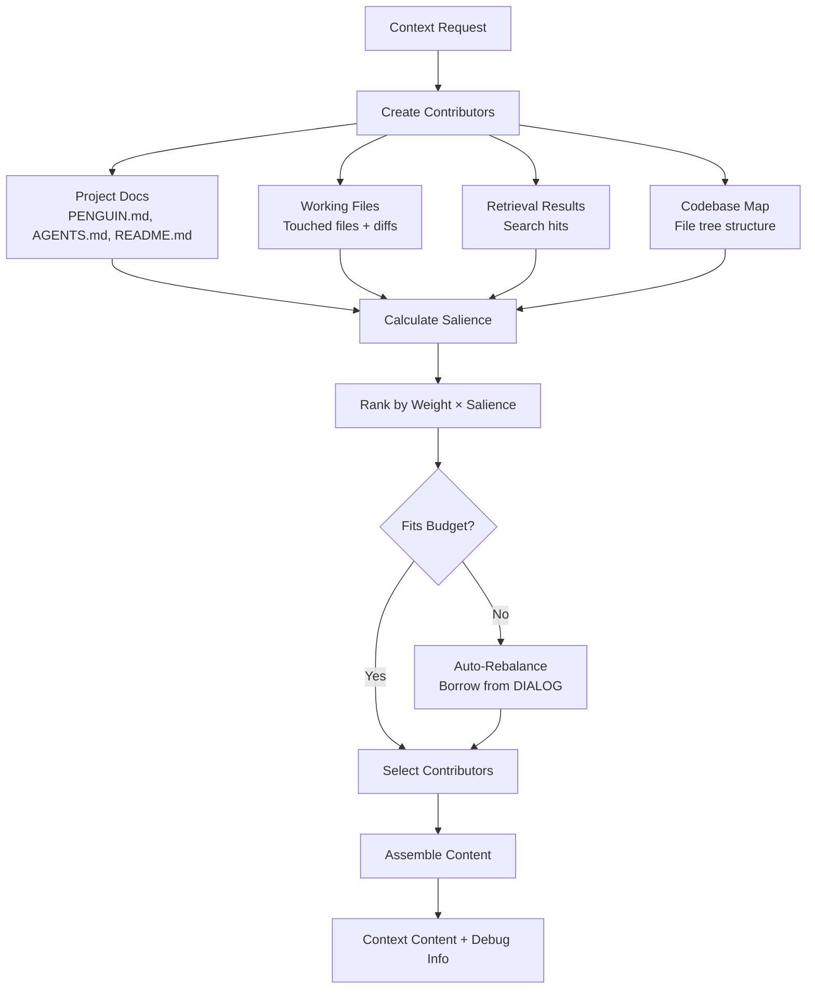
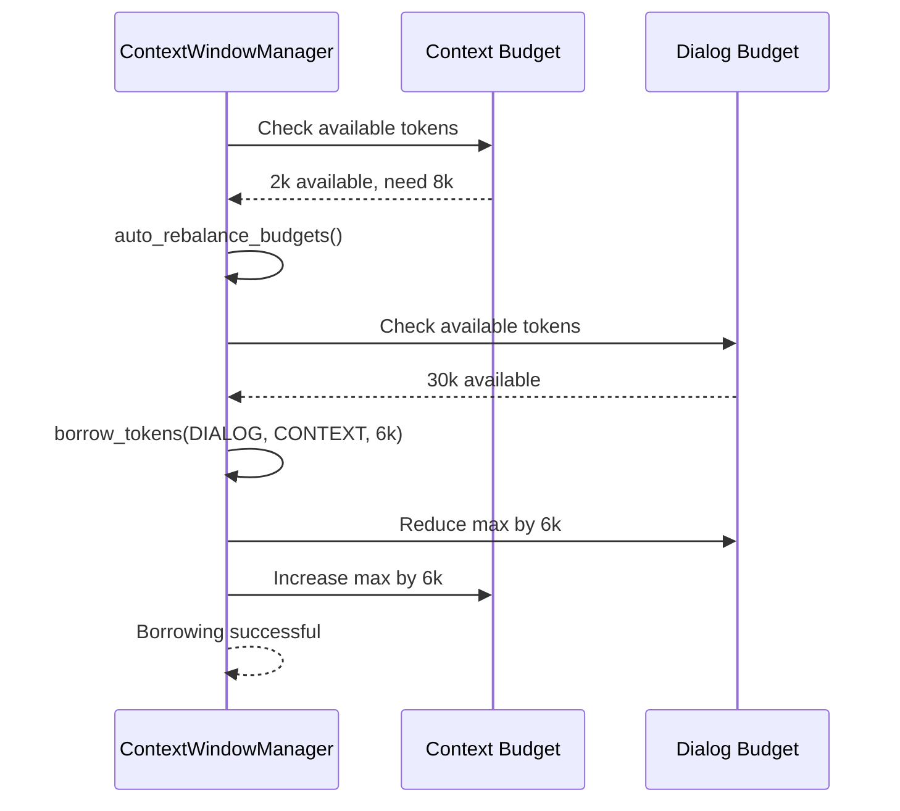
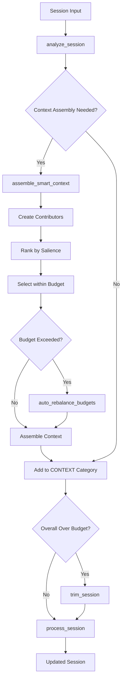

# Context Window Manager (CWM) Architecture

This document explains the Context Window Manager's architecture before and after Phase 2 enhancements, including the new smart context assembly system.

## Overview

The Context Window Manager (CWM) is responsible for:
1. **Token Budgeting**: Allocating available tokens across message categories
2. **Content Trimming**: Removing old content when budgets are exceeded
3. **Context Assembly**: Intelligently selecting and ranking context content (Phase 2)
4. **Dynamic Reallocation**: Borrowing tokens between categories as needed (Phase 2)

---

## Pre-Phase 2 Architecture (Original CWM)

### Core Components

```
┌─────────────────────────────────────────────────────────┐
│                ContextWindowManager                     │
├─────────────────────────────────────────────────────────┤
│ • max_tokens: int (150k default)                       │
│ • token_counter: Callable                              │
│ • _budgets: Dict[MessageCategory, TokenBudget]         │
├─────────────────────────────────────────────────────────┤
│ Methods:                                                │
│ • _initialize_token_budgets()                          │
│ • analyze_session(session) -> stats                    │
│ • trim_session(session) -> trimmed_session             │
│ • process_session(session) -> processed_session        │
└─────────────────────────────────────────────────────────┘
```

### Message Categories & Budget Allocation

```
Total Budget (150k tokens)
├── SYSTEM (10% = 15k)          [Never trimmed]
├── CONTEXT (35% = 52.5k)       [High priority]
├── DIALOG (50% = 75k)          [Medium priority] 
└── SYSTEM_OUTPUT (5% = 7.5k)   [Lowest priority]
```

### TokenBudget Structure

```
┌─────────────────────────┐
│      TokenBudget        │
├─────────────────────────┤
│ • min_tokens: int       │
│ • max_tokens: int       │
│ • current_tokens: int   │
└─────────────────────────┘
```

### Original Workflow



### Limitations of Original System

1. **Static Allocation**: Fixed percentages couldn't adapt to workload
2. **Coarse Trimming**: Removed entire messages, losing important context
3. **No Content Intelligence**: Didn't prioritize relevant vs irrelevant content
4. **Category Isolation**: No borrowing between categories when needed
5. **Manual Context Loading**: Required explicit context file management

---

## Post-Phase 2 Architecture (Enhanced CWM)

### New Components Added

```
┌─────────────────────────────────────────────────────────┐
│                ContextWindowManager                     │
├─────────────────────────────────────────────────────────┤
│ ORIGINAL FUNCTIONALITY (unchanged)                      │
├─────────────────────────────────────────────────────────┤
│ NEW PHASE 2 EXTENSIONS:                                 │
│ • get_available_tokens(category)                        │
│ • borrow_tokens(from, to, amount)                      │
│ • auto_rebalance_budgets()                             │
│ • assemble_smart_context(**params)                     │
│ • get_allocation_report()                              │
└─────────────────────────────────────────────────────────┘

┌─────────────────────────────────────────────────────────┐
│           ContextContributorManager                     │
├─────────────────────────────────────────────────────────┤
│ • workspace_root: Path                                  │
│ • type_weights: Dict[ContributorType, float]           │
├─────────────────────────────────────────────────────────┤
│ Methods:                                                │
│ • create_project_docs_contributor()                     │
│ • create_working_files_contributor()                    │
│ • create_retrieval_contributor()                        │
│ • create_codebase_map_contributor()                     │
│ • calculate_salience()                                  │
│ • select_contributors()                                 │
│ • assemble_context_content()                           │
└─────────────────────────────────────────────────────────┘
```

### Enhanced Budget System with Borrowing

```
Total Budget (150k tokens)
├── SYSTEM (10% = 15k)          [Fixed, never borrowed]
├── CONTEXT (35% = 52.5k)       [Can borrow from DIALOG]
│   └── Dynamic Contributors:
│       ├── Working Files (40% weight)
│       ├── Project Docs (15% weight)  
│       ├── Retrieval (25% weight)
│       └── Codebase Map (20% weight)
├── DIALOG (50% = 75k)          [Can lend to CONTEXT]
└── SYSTEM_OUTPUT (5% = 7.5k)   [Lowest priority]
```

### Contributor Architecture

```
┌─────────────────┐    ┌──────────────────┐
│  ContributorType │    │   Contributor    │
├─────────────────┤    ├──────────────────┤
│ WORKING_FILES   │    │ • type           │
│ PROJECT_DOCS    │    │ • content        │
│ RETRIEVAL       │    │ • weight         │
│ CODEBASE_MAP    │    │ • salience_score │
└─────────────────┘    │ • token_count    │
                       │ • source_path    │
                       └──────────────────┘
```

### Context Assembly Workflow (New)



### Token Borrowing Mechanism



### Project Documentation Auto-loading

```
Workspace Root
├── PENGUIN.md         (Priority 1 - 600 tokens)
├── AGENTS.md          (Priority 2 - 500 tokens)  
├── README.md          (Priority 3 - 300 tokens)
└── src/
    ├── main.py        (Working files)
    └── utils.py

Loading Logic:
1. Check for PENGUIN.md → Load & stop
2. If not found, check AGENTS.md → Load & stop  
3. If not found, check README.md → Load
4. Create PROJECT_DOCS contributor with truncated content
```

### Enhanced Session Processing Workflow



---

## Key Improvements in Phase 2

### 1. Intelligent Content Selection

**Before**: Load all context files uniformly
```python
# Old way - all or nothing
context_files = load_all_context_files()
```

**After**: Rank and select by relevance
```python
# New way - smart selection
contributors = create_all_contributors()
ranked = rank_by_salience(contributors, current_task)
selected = select_within_budget(ranked, available_tokens)
```

### 2. Dynamic Token Allocation

**Before**: Fixed 35% allocation to CONTEXT regardless of need
```
CONTEXT: 52,500 tokens (fixed)
DIALOG:  75,000 tokens (fixed)
```

**After**: Adaptive allocation based on workload
```
CONTEXT: 52,500 + borrowed tokens (dynamic)
DIALOG:  75,000 - lent tokens (dynamic)
```

### 3. Automatic Project Context

**Before**: Manual context file management
```python
# User had to manually load project context
context_loader.load_file("PENGUIN.md") 
```

**After**: Automatic discovery and loading
```python
# Automatic discovery in priority order
project_docs = auto_load_project_docs()  # PENGUIN.md > AGENTS.md > CLAUDE.md > README.md
```

### 4. Content Prioritization

**Before**: Simple recency-based trimming
```
Keep recent messages, discard old messages
```

**After**: Salience-based selection
```
Keep high-salience content regardless of age:
- Working files (weight: 0.4)
- Search results matching current task (weight: 0.25) 
- Project instructions (weight: 0.15)
- Codebase structure (weight: 0.2)
```

---

## Configuration & Extensibility

### Contributor Type Weights
```python
type_weights = {
    ContributorType.WORKING_FILES: 0.4,   # Highest priority
    ContributorType.RETRIEVAL: 0.25,      # High relevance  
    ContributorType.CODEBASE_MAP: 0.2,    # Structural context
    ContributorType.PROJECT_DOCS: 0.15    # Background info
}
```

### Future Extension Points

1. **Custom Contributors**: Plugin architecture for domain-specific contributors
2. **Machine Learning Salience**: Train models to predict content relevance
3. **Multi-Agent Context Sharing**: Shared context pools between sub-agents
4. **Context Caching**: Cache and reuse stable context between sessions

---

## Performance Characteristics

### Token Efficiency
- **Before**: ~20-30% of context tokens wasted on irrelevant content
- **After**: ~5-10% waste through intelligent selection and ranking

### Context Quality  
- **Before**: Important project context often trimmed due to recency bias
- **After**: Critical project docs and working files preserved via salience scoring

### Adaptation Speed
- **Before**: Static allocation caused frequent over/under utilization  
- **After**: Dynamic borrowing adapts to workload patterns in real-time

### Memory Overhead
- **Before**: Minimal overhead for simple budget tracking
- **After**: ~10-15% overhead for contributor creation and ranking (acceptable trade-off)

---

## Integration Points

### Current Penguin Components
- **Core**: Session processing pipeline
- **ConversationManager**: Message categorization  
- **Memory System**: Retrieval results as contributors
- **File System**: Automatic project doc discovery

### Future Integrations
- **IDE Extensions**: Active file context from editors
- **Git Integration**: Recent commits and blame information
- **Test Runners**: Test results and coverage as contributors
- **Code Analysis**: Static analysis results and metrics

This architecture provides a solid foundation for intelligent context management while maintaining backward compatibility and extensibility for future enhancements.