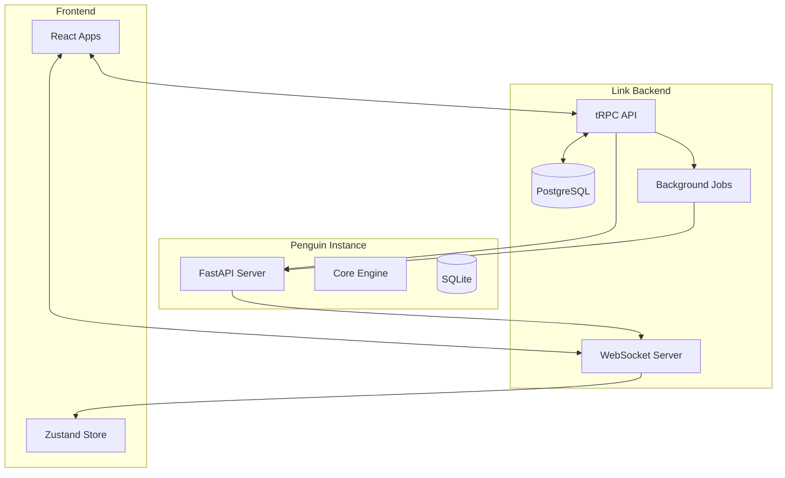

# Link Backend Development Roadmap

> **Mission:** Build the collaborative orchestration layer that enables seamless human-AI teamwork through shared project management, real-time communication, and intelligent error recovery.

---

## 🎯 **Core Architecture Principles**

### **Link as the Source of Truth**
- **Shared Project Management:** Link owns the canonical project/task state that both humans and Penguin agents collaborate on
- **Multi-Actor Coordination:** Handle conversations and workflows involving multiple humans and AI agents simultaneously
- **Real-Time Collaboration:** Discord/Slack-like experience with AI agents as first-class participants

### **Separation of Concerns**
- **Link:** Project orchestration, user management, multi-actor coordination, real-time communication
- **Penguin:** Task execution, code generation, autonomous work within assigned boundaries
- **Clean Integration:** Well-defined APIs between Link and Penguin instances

---

## 📍 **Current Status: Phase 3.5 Planning**

**✅ Frontend Complete:**
- Timeline interface with real-time updates
- Agent dashboard with comprehensive management
- Project board with Kanban workflow
- Cross-platform support (web/desktop)

**🎯 Next: Backend Foundation**
- Shared project management system
- Multi-actor communication infrastructure
- Penguin integration layer
- Real-time collaboration features

---

## 🗺️ **Phased Development Plan**

### **Phase 3.5: Foundation & Integration (4-6 weeks)**

**Objective:** Establish Link as the collaborative hub with core project management and Penguin integration.

#### **Week 1-2: Core Backend Infrastructure**
- **Database Schema Design**
  - Multi-tenant project/task management
  - User and agent identity systems
  - Conversation threading with multi-actor support
  - Permission and access control models

- **API Foundation**
  - tRPC server with TypeScript end-to-end safety
  - WebSocket infrastructure for real-time updates
  - Authentication/authorization framework
  - Rate limiting and request validation

- **Project Management System**
  - Hierarchical project structure (Workspaces → Projects → Tasks)
  - Task assignment to humans, agents, or teams
  - Dependency tracking and workflow management
  - Progress tracking with real-time updates

#### **Week 3-4: Penguin Integration Layer**
- **Communication Protocol**
  - HTTP API for CRUD operations with Penguin instances
  - WebSocket streaming for real-time task progress
  - Error handling and retry logic
  - Agent lifecycle management (spawn, monitor, terminate)

- **Task Delegation System**
  - Task routing to appropriate Penguin instances
  - Context passing and project state synchronization
  - Result aggregation and status reporting
  - Conflict resolution for concurrent modifications

- **Shared Data Models**
  - Unified project/task schemas between Link and Penguin
  - Event-driven synchronization patterns
  - State reconciliation mechanisms

#### **Week 5-6: Multi-Actor Collaboration**
- **Conversation Management**
  - Multi-turn conversations with humans and AI agents
  - Context preservation across actor switches
  - Thread branching and merging capabilities
  - Message attribution and audit trails

- **Real-Time Communication**
  - WebSocket broadcasting to all relevant participants
  - Typing indicators for both humans and agents
  - Presence management (online/offline/working status)
  - Live collaboration on shared documents/tasks

**Acceptance Criteria:**
- Users can create projects and assign tasks to Penguin agents
- Real-time progress updates stream from Penguin to Link frontend
- Multiple users can collaborate on the same project simultaneously
- Basic error recovery when Penguin instances become unavailable

---

### **Phase 4: Advanced Collaboration & Observability (4-6 weeks)**

**Objective:** Enhance multi-actor workflows and implement comprehensive observability with error recovery.

#### **Advanced Multi-Actor Features**
- **Agent Orchestration**
  - Multiple Penguin agents working on the same project
  - Task handoffs between agents
  - Supervisor-worker hierarchies
  - Agent specialization and routing

- **Human-AI Workflow Integration**
  - Review/approval workflows for agent outputs
  - Human intervention points in automated processes
  - Collaborative editing with conflict resolution
  - Decision delegation patterns

#### **Observability & Error Recovery**
- **Intelligent Monitoring**
  - Task success/failure pattern analysis
  - Performance degradation detection
  - Resource utilization tracking
  - User satisfaction metrics

- **Course Correction Systems**
  - Automatic retry with different strategies
  - Escalation to human oversight
  - Learning from failure patterns
  - Rollback and checkpoint mechanisms

- **Error Recovery Workflows**
  - Graceful degradation when agents fail
  - Alternative agent assignment
  - Partial result preservation
  - Context reconstruction after failures

**Acceptance Criteria:**
- System automatically recovers from common failure modes
- Performance issues are detected and mitigated proactively
- Failed tasks can be reassigned or retried intelligently
- Clear audit trail of all human and agent actions

---

### **Phase 5: Scale & Enterprise Features (6-8 weeks)**

**Objective:** Production-ready deployment with enterprise-grade features and multi-tenancy.

#### **Multi-Tenancy & Organizations**
- **Organization Management**
  - Workspace isolation and resource quotas
  - Team management and role-based access control
  - Cross-organization collaboration capabilities
  - Billing and usage tracking per organization

- **Advanced Permissions**
  - Fine-grained access control for projects/tasks
  - Agent permission boundaries and sandboxing
  - Data privacy and compliance features
  - Audit logging and compliance reporting

#### **Performance & Scalability**
- **Horizontal Scaling**
  - Load balancing across multiple Link instances
  - Database sharding and read replicas
  - Caching strategies for frequently accessed data
  - Background job processing with queues

- **Integration Ecosystem**
  - GitHub/GitLab integration for code projects
  - Slack/Discord notifications and commands
  - Third-party tool connectors (Jira, Notion, etc.)
  - Webhook system for external integrations

**Acceptance Criteria:**
- Support for 1000+ concurrent users per instance
- Sub-200ms API response times at scale
- 99.9% uptime with graceful degradation
- Complete audit trail and compliance features

---

## 🛠️ **Technical Architecture**

### **Core Technology Stack**
```yaml
Backend Framework: Node.js + tRPC + Fastify
Database: PostgreSQL with Redis for caching
Real-time Protocol: A2A (Agent-to-Agent) with Server-Sent Events (SSE)
Authentication: JWT with refresh tokens
Deployment: Docker + Kubernetes
Monitoring: Prometheus + Grafana + OpenTelemetry
```

### **Database Schema (Core Entities)**
```sql
-- Multi-tenant workspace structure
Workspaces (id, name, owner_id, settings, created_at)
Users (id, email, name, avatar_url, created_at)
WorkspaceMembers (workspace_id, user_id, role, permissions)

-- Project management
Projects (id, workspace_id, name, description, status, created_by)
Tasks (id, project_id, title, description, status, assigned_to, assigned_type)
TaskDependencies (task_id, depends_on_task_id, dependency_type)

-- Multi-actor conversations
Conversations (id, project_id, task_id, type, participants)
Messages (id, conversation_id, author_id, author_type, content, timestamp)
ConversationParticipants (conversation_id, participant_id, participant_type)

-- Agent management
Agents (id, workspace_id, name, type, status, penguin_instance_url)
AgentAssignments (agent_id, task_id, assigned_at, status)
AgentSessions (id, agent_id, task_id, started_at, ended_at, outcome)
```

### **API Design Patterns**
```typescript
// tRPC router for client-server communication
const appRouter = router({
  // Project management
  projects: projectRouter,
  tasks: taskRouter,
  
  // Agent orchestration  
  agents: agentRouter,
  delegation: delegationRouter,
  
  // Real-time collaboration
  conversations: conversationRouter,
  presence: presenceRouter,
  
  // Integration
  penguin: penguinIntegrationRouter,
  webhooks: webhookRouter,
});

// A2A Protocol for agent communication
interface A2A_API {
  'message/stream': (params: StreamMessageParams) => SSEStream;
  'tasks/create': (params: CreateTaskParams) => Promise<Task>;
  'tasks/status': (params: TaskStatusParams) => Promise<TaskStatus>;
  // ... other A2A methods
}

// WebSocket for client-side real-time updates (bridged from A2A)
type WebSocketEvents = {
  'task:progress': TaskProgressUpdate;
  'conversation:message': NewMessage;
  'agent:status': AgentStatusChange;
  'user:presence': PresenceUpdate;
  'project:update': ProjectStateChange;
};
```

---

## 🔄 **Integration with Penguin**

### **Communication Patterns**
1. **Agent Orchestration:** Link ↔ Penguin via A2A Protocol
2. **Real-time Streaming:** A2A Server-Sent Events (SSE) for task updates
3. **Client Updates:** WebSocket bridge for frontend notifications
4. **Error Reporting:** A2A-compliant error responses with recovery info

### **Data Flow Architecture**


### **Shared State Management**
- **Link as Authority:** Project structure, user assignments, permissions
- **Penguin as Executor:** Task progress, code changes, execution results  
- **Event Synchronization:** Real-time updates flow both directions
- **Conflict Resolution:** Link has final authority on project state

---

## 📊 **Observability & Error Recovery**

### **Key Metrics & Monitoring**
```typescript
interface ObservabilityMetrics {
  // Task execution patterns
  taskSuccessRate: number;
  averageTaskDuration: Duration;
  errorRecoveryTime: Duration;
  
  // Agent performance
  agentUtilization: Record<AgentId, number>;
  agentErrorRates: Record<AgentId, number>;
  taskReassignmentFrequency: number;
  
  // User experience
  responseLatency: LatencyMetrics;
  collaborationEfficiency: number;
  userSatisfactionScore: number;
  
  // System health
  penguinInstanceHealth: Record<InstanceId, HealthStatus>;
  databasePerformance: DatabaseMetrics;
  websocketConnectionQuality: ConnectionMetrics;
}
```

### **Error Recovery Strategies**
1. **Automatic Retry:** Failed tasks retry with exponential backoff
2. **Agent Failover:** Reassign tasks to healthy Penguin instances
3. **Graceful Degradation:** Core features remain available during outages
4. **Human Escalation:** Complex failures escalate to human oversight
5. **Learning Loop:** Failed patterns inform future task routing

### **Course Correction Mechanisms**
- **Performance Monitoring:** Detect degrading task success rates
- **Context Recovery:** Reconstruct lost context from conversation history
- **Alternative Strategies:** Try different approaches for failed tasks
- **Resource Reallocation:** Shift workload to performing agents
- **Proactive Intervention:** Prevent failures before they occur

---

## 🚀 **Deployment & Operations**

### **Development Environment**
```yaml
# docker-compose.dev.yml
services:
  link-backend:
    build: ./apps/backend
    environment:
      - DATABASE_URL=postgresql://postgres:password@db:5432/link_dev
      - REDIS_URL=redis://redis:6379
    depends_on: [db, redis]
  
  db:
    image: postgres:15
    environment:
      POSTGRES_DB: link_dev
      POSTGRES_USER: postgres
      POSTGRES_PASSWORD: password
  
  redis:
    image: redis:7-alpine
  
  penguin:
    image: penguin-ai:latest
    environment:
      - OPENROUTER_API_KEY=${OPENROUTER_API_KEY}
```

### **Production Deployment**
- **Kubernetes:** Multi-pod deployment with auto-scaling
- **Database:** Managed PostgreSQL with read replicas
- **Caching:** Redis cluster for session and real-time data
- **Load Balancing:** Application-level load balancing for WebSockets
- **Monitoring:** Full observability stack with alerting

### **Security Considerations**
- **Authentication:** JWT tokens with short expiration and refresh
- **Authorization:** Role-based access control with fine-grained permissions
- **API Security:** Rate limiting, input validation, CORS configuration
- **Agent Sandboxing:** Isolated Penguin instances with resource limits
- **Data Privacy:** Encryption at rest and in transit, audit logging

---

## 🎯 **Success Metrics**

### **Technical Performance**
- **API Latency:** P95 < 200ms for all endpoints
- **WebSocket Latency:** < 50ms for real-time updates
- **Task Success Rate:** > 95% successful task completion
- **Error Recovery Time:** < 30 seconds average recovery
- **System Uptime:** 99.9% availability

### **User Experience**
- **Onboarding Time:** < 5 minutes to first successful task delegation
- **Collaboration Efficiency:** 50% reduction in project coordination overhead
- **Error Transparency:** Clear, actionable error messages for all failures
- **Agent Trust:** Users confident in delegating complex tasks to agents

### **Business Metrics**
- **User Engagement:** Daily active users and session duration
- **Task Throughput:** Tasks completed per user per day
- **Error Reduction:** Month-over-month reduction in manual interventions
- **Scalability:** Linear cost scaling with user growth

---

## ⚠️ **Key Risks & Mitigations**

### **Technical Risks**
- **State Synchronization Complexity:** Mitigate with event sourcing and CQRS patterns
- **WebSocket Connection Management:** Use connection pooling and automatic reconnection
- **Database Performance:** Implement proper indexing and query optimization
- **Penguin Integration Reliability:** Circuit breaker patterns and health checks

### **Product Risks**
- **Multi-Actor UX Complexity:** Extensive user testing and iterative design
- **Agent Reliability Perception:** Transparent error reporting and quick recovery
- **Performance at Scale:** Load testing and gradual rollout strategy
- **Data Consistency:** Strong consistency guarantees for critical operations

### **Operational Risks**
- **Deployment Complexity:** Infrastructure as code and automated deployments
- **Monitoring Blind Spots:** Comprehensive observability from day one
- **Security Vulnerabilities:** Regular security audits and penetration testing
- **Vendor Dependencies:** Minimize lock-in and maintain escape hatches

---

## 🔮 **Future Considerations**

### **Advanced Features (Post-MVP)**
- **AI-Powered Project Planning:** Automatic project breakdown and estimation
- **Predictive Error Prevention:** ML-based failure prediction and prevention
- **Advanced Agent Orchestration:** Dynamic agent teams and specialization
- **Cross-Workspace Collaboration:** Enterprise-grade multi-organization features

### **Integration Ecosystem**
- **IDE Plugins:** Deep integration with VS Code, JetBrains, etc.
- **CI/CD Integration:** Automated agent tasks in development pipelines
- **Third-Party Connectors:** Extensive marketplace of integrations
- **API Marketplace:** Community-driven extensions and customizations

---

## 🔗 **Penguin Integration Deep Dive**

### **Leveraging Penguin's Existing Architecture**

Based on Penguin's current v0.2.x capabilities and sophisticated context management, Link should integrate with rather than replace:

#### **Penguin's Advanced Context Management**
- **Context Window Manager:** Leverage Penguin's existing token budgeting with 4-tier priority system (SYSTEM, CONTEXT, DIALOG, SYSTEM_OUTPUT) as documented at [Penguin's Context Window Manager](https://penguin-rho.vercel.app/docs/system/context-window)
- **Conversation Manager:** Utilize Penguin's high-level coordinator for message exchanges and session management as shown in [Penguin's Conversation Manager](https://penguin-rho.vercel.app/docs/system/conversation-manager)
- **Memory System:** Integrate with Penguin's pluggable memory providers (SQLite, FAISS, LanceDB, ChromaDB) detailed in [Penguin's Memory System](https://penguin-rho.vercel.app/docs/system/memory-system)
- **Established API Surface:** Build on Penguin's comprehensive REST API and WebSocket interface documented in [Penguin's API Usage](https://penguin-rho.vercel.app/docs/usage/api_usage)

#### **General Streams Architecture for Long-Running Agents**
```typescript
interface GeneralStream {
  // Main journal for 24/7 running agents
  journalPath: string; // e.g., "journal.md"
  
  // Agentic RAG for information compression/decompression
  compressionAgent: {
    compress: (events: AgentEvent[]) => CompressedEntry;
    decompress: (query: string) => RelevantContext[];
    updateJournal: (entry: CompressedEntry) => void;
  };
  
  // Task branching system
  taskBranches: {
    createBranch: (taskId: string, parentStream: string) => TaskBranch;
    mergeBranch: (branch: TaskBranch, summary: TaskSummary) => void;
    getActiveBranches: () => TaskBranch[];
  };
  
  // Stream management
  streamManager: {
    getCurrentContext: () => StreamContext;
    searchHistory: (query: string, timeRange?: TimeRange) => HistoryEntry[];
    maintainContinuity: () => void;
  };
}
```

#### **Text Channels & Stream Integration (Future)**
- **Channel-Specific Streams:** Each text channel maintains its own general stream
- **Cross-Channel Context:** Ability to reference and pull context across channels
- **Stream Synchronization:** Coordinate multiple agent streams in collaborative scenarios
- **Context Inheritance:** Task branches inherit relevant context from parent streams

#### **Penguin's Core Engine Integration**
- **Unified Engine Loop:** Leverage Penguin's deterministic async loop for all agent actions
- **Tool Orchestration:** Use Penguin's existing tool management and action processing
- **Model Management:** Utilize Penguin's LiteLLM integration for multi-model support
- **Session Boundaries:** Respect Penguin's automatic session management and transitions

#### **Project Management Synchronization Strategy**
```typescript
// Unified approach given single creator control
interface UnifiedProjectManagement {
  // Shared schema between Link and Penguin
  sharedSchema: {
    projects: ProjectSchema;
    tasks: TaskSchema;
    dependencies: DependencySchema;
    streams: StreamSchema; // New for general streams
  };
  
  // Middleware for both systems
  middleware: {
    syncEngine: ProjectSyncEngine;
    eventBus: SharedEventBus;
    stateReconciler: StateReconciler;
  };
  
  // Link as orchestrator, Penguin as executor
  orchestration: {
    createProject: (spec: ProjectSpec) => Promise<UnifiedProject>;
    delegateTask: (task: Task, agentId: string) => Promise<TaskExecution>;
    monitorProgress: (taskId: string) => Observable<TaskProgress>;
  };
}
```

#### **Performance Alignment**
- **Startup Time:** Work within Penguin's <250ms P95 initialization target
- **Memory Usage:** Account for Penguin's <200MB baseline footprint plus journal storage
- **API Latency:** Align with Penguin's sub-250ms P95 endpoint targets
- **Stream Processing:** Efficient compression/decompression for continuous operation

---

## 🤖 **AI-Human Collaboration Patterns**

### **Enhanced Multi-Actor Conversation Management**

Building on Penguin's sophisticated conversation and context systems:

#### **Session Analysis & Context Management**
```typescript
interface EnhancedSessionAnalytics {
  // Leverage Penguin's existing conversation manager
  penguinConversationManager: ConversationManager;
  
  // Enhanced with general streams
  streamAnalytics: {
    journalSummarizer: SmallLanguageModel;
    contextRetriever: AgenticRAG;
    streamBrancher: TaskBranchManager;
  };
  
  // Knowledge graph of sessions and streams
  knowledgeGraph: {
    sessionNodes: SessionNode[];
    streamNodes: StreamNode[];
    crossReferences: CrossReference[];
    semanticSearch: (query: string) => RelevantNode[];
  };
  
  // Automatic categorization building on Penguin's context categories
  autoTagging: {
    extendPenguinCategories: (session: ConversationSession) => ExtendedCategories;
    generateStreamTags: (stream: GeneralStream) => string[];
    extractStreamInsights: (stream: GeneralStream) => StreamInsight[];
  };
}
```

#### **General Stream Management for 24/7 Operation**
- **Continuous Journaling:** Agents maintain compressed journals of their activities
- **Context Preservation:** Long-term context maintained through agentic RAG
- **Task Branching:** Temporary branches for specific tasks that merge back to main stream
- **Stream Continuity:** Seamless operation across restarts and interruptions

#### **Interactive Task Refinement with Streams**
- **Stream-Aware Human Input:** Human interventions recorded in the general stream
- **Context-Rich Collaboration:** Full stream history available for human decision-making
- **Branch Management:** Humans can create, monitor, and merge task branches
- **Stream Handoffs:** Seamless context transfer between human and AI actors

---

## 🔧 **Advanced Integration Scenarios**

### **Unified CLI/API Integration**
```bash
# Link orchestrates Penguin operations
link agent spawn --project=proj_123 --stream-config=continuous.toml
link agent delegate --task=task_456 --agent=penguin_001 --branch-from=main-stream
link stream query --agent=penguin_001 --query="recent database changes"

# Penguin operations with Link awareness and stream context
penguin task start --link-project=proj_123 --stream-branch=feature-branch
penguin stream compress --journal=journal.md --timeframe=24h
penguin memory search --stream-context --project=proj_123
```

### **Stream-Aware Checkpoint and Session Management**
- **Unified Checkpointing:** Coordinate checkpoints between Link project state, Penguin session state, and general streams
- **Stream Rollback:** Ability to rollback stream state to previous compression points
- **Branch Checkpointing:** Independent checkpoints for task branches
- **Cross-System Recovery:** Consistent recovery across Link, Penguin, and stream data

### **Model Management with Stream Context**
```typescript
interface StreamAwareModelOrchestration {
  // Model selection considering stream context
  selectOptimalModel: (task: Task, streamContext: StreamContext) => ModelConfig;
  
  // Dynamic switching based on stream complexity
  adaptModelToStreamPhase: (streamPhase: StreamPhase) => ModelConfig;
  
  // Resource optimization across continuous operation
  optimizeForContinuousOperation: (streamLoad: StreamLoad) => ResourcePlan;
  
  // Stream-specific model fine-tuning
  adaptToStreamPatterns: (streamHistory: StreamHistory) => ModelAdaptation;
}
```

---

## 📊 **Success Metrics & KPIs**

### **Stream-Enhanced Collaboration Effectiveness**
```typescript
interface StreamCollaborationMetrics {
  // Traditional collaboration metrics
  taskHandoffTime: Duration;
  contextLossRate: number;
  decisionLatency: Duration;
  
  // Stream-specific metrics
  streamContinuityScore: number;
  compressionEfficiency: number;
  decompressionAccuracy: number;
  branchMergeSuccessRate: number;
  
  // Long-running agent performance
  journalGrowthRate: number;
  contextRetrievalLatency: Duration;
  streamMemoryUtilization: number;
  
  // Agent performance in continuous operation
  uptime: Duration;
  streamQuality: QualityScore;
  contextCoherence: CoherenceScore;
}
```

### **General Stream Effectiveness**
- **Context Preservation:** How well context is maintained across long sessions
- **Compression Quality:** Effectiveness of information compression in journals
- **Retrieval Accuracy:** Success rate of agentic RAG in context retrieval
- **Branch Management:** Efficiency of task branching and merging operations

---

## 🚧 **Implementation Considerations**

### **Phase 3.5 Specific Additions**

#### **Week 1-2 Additions:**
- **Penguin Context Integration:** Deep integration with Penguin's existing context window and conversation managers
- **Shared Schema Definition:** Unified project/task/stream schema for both systems
- **Stream Foundation:** Basic general stream architecture and journal management

#### **Week 3-4 Additions:**
- **Stream Compression Engine:** Implement agentic RAG for journal compression/decompression
- **Task Branching System:** Stream branching for task isolation and merging
- **Performance Monitoring Integration:** Connect to Penguin's existing observability systems

#### **Week 5-6 Additions:**
- **Advanced Stream Analytics:** Implement stream-aware session analysis
- **Cross-System Checkpointing:** Unified checkpoint system across Link, Penguin, and streams
- **Stream-Aware Context Management:** Enhanced context passing leveraging stream history

### **Shared Middleware Architecture**
```typescript
// Middleware used by both Link and Penguin
interface SharedMiddleware {
  // Event system for both platforms
  eventBus: {
    publish: (event: SystemEvent) => void;
    subscribe: (eventType: string, handler: EventHandler) => void;
    unsubscribe: (eventType: string, handler: EventHandler) => void;
  };
  
  // Shared state management
  stateManager: {
    syncState: (source: StateSource, target: StateTarget) => void;
    resolveConflicts: (conflicts: StateConflict[]) => Resolution[];
    validateState: (state: SystemState) => ValidationResult;
  };
  
  // Stream management middleware
  streamMiddleware: {
    createStream: (config: StreamConfig) => GeneralStream;
    compressStream: (stream: GeneralStream, timeframe: TimeFrame) => void;
    queryStream: (stream: GeneralStream, query: string) => StreamResult[];
  };
}
```

### **Observability Integration**
- **Grafana Dashboards:** Bootstrap with pre-configured dashboards for Link-Penguin integration
- **Prometheus Metrics:** Extend Penguin's existing metrics with Link-specific measurements
- **Stream Monitoring:** Specialized monitoring for general stream health and performance
- **Cross-System Tracing:** Distributed tracing across Link and Penguin operations

---

## 🔮 **Strategic Questions & Future Considerations**

### **Stream Architecture Evolution**
1. **Stream Scalability:** How do we handle multiple long-running agents with individual streams?
2. **Cross-Stream Intelligence:** How do agents learn from other agents' streams?
3. **Stream Persistence:** What's the long-term storage strategy for compressed journals?

### **Text Channels Integration (Future)**
1. **Channel-Stream Mapping:** How do we map text channels to general streams?
2. **Multi-Agent Channels:** How do multiple agents collaborate in shared text channels?
3. **Stream Synchronization:** How do we coordinate streams across different channels?

### **Performance at Scale**
1. **Stream Compression Efficiency:** How do we maintain performance as journals grow?
2. **Memory Management:** How do we balance stream context with memory constraints?
3. **Real-time Processing:** How do we maintain responsiveness during stream operations?

### **Integration Simplification**
Given single creator control:
- **Unified Development:** How do we optimize the development workflow across both systems?
- **Shared Components:** What additional components can be shared between Link and Penguin?
- **Testing Strategy:** How do we test the integrated system efficiently?

---

*Build for collaboration, optimize for reliability, scale for the future.*