# RunMode / Project Management / ITUV System Map

## Purpose

This document gives a visual and conceptual map of the RunMode + Project Management + ITUV execution system.

It exists to answer:

- what the major components are
- how a Blueprint becomes runnable project work
- how task state, dependency policy, and ITUV phases interact
- where validation, review, and artifact evidence fit
- where enforcement points live

This is a system map, not a full contract. Use it to orient yourself quickly before diving into implementation details.

## Related Documents

- `context/architecture/ituv-task-state-machine-contract.md`
  - lifecycle legality and review/completion semantics
- `context/architecture/artifact-evidence-contract.md`
  - artifact declaration and validation rules for `artifact_ready`
- `context/architecture/blueprint-typed-dependency-syntax-contract.md`
  - authoring and normalization rules for typed dependency syntax
- `context/architecture/clarification-handling-contract.md`
  - contract for waiting, escalation, and resumption when execution needs clarification
- `context/tasks/runmode-project-ituv-gap-matrix.md`
  - phased implementation plan and remaining backlog

---

## 1. High-Level System View

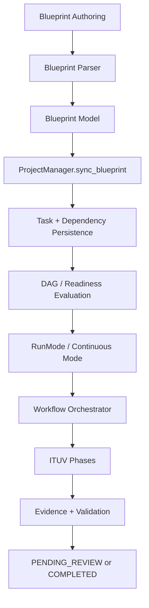

### Summary

- Blueprints define intended work.
- ProjectManager materializes them into tasks.
- Scheduler selects ready tasks using dependency policy semantics.
- RunMode and the orchestrator execute tasks through ITUV.
- Evidence and review determine whether work ends at:
  - `PENDING_REVIEW`
  - or `COMPLETED`

---

## 2. Main Runtime Components

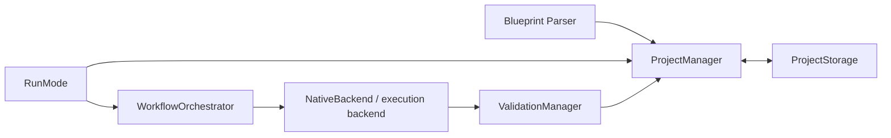

## 3. Blueprint to Task Lifecycle

### Flow

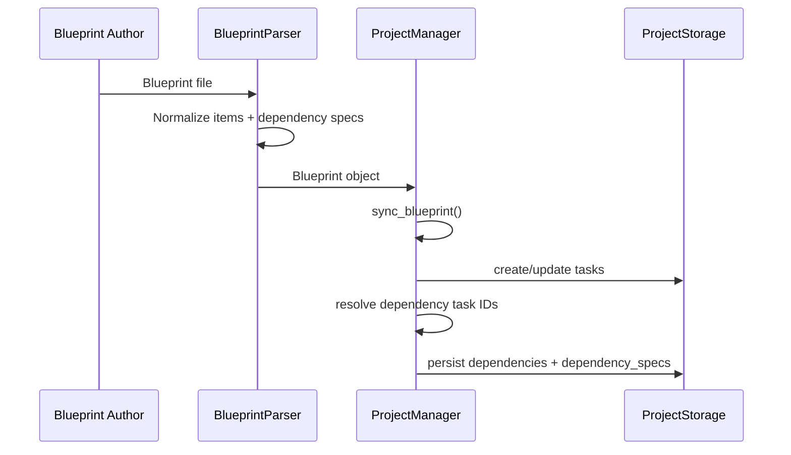

### Key State

At this point the system has:

- task identity
- status/phase defaults
- dependency list
- typed dependency specs
- recipe references
- acceptance criteria
- scheduling metadata

No execution has happened yet.

---

## 4. Task State Model: Two Axes

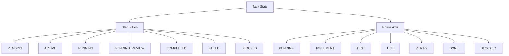

### Important Rule

- `status` and `phase` are related but not interchangeable
- `DONE` is not equal to `COMPLETED`
- successful execution normally ends at:
  - `status=PENDING_REVIEW`
  - `phase=DONE`

---

## 5. Dependency Policy Model

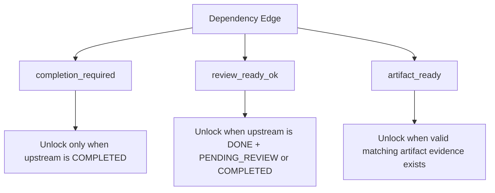

### Current Meaning

| Policy | Unlock Condition |
| --- | --- |
| `completion_required` | upstream `status == COMPLETED` |
| `review_ready_ok` | upstream `phase == DONE` and `status in {PENDING_REVIEW, COMPLETED}` |
| `artifact_ready` | valid artifact evidence with matching `artifact_key` and producer |

---

## 6. Scheduler / Readiness Flow

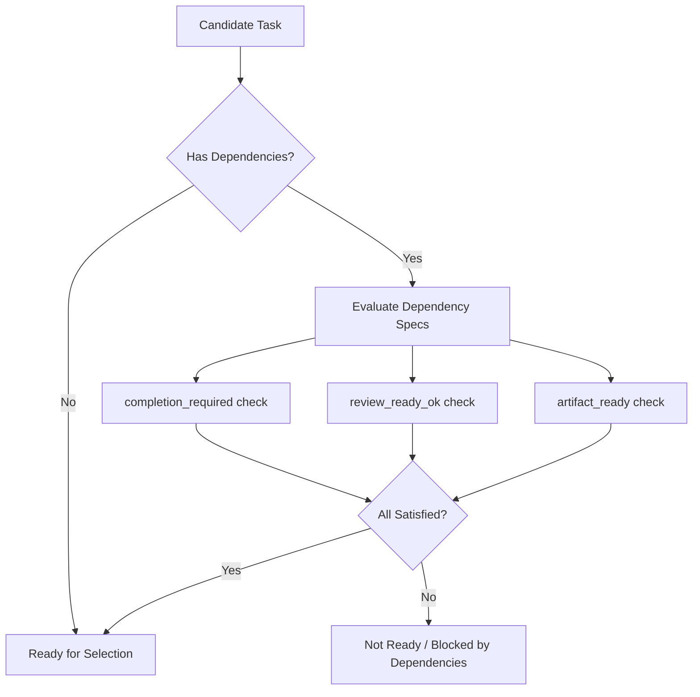

### Enforcement Location

Current central choke point:

- `ProjectManager._is_dependency_satisfied(...)`

That is important because it avoids policy semantics being duplicated across:
- ready-task selection
- blocked checks
- future execution heuristics

---

## 7. RunMode and Orchestrated Execution

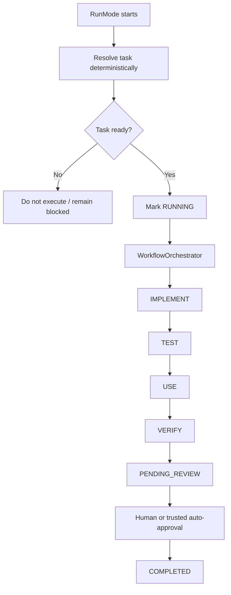

### Important Guardrails

- project-scoped RunMode does not invent synthetic drift work by default
- orchestrator owns ITUV phase progression
- success no longer jumps directly to `COMPLETED`
- side-door CLI/API/native paths were normalized to review semantics

---

## 8. Evidence and Validation

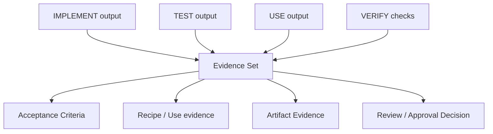

### Evidence Classes

- test evidence
- usage evidence
- acceptance criteria evidence
- artifact evidence
- transition/execution records

### Current Artifact Evidence Rule

Artifact-based unlocking requires:

- matching `artifact_key`
- `valid == true`
- `producer_task_id` matches the dependency source task

That is intentionally minimal but honest.

---

## 9. Persistence Model

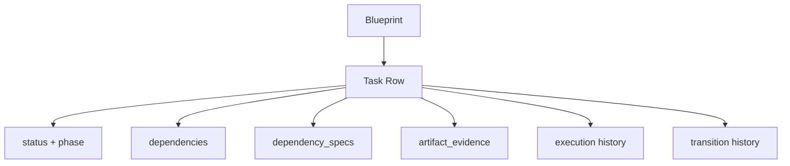

### Stored Task Data Now Includes

- lifecycle state
- ITUV phase state
- typed dependency metadata
- artifact evidence
- execution history
- review metadata
- blueprint traceability

This is why the current system is materially stronger than the earlier gap-matrix state.

---

## 10. System Boundaries and Trust

### Human-Trusted Boundaries

- approval from `PENDING_REVIEW -> COMPLETED`
- choosing when relaxed dependency policy is appropriate
- authoring typed dependency policies responsibly

### Machine-Trusted Boundaries

- state normalization
- dependency policy evaluation
- cycle detection
- artifact evidence matching
- fail-closed behavior for missing evidence

### Dangerous Failure Modes

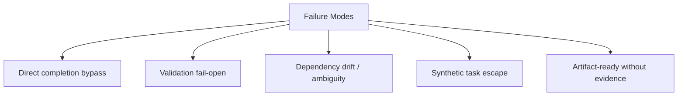

These are exactly the failure classes the recent hardening work was designed to kill.

---

## 11. Current Maturity Map

| Area | Maturity | Notes |
| --- | --- | --- |
| ITUV state semantics | Stronger | Contract + enforcement + tests exist |
| Review semantics | Stronger | `DONE` vs `COMPLETED` distinction is real |
| Dependency typing | Good | Schema + scheduler semantics exist |
| Artifact evidence | Minimal honest implementation | Valid matching artifact unlocks; deeper validators not yet implemented |
| Property testing | Seeded | Hypothesis phase started |
| Blueprint authoring UX | Weak | Typed syntax exists structurally, but human-friendly forms are still limited |

---

## 12. Recommended Next Evolution

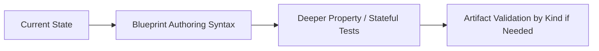

### Why This Order

- syntax next: unlock actual usage
- more property tests after syntax: harden semantics under broader inputs
- deeper artifact validation later: only when real workflows justify the extra complexity

---

## 13. Mental Model Summary

If you need the shortest possible framing, use this:

1. **Blueprints define intended work**
2. **ProjectManager materializes and schedules work**
3. **RunMode selects project-scoped ready work**
4. **WorkflowOrchestrator runs ITUV**
5. **Validation and evidence determine review or completion**
6. **Typed dependency policies decide when downstream work may begin**

That is the system.

Anything that bypasses those boundaries is either:
- a bug
- technical debt
- or a conscious exception that should be documented like a grown-up.
