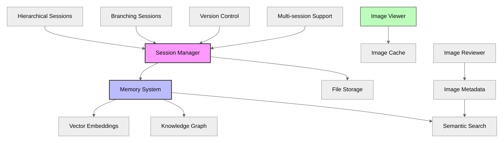
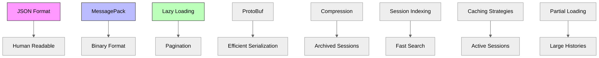
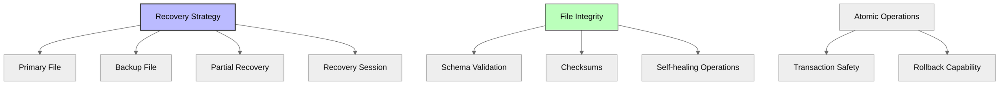

# Future Considerations

This document outlines planned and potential future enhancements for the Penguin AI Assistant platform.

## Conversation and Memory Systems

### Image Re-viewing Capability

- Add mechanism to "re-view" previously trimmed images
- Store image references in a specialized cache
- Implement commands to recall specific images
- Create an image gallery view across the conversation
- Enable search by image description or content

### Workspace Memory Integration

- Create a memory system that can scan conversation files
- Build embeddings of key points from conversations
- Allow semantic search across past sessions
- Enable "remember when we discussed X" functionality
- Connect related conversations through topics/themes

### Dual File Format System

- Human-readable JSON for conversations (easily viewable/editable)
- Optimized binary format for system operations (faster/smaller)
- Automatic conversion between formats
- Specialized index files for efficient searching
- Allow users to directly view/edit conversation files

### Enhanced Metadata

- Add automatic task/project association
- Generate searchable keywords
- Track tool usage patterns
- Measure session effectiveness
- Store user feedback and satisfaction metrics

### Advanced Session Management

- Implement hierarchical session structures (project→task→subtask)
- Allow multiple active sessions with context switching
- Add branching/forking of conversations
- Automatic checkpoint creation with rollback support
- Conversation tree UI for managing branches
- Implement proper version control for sessions

## Performance and Storage

### Storage Performance

- Consider MessagePack or Protobuf for improved serialization performance
- Add compression for archived sessions
- Maintain human-readable JSON for active development/debugging

### Performance Optimizations

- Implement lazy loading of session content
- Add compression for archived sessions
- Create session indices for faster searching
- Implement partial session loading for large histories

### Scalability to Thousands of Sessions

- Session Indexing with lightweight database 
- Optimize search structures for fast lookup by ID, date, or tags
- Maintain an in-memory index of recent/active sessions
- Storage Tiering with different performance levels for active vs. archived sessions

## AI-Human Collaboration

```mermaid
%%{init: {'theme': 'neutral', 'flowchart': {'useMaxWidth': false, 'htmlLabels': true}}}%%
flowchart TD
    style TaskManagement fill:#f9f,stroke:#333,stroke-width:2px
    style KnowledgeSystems fill:#bbf,stroke:#333,stroke-width:2px
    style WorkflowOpt fill:#bfb,stroke:#333,stroke-width:1px
    style CodeSystems fill:#fdb,stroke:#333,stroke-width:1px
    
    TaskManagement[Task Management] --> TaskProgress[Real-time Progress]
    TaskManagement --> TaskRefinement[Interactive Refinement]
    TaskManagement --> ProjectPlanning[Collaborative Planning]
    
    KnowledgeSystems[Knowledge Systems] --> KnowledgeSharing[Knowledge Sharing]
    KnowledgeSystems --> Documentation[Auto-Documentation]
    KnowledgeSystems --> LightweightModel[Lightweight Model]
    
    WorkflowOpt[Workflow Optimization] --> WorkflowAnalysis[Workflow Analysis] 
    WorkflowOpt --> AdaptiveProcesses[Adaptive Processes]
    WorkflowOpt --> ResourceAllocation[Resource Allocation]
    
    CodeSystems[Code Systems] --> CodeReview[Automated Review]
    CodeSystems --> BugDetection[Bug Detection]
    CodeSystems --> SkillDevelopment[Skill Development]
```

### Real-time Task Progress Monitoring

- Live dashboard for tracking AI-driven tasks
- Real-time progress updates without manual refreshing
- Critical event highlighting for immediate attention

### Interactive Task Refinement

- AI flag for human input without halting execution
- Notification system for input requests
- Chat interface for quick AI-human communication

### Collaborative Project Planning

- AI-suggested task breakdowns based on project goals
- Real-time human modification of AI-generated plans
- AI-provided resource estimates and risk factor analysis

### Adaptive Workflow Optimization

- Continuous workflow pattern analysis
- Regular optimization reports
- Contextual improvement suggestions

### Knowledge Sharing and Documentation

- Searchable project history and decision rationales
- Automatic documentation of key discussions
- On-demand project history summarization

### Smaller Model for Session Analysis

- Lightweight model for reading and summarizing conversation logs
- Knowledge graph of sessions and their relationships
- Semantic search across multiple sessions
- Automatic session title generation and insight extraction
- Vector embeddings for related session connections
- Automatic tagging and categorization of discussions

### Automated Code Review Assistance

- Style guide and best practice checking
- Bug and performance issue detection
- Optimization suggestions and alternative implementations

### Continuous Learning and Skill Development

- Personalized learning recommendations based on work
- Tailored resource suggestions for team members
- Skill development tracking and integration with project planning

## Error Recovery and Safety

- Multi-level session file recovery strategy
- Atomic file operations with backup mechanisms
- Integrity validation on session load
- Partial content recovery for corrupted sessions
- Transaction safety for all file operations 
## Tool and Parser Improvements

- Consolidated tool discovery mechanism for third-party plugins
- Formal schema validation for `parse_action` outputs
- Richer error reporting from the `ActionExecutor`
- Option to preload heavy tools in background threads

## Command-Line Interface (CLI) Roadmap

The current `penguin` CLI intentionally exposes only a minimal, rock-solid surface area (chat plus basic project/task CRUD and config helpers).  Everything else documented in older drafts lives here as **future work**.

Planned features (subject to change):

| Area | Proposed Commands | Status |
|------|-------------------|--------|
| Project inspection | `penguin project show`, `penguin project stats`, `penguin project archive/restore`, `--verbose` views | ⚪ Planned |
| Project export/import | `penguin project export`, `penguin project import` | ⚪ Planned |
| Extended task ops | `task update`, `task show`, dependency graph actions, bulk operations | ⚪ Planned |
| Memory tooling | `penguin memory *` sub-app (search, list, export) | ⚪ Planned |
| Database ops | `penguin db *` maintenance suite | ⚪ Planned |
| Workspace ops | `penguin workspace *` housekeeping commands | ⚪ Planned |
| Model management | `penguin models *` richer catalogue & switcher | ⚪ Planned |
| Web server | `penguin-web` launch & control wrappers | ⚪ Planned |
| Continuous/agent modes | First-class `run` sub-app with presets, schedules | ⚪ Planned |

Legend: 🟢 Implemented 🟡 In progress ⚪ Planned / not started

> These items are tracked in GitHub issues and the product roadmap.  Keep this table in sync when functionality lands!

## Web Interface Roadmap

The current release ships only the **backend HTTP API server** (FastAPI).  Everything described below is **planned** for a future graphical web interface.

| Area | Planned Feature | Status |
|------|-----------------|--------|
| Dashboard | Project cards, activity feed, resource charts | ⚪ Planned |
| Project views | Kanban board, Gantt chart, template picker | ⚪ Planned |
| Task panel | Live logs, dependency graph, execution history | ⚪ Planned |
| Chat UI | Rich Markdown, file attachments, code execution | ⚪ Planned |
| Real-time updates | WebSocket streaming for tasks, notifications | ⚪ Planned |
| Workflow automation | Triggers, action chains, approval gates | ⚪ Planned |
| Integrations | GitHub, Slack/Discord, Jira/Trello, CI/CD | ⚪ Planned |
| Mobile / PWA | Responsive design, push notifications | ⚪ Planned |
| Security layer | Auth, RBAC, OAuth providers | ⚪ Planned |

Legend: 🟢 Implemented 🟡 In progress ⚪ Planned / not started

Keep this table updated when features land in `penguin.web`.

## Python API Roadmap

| Area | Planned Classes / Helpers | Status |
|------|---------------------------|--------|
| Memory subsystem | Pluggable `MemoryProvider`, embeddings, vector search | ⚪ Planned |
| Batch processing | `BatchProcessor` for parallel task execution | ⚪ Planned |
| Monitoring | `PerformanceMonitor`, Prometheus export helpers | ⚪ Planned |
| Error handling | Fine-grained `ErrorRecovery` strategies | ⚪ Planned |
| Plugin system | `Plugin`, `plugin_hook` decorators, dynamic discovery | ⚪ Planned |
| Builder API | `AgentBuilder` fluent builder for complex configs | ⚪ Planned |

Keep this table synced with actual releases.

## Project Management API Roadmap

| Feature | Status |
|---------|--------|
| Subtasks & hierarchy browsing | ⚪ Planned |
| Task dependency graphs & validation | ⚪ Planned |
| Bulk operations (create/update/delete) | ⚪ Planned |
| EventBus real-time project/task events | ⚪ Planned |
| Resource constraints & execution records | ⚪ Planned |
| Checkpointing & rollback | ⚪ Planned |
| Advanced search & filtering DSL | ⚪ Planned |

