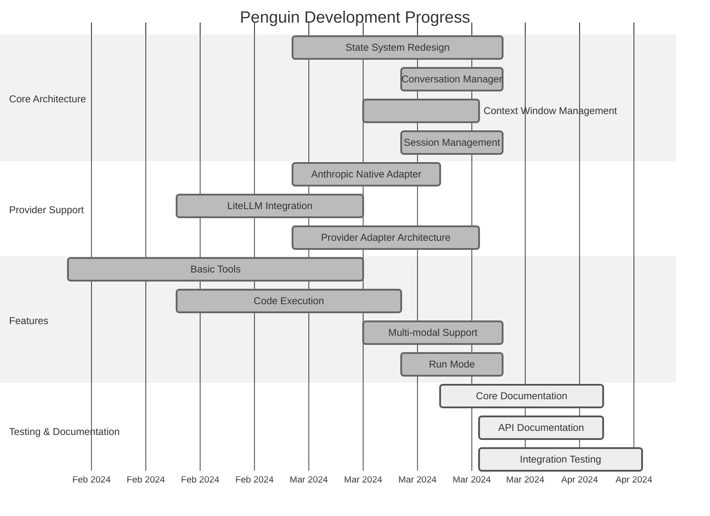
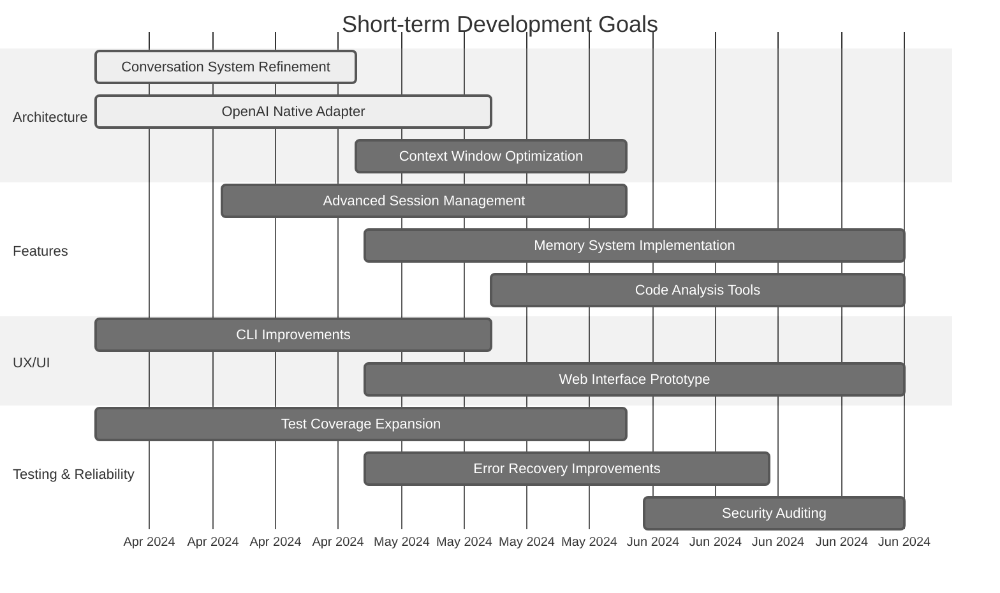
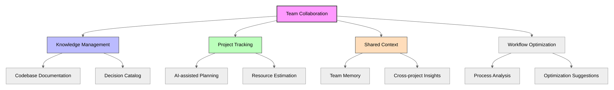

# Development Roadmap

This document outlines the planned development trajectory for Penguin AI Assistant.

## Current Status

## Short-term Roadmap (Next 3 Months)

## Implementation Priorities

### Phase 1: Core Stability (Current)

- ✅ Complete state system refactoring
- ✅ Implement conversation management
- ✅ Integrate LiteLLM for multi-provider support
- ✅ Add Anthropic native adapter
- 🔄 Improve token counting across providers
- 🔄 Complete documentation
- 🔄 Expand test coverage

### Phase 2: Enhanced Capabilities (Q2 2024)

- Add OpenAI native adapter
- Implement advanced session management
- Develop memory and knowledge systems
- Create semantic search across sessions
- Improve real-time collaborative features
- Add web interface for broader access

### Phase 3: Production Readiness (Q3 2024)

- Optimize performance for large histories
- Implement enterprise security features
- Add team collaboration capabilities
- Develop fine-tuning support for custom behaviors
- Create CI/CD pipeline for plugin development
- Build documentation generation tools

### Phase 4: Extended Platform (Q4 2024)

- Create ecosystem for third-party plugins
- Develop hosted version for non-technical users
- Implement team knowledge management
- Add advanced code analysis tools
- Create cross-project insights
- Develop integration with project management tools

## Focus Areas

### Development Experience

```mermaid
%%{init: {'theme': 'neutral', 'flowchart': {'useMaxWidth': false, 'htmlLabels': true, 'diagramPadding': 20}}}%%
flowchart TD
    style DevExp fill:#f9f,stroke:#333,stroke-width:2px
    style CodeTools fill:#bbf,stroke:#333,stroke-width:1px
    style AdvancedLLM fill:#bfb,stroke:#333,stroke-width:1px
    style TemplateSystem fill:#fdb,stroke:#333,stroke-width:1px
    style SemanticSearch fill:#ddf,stroke:#333,stroke-width:1px
    
    DevExp[Developer Experience] --> CodeTools[Code Tools]
    DevExp --> AdvancedLLM[Advanced LLM Integration]
    DevExp --> TemplateSystem[Template System]
    DevExp --> SemanticSearch[Semantic Code Search]
    DevExp --> LocalAPI[Robust Local API]
    
    CodeTools --> SmartRefactoring[Smart Refactoring]
    CodeTools --> AugmentedLinting[Augmented Linting]
    CodeTools --> ArchitectureViz[Architecture Visualization]
    
    AdvancedLLM --> MultimodalProgramming[Multimodal Programming]
    AdvancedLLM --> CustomAgents[Custom Agent Creation]
    
    TemplateSystem --> ProjectScaffolding[Project Scaffolding]
    TemplateSystem --> CodeGeneration[Code Generation]
    
    SemanticSearch --> RepoUnderstanding[Repository Understanding]
    SemanticSearch --> IntentSearch[Intent-based Search]
    
    LocalAPI --> IDEIntegration[IDE Integration]
    LocalAPI --> DevToolsEcosystem[Developer Tools Ecosystem]
```

### Team Collaboration

## Success Metrics

- **State Refactoring**: 50% code complexity reduction
- **Provider Support**: Seamless experience across Anthropic, OpenAI, and local models
- **Token Efficiency**: 30% reduction in context window utilization
- **Documentation**: 100% API coverage with diagrams
- **UX Improvements**: 50% reduction in user input for common tasks
- **Performance**: Support 10,000+ session history

## Get Involved

We welcome contributions in these areas:

- Provider adapters for additional LLM services
- Tool development for specialized domains
- Testing across different environments and workflows
- Documentation improvements and examples
- UX feedback and suggestions

Visit our [GitHub repository](https://github.com/maximooch/penguin) to contribute or report issues. 