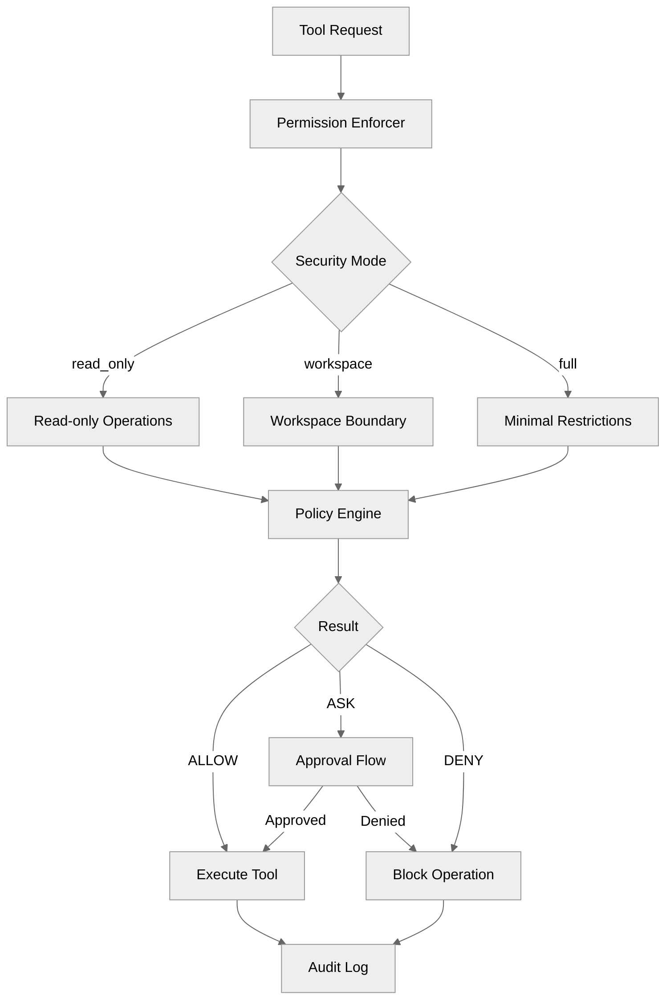

# Security & Permissions

Penguin includes a comprehensive permission and policy engine that controls what operations the AI agent can perform. This system provides granular control over file system access, process execution, network operations, and more.

## Overview

The security system operates on three core principles:

1. **Defense in Depth**: Multiple layers of checks (mode → policy → path validation)
2. **Least Privilege**: Agents start with minimal permissions and can be granted more
3. **Transparent Auditing**: All permission decisions are logged for debugging and compliance



## Security Modes

Penguin supports three security modes that provide different levels of access:

### `read_only` Mode
The most restrictive mode. The agent can only read files and cannot modify the file system.

**Allowed operations:**
- `filesystem.read` - Read file contents
- `filesystem.list` - List directory contents
- `memory.*` - All memory operations

**Blocked operations:**
- All write, delete, and execute operations
- Git operations (except read-only ones)
- Network requests

### `workspace` Mode (Default)
A balanced mode that restricts file operations to the workspace and project directories.

**Allowed operations:**
- All read operations
- Write/delete within workspace and project roots
- Process execution (with approval for dangerous commands)
- Git operations within project

**Blocked operations:**
- File operations outside workspace/project boundaries
- System directory access (`/etc`, `/usr`, `~/.ssh`, etc.)
- Force push and destructive git operations (require approval)

### `full` Mode
Minimal restrictions for trusted environments. Use with caution.

**Allowed operations:**
- Most operations allowed by default
- System directories still protected

**Operations requiring approval:**
- `git.force` - Force push
- `process.execute` - For potentially dangerous commands

## Configuration

### Basic Configuration

Add security settings to your `config.yml`:

```yaml
security:
  # Security mode: read_only, workspace, or full
  mode: workspace
  
  # Enable/disable permission checks entirely
  enabled: true
  
  # Additional allowed paths (beyond workspace/project)
  allowed_paths:
    - /path/to/shared/resources
    - ~/Documents/reference
  
  # Explicitly denied paths (overrides allowed)
  denied_paths:
    - ~/.ssh
    - ~/.aws
    - /etc
    - /usr
  
  # Operations that always require user approval
  require_approval:
    - filesystem.delete
    - git.push
    - git.force
```

### Environment Variables

You can also control security via environment variables:

```bash
# Disable all permission checks (YOLO mode - use with caution!)
PENGUIN_YOLO=true

# Set security mode
PENGUIN_SECURITY_MODE=workspace
```

### Runtime Configuration

Security settings can be changed at runtime via the CLI or API:

```bash
# Via CLI slash command
/config runtime set security_mode read_only

# Via API
curl -X POST http://localhost:8000/api/v1/system/config/security \
  -H "Content-Type: application/json" \
  -d '{"mode": "workspace", "enabled": true}'
```

## Operation Taxonomy

The permission system uses a standardized operation taxonomy:

| Category | Operations | Description |
|----------|-----------|-------------|
| `filesystem` | `read`, `write`, `delete`, `list`, `create_dir` | File system operations |
| `process` | `execute`, `background`, `kill` | Process management |
| `network` | `request`, `download`, `upload` | Network operations |
| `git` | `read`, `write`, `commit`, `push`, `force` | Git operations |
| `memory` | `read`, `write`, `delete`, `search` | Memory system operations |

### Tool to Operation Mapping

Each tool is mapped to one or more operations:

```python
TOOL_OPERATION_MAP = {
    "read_file": [Operation.FILESYSTEM_READ],
    "write_file": [Operation.FILESYSTEM_WRITE],
    "bash": [Operation.PROCESS_EXECUTE],
    "git_push": [Operation.GIT_PUSH],
    # ... etc
}
```

## Approval Flow

When an operation returns `ASK`, the user must approve it before execution.

### Web Interface

In the web interface, approval requests appear as interactive prompts:

```json
{
  "event": "approval_required",
  "data": {
    "request_id": "apr_abc123",
    "tool_name": "bash",
    "operation": "process.execute",
    "resource": "rm -rf ./build",
    "reason": "Destructive command requires approval"
  }
}
```

### API Approval

Approve or deny requests programmatically:

```bash
# Approve a request
curl -X POST http://localhost:8000/api/v1/approvals/apr_abc123/approve \
  -H "Content-Type: application/json" \
  -d '{"scope": "once"}'

# Deny a request
curl -X POST http://localhost:8000/api/v1/approvals/apr_abc123/deny

# Pre-approve an operation pattern
curl -X POST http://localhost:8000/api/v1/approvals/pre-approve \
  -H "Content-Type: application/json" \
  -d '{
    "operation": "filesystem.delete",
    "pattern": "./build/*",
    "session_id": "sess_xyz"
  }'
```

### Approval Scopes

When approving a request, you can specify the scope:

- `once` - Approve this single request only
- `session` - Approve similar operations for the current session
- `pattern` - Approve operations matching a resource pattern

## Multi-Agent Permissions

When using multiple agents, each agent can have its own permission configuration.

### Agent Permission Configuration

Define permissions in your agent personas:

```yaml
# In config.yml
agents:
  code-reviewer:
    persona: "Code Review Expert"
    permissions:
      mode: read_only
      operations:
        - filesystem.read
        - memory.read
      allowed_paths:
        - ./src
        - ./tests
  
  deployment-agent:
    persona: "Deployment Specialist"
    permissions:
      mode: workspace
      operations:
        - filesystem.read
        - filesystem.write
        - process.execute
        - git.push
      require_approval:
        - git.force
```

### Permission Inheritance

Sub-agents inherit permissions from their parent, with refinement:

```
Parent (workspace mode, all operations)
    └── Child (can only have equal or more restrictive permissions)
        - Can reduce to read_only mode
        - Can remove operations from allowed list
        - Cannot add operations parent doesn't have
        - Cannot access paths parent can't access
```

### Programmatic Agent Permissions

```python
from penguin.multi import MultiAgentCoordinator

coordinator = MultiAgentCoordinator()

# Spawn agent with restricted permissions
await coordinator.spawn_agent(
    agent_id="restricted-helper",
    persona="helper",
    permissions={
        "mode": "read_only",
        "allowed_paths": ["./docs"],
        "operations": ["filesystem.read", "memory.read"]
    },
    parent_agent_id="main-agent"  # Inherits and refines parent permissions
)
```

## Audit Logging

All permission checks are logged for debugging and compliance.

### Audit Configuration

```yaml
security:
  audit:
    enabled: true
    log_file: ".penguin/permission_audit.log"
    
    # Per-category verbosity
    categories:
      filesystem: all          # Log everything
      process: ask_and_deny    # Log ASK and DENY only
      network: deny_only       # Log only denials
      git: ask_and_deny
      memory: off              # No logging
    
    # Memory buffer for API queries
    max_memory_entries: 1000
    
    # Include full context (may contain sensitive data)
    include_context: false
```

### Verbosity Levels

- `off` - No logging for this category
- `deny_only` - Only log DENY results
- `ask_and_deny` - Log ASK and DENY results
- `all` - Log all permission checks (ALLOW, ASK, DENY)

### CLI Commands

```bash
# View current permission settings
penguin permissions list

# View recent audit log entries
penguin permissions audit -n 50

# Filter by result
penguin permissions audit --result deny

# View audit statistics
penguin permissions summary
```

### API Endpoints

```bash
# Get recent audit entries
curl "http://localhost:8000/api/v1/security/audit?limit=100&result=deny"

# Get audit statistics
curl http://localhost:8000/api/v1/security/audit/stats
```

**Response:**
```json
{
  "total": 1250,
  "by_result": {
    "allow": 1180,
    "ask": 45,
    "deny": 25
  },
  "by_category": {
    "filesystem": 890,
    "process": 200,
    "git": 160
  }
}
```

## Custom Policies

You can implement custom policies by extending the `PolicyEngine` base class:

```python
from penguin.security import PolicyEngine, Operation, PermissionResult

class CustomSecurityPolicy(PolicyEngine):
    """Custom policy that restricts operations during business hours."""
    
    def __init__(self):
        super().__init__(name="business-hours-policy", priority=50)
    
    def check_operation(
        self,
        operation: Operation,
        resource: str,
        context: dict
    ) -> tuple[PermissionResult, str]:
        import datetime
        
        hour = datetime.datetime.now().hour
        
        # Restrict destructive operations outside business hours
        if operation in [Operation.GIT_PUSH, Operation.FILESYSTEM_DELETE]:
            if hour < 9 or hour > 17:
                return (
                    PermissionResult.DENY,
                    "Destructive operations not allowed outside business hours (9 AM - 5 PM)"
                )
        
        # Defer to other policies
        return (PermissionResult.ALLOW, "Within business hours")
```

Register your custom policy:

```python
from penguin.security import PermissionEnforcer

enforcer = PermissionEnforcer(mode="workspace")
enforcer.add_policy(CustomSecurityPolicy())
```

## Path Security

The permission system includes robust path validation:

### Path Traversal Detection

Prevents `../` attacks and symbolic link escapes:

```python
from penguin.security import validate_path_security

# This will raise PathTraversalError
validate_path_security(
    path="../../../etc/passwd",
    boundaries=["/home/user/workspace"]
)

# This will raise SymlinkEscapeError if symlink points outside boundaries
validate_path_security(
    path="./link-to-secrets",
    boundaries=["/home/user/workspace"],
    check_symlinks=True
)
```

### Sensitive Path Protection

These paths are always protected regardless of mode:

- `~/.ssh` - SSH keys
- `~/.aws` - AWS credentials
- `~/.gnupg` - GPG keys
- `/etc` - System configuration
- `/usr` - System binaries
- Environment files containing secrets

## Best Practices

### Development Environment

```yaml
security:
  mode: workspace
  enabled: true
  audit:
    enabled: true
    categories:
      filesystem: all  # Full visibility during development
```

### Production Environment

```yaml
security:
  mode: read_only  # or workspace with strict boundaries
  enabled: true
  denied_paths:
    - ~/.ssh
    - ~/.aws
    - /etc
    - /var
  require_approval:
    - filesystem.delete
    - process.execute
    - git.push
  audit:
    enabled: true
    log_file: /var/log/penguin/permissions.log
    categories:
      filesystem: ask_and_deny
      process: all
      network: all
```

### CI/CD Pipelines

```yaml
security:
  mode: workspace
  enabled: true
  allowed_paths:
    - ./  # Current directory only
  require_approval: []  # No interactive approval in CI
  audit:
    enabled: true
    categories:
      filesystem: deny_only
      process: deny_only
```

## Troubleshooting

### Common Issues

**Operation unexpectedly denied:**
1. Check audit log: `penguin permissions audit --result deny`
2. Verify security mode: `penguin permissions list`
3. Check path boundaries in config

**Approval flow not working:**
1. Ensure WebSocket connection is active
2. Check for `approval_required` events in browser console
3. Verify session ID matches

**Agent permissions not applying:**
1. Check agent is registered: `GET /api/v1/agents`
2. Verify permissions block in config
3. Check parent agent permissions (inheritance rules)

### Debug Logging

Enable verbose permission logging:

```yaml
security:
  audit:
    enabled: true
    categories:
      filesystem: all
      process: all
      network: all
      git: all
      memory: all
    include_context: true  # Warning: may log sensitive data
```

Then check logs:
```bash
tail -f .penguin/permission_audit.log | jq .
```

