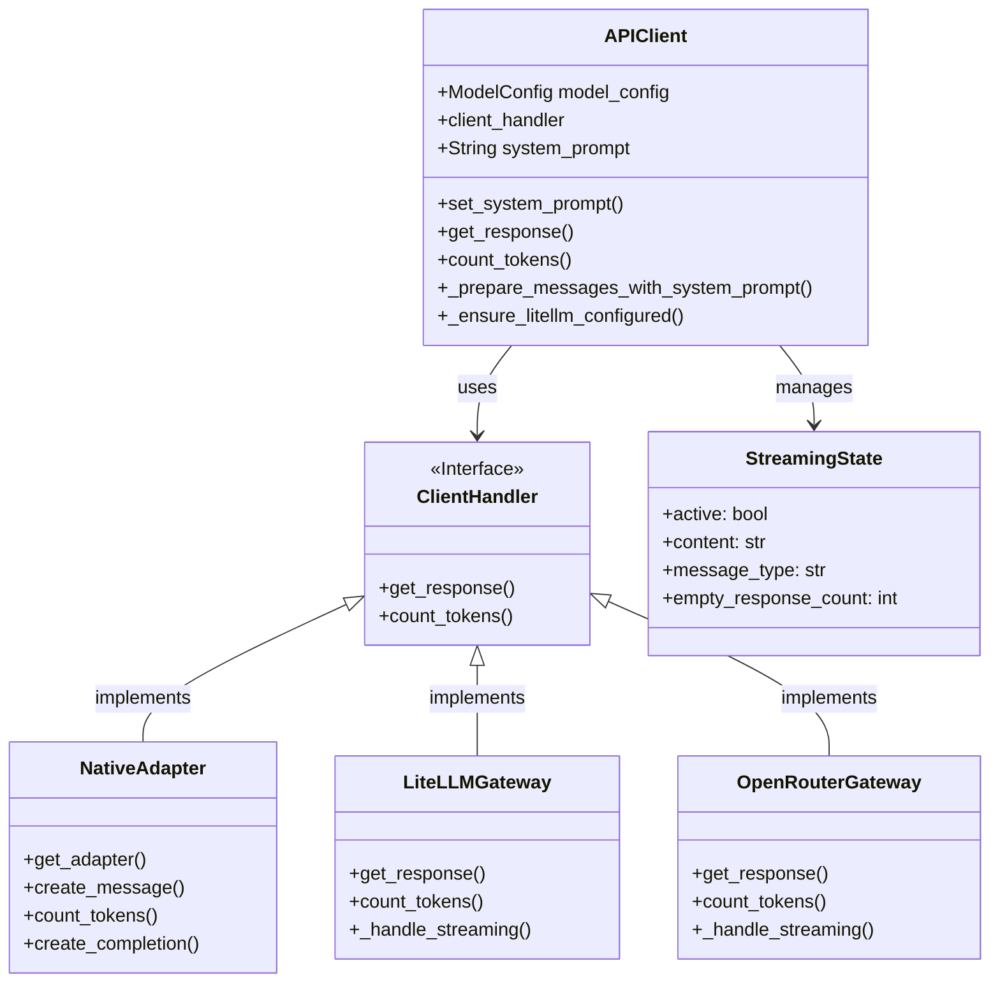
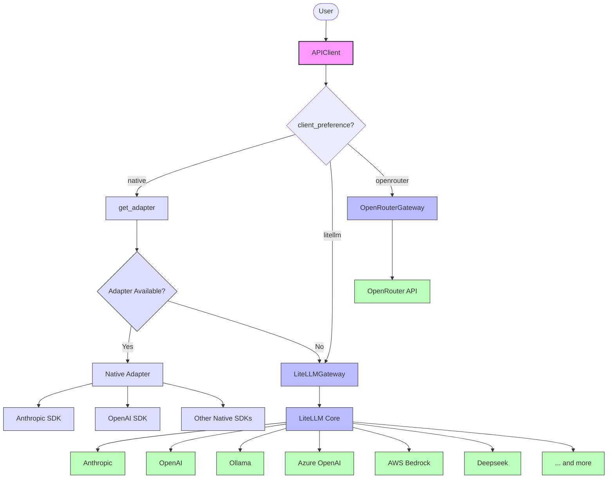
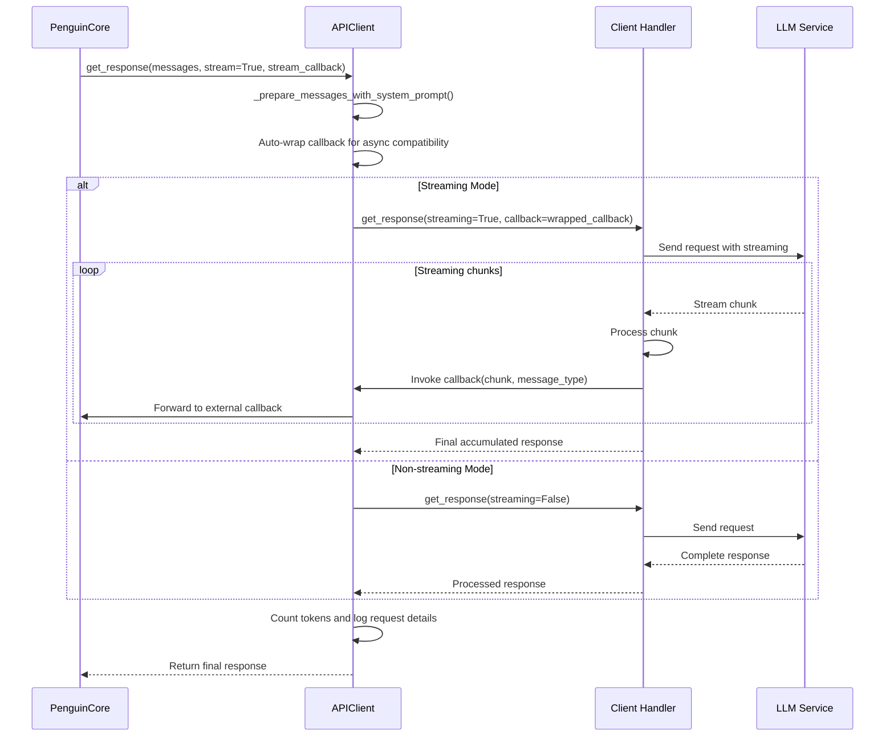

# API Client

The `APIClient` class provides a unified interface for interacting with various AI model APIs, handling both native provider-specific implementations and generic model access through OpenRouter and LiteLLM. With streaming support, advanced callback handling, and comprehensive message preprocessing.

## Architecture

The API client architecture v0.3.1 consists of:

1. **APIClient** - Main interface with enhanced streaming and callback handling
2. **Client Handlers** - Provider-specific implementations (native adapters or gateway classes)
3. **Message Processing** - Advanced preprocessing with system prompt injection
4. **Streaming Support** - Real-time callback handling with async/sync compatibility



## Provider Architecture



## Message Flow



## Initialization

```python
def __init__(self, model_config: ModelConfig):
    """
    Initialize the APIClient.

    Args:
        model_config (ModelConfig): Configuration for the AI model.
    """
```

The client automatically attempts to use the most appropriate adapter:
1. First tries to use a native, provider-specific adapter (e.g., direct Anthropic SDK)
2. Falls back to generic provider adapters via LiteLLM if native adapter isn't available

## Key Methods

### Enhanced Message Processing

```python
def _prepare_messages_with_system_prompt(self, messages: List[Dict[str, Any]]) -> List[Dict[str, Any]]
```

Injects system prompt at the beginning of message list while preserving other system messages (action results, iteration markers). Ensures system prompt is always in slot-0 position.

**Features:**
- Preserves action results and iteration markers
- Handles duplicate system prompt removal
- Maintains message order integrity

### Advanced Streaming with Callback Handling

```python
async def get_response(
    self,
    messages: List[Dict[str, Any]],
    max_tokens: Optional[int] = None,
    temperature: Optional[float] = None,
    stream: Optional[bool] = None,
    stream_callback: Optional[Callable[[str], None]] = None,
    **kwargs: Any
) -> str
```

Unified interface for both streaming and non-streaming responses with enhanced callback handling.

**Parameters:**
- `messages`: List of message dictionaries (OpenAI format)
- `max_tokens`: Maximum tokens to generate
- `temperature`: Sampling temperature
- `stream`: Whether to use streaming mode
- `stream_callback`: Callback accepting `(chunk: str, message_type: str)`
- `**kwargs`: Additional parameters (reasoning config, etc.)

**Features:**
- Automatic callback wrapping for async/sync compatibility
- Enhanced logging with request IDs and token counting
- Fallback retry logic for empty responses
- Comprehensive error handling and recovery

### Token Counting with Fallback Strategy

```python
def count_tokens(self, content: Union[str, List, Dict]) -> int
```

Counts tokens using provider-specific tokenizer with intelligent fallback strategy.

**Fallback Chain:**
1. Client handler's native token counter
2. LiteLLM generic counter for model
3. Rough character-based estimation (final fallback)

### System Prompt Management

```python
def set_system_prompt(self, prompt: str) -> None
```

Sets the system prompt with debug logging for length tracking.

### Performance Optimization

```python
def _ensure_litellm_configured(self) -> None
```

Lazy initialization of LiteLLM to avoid import-time overhead. Disables debugging and sets optimal defaults for production use.

## Multi-Provider Support

The `APIClient` supports multiple providers through adapter architecture:

1. **Native Adapters**: Direct SDK implementations for:
   - Anthropic (Claude models)
   - *OpenAI (GPT models) - Planned but not yet implemented*
   - More to come

2. **Generic Adapters** via LiteLLM:
   - OpenAI
   - Anthropic
   - Ollama
   - DeepSeek
   - Azure OpenAI
   - AWS Bedrock
   - And many more

The selection between native and generic adapters is controlled by the `use_native_adapter` flag in the model configuration.

## Provider-Specific Features

### Anthropic (Native Adapter)

```python
class AnthropicAdapter(BaseAdapter):
    # Direct implementation using Anthropic's SDK
```

- Native multi-modal support
- Streaming implementation
- Direct token counting
- Base64 image handling
- Vision support for Claude 3 models

### OpenAI (via LiteLLM)

```python
class OpenAIAdapter(ProviderAdapter):
    # Implementation for OpenAI through provider adapter
```

- Multi-modal content support
- Message formatting for OpenAI-specific features
- Support for OpenAI's message structure

### Ollama (via LiteLLM)

```python
class OllamaAdapter(ProviderAdapter):
    # Implementation for Ollama through provider adapter
```

- Local model support
- Basic message formatting

### DeepSeek (via LiteLLM)

```python
class DeepseekAdapter(ProviderAdapter):
    # Implementation for DeepSeek through provider adapter
```

- System message handling
- Role alternation enforcement

## Configuration

Configure the API client through `ModelConfig` with enhanced client preference system:

```python
@dataclass
class ModelConfig:
    model: str
    provider: str
    client_preference: str = "native"  # "native", "litellm", or "openrouter"
    api_base: Optional[str] = None
    api_key: Optional[str] = None
    api_version: Optional[str] = None
    max_tokens: Optional[int] = None
    max_history_tokens: Optional[int] = None
    temperature: float = 0.7
    streaming_enabled: bool = True
    enable_token_counting: bool = True
    vision_enabled: bool = None
    reasoning_enabled: bool = False
    reasoning_effort: Optional[str] = None
    reasoning_max_tokens: Optional[int] = None
    reasoning_exclude: bool = False
```

**Client Preference Options:**
- `"native"`: Use direct provider SDK (e.g., Anthropic SDK)
- `"litellm"`: Use LiteLLM gateway for all providers
- `"openrouter"`: Use OpenRouter gateway with automatic model discovery

The client preference controls which handler implementation is used, with automatic fallback to LiteLLM if native adapter is unavailable.

## Usage Examples

### Basic Setup with Enhanced Streaming

```python
from penguin.llm.model_config import ModelConfig
from penguin.llm.api_client import APIClient

# Initialize with OpenRouter gateway for automatic model discovery
model_config = ModelConfig(
    model="openai/gpt-5",
    provider="openai",
    client_preference="openrouter",  # Automatic model specs fetching
    streaming_enabled=True
)

# Create client (automatically configures appropriate handler)
api_client = APIClient(model_config=model_config)
api_client.set_system_prompt("You are a helpful assistant.")
```

### Advanced Streaming with Enhanced Callbacks

```python
# Enhanced streaming callback with message type support
async def streaming_callback(chunk: str, message_type: str = "assistant"):
    if message_type == "reasoning":
        print(f"[REASONING] {chunk}", end="", flush=True)
    else:
        print(f"[RESPONSE] {chunk}", end="", flush=True)

messages = [
    {"role": "user", "content": "Explain quantum computing in simple terms"}
]

# Get streaming response with enhanced callback
response = await api_client.get_response(
    messages,
    stream=True,
    stream_callback=streaming_callback,
    max_tokens=1000,
    temperature=0.7
)

print(f"\n\nFinal response: {response}")
```

### Model Switching with Automatic Configuration

```python
# Switch to a different model at runtime
new_config = ModelConfig(
    model="anthropic/claude-sonnet-4",
    provider="anthropic",
    client_preference="openrouter"  # Will fetch latest specs automatically
)

new_api_client = APIClient(new_config)
# Automatically fetches context window, pricing, and capabilities from OpenRouter
```

### Enhanced Error Handling and Retry Logic

```python
try:
    response = await api_client.get_response(
        messages,
        stream=True,
        stream_callback=streaming_callback
    )

    # APIClient automatically handles:
    # - Empty response retries with streaming disabled
    # - Token counting and logging
    # - Async/sync callback compatibility
    # - Comprehensive error reporting

except Exception as e:
    print(f"Request failed: {e}")
    # APIClient provides detailed error context for debugging
```

### Multi-Modal Content with Vision Models

```python
# Encode image for vision models
base64_image = api_client.encode_image_to_base64("diagram.png")

vision_messages = [
    {
        "role": "user",
        "content": [
            {"type": "text", "text": "Analyze this architecture diagram:"},
            {
                "type": "image_url",
                "image_url": {
                    "url": f"data:image/png;base64,{base64_image}"
                }
            }
        ]
    }
]

# Process normally - APIClient handles format conversion for each provider
response = await api_client.get_response(vision_messages)
```

## Performance Features

### Lazy Initialization
- LiteLLM is configured only on first use to avoid import overhead
- Client handlers are initialized during first API call
- Memory usage optimized for fast startup scenarios

### Enhanced Logging
- Request IDs for tracing API calls
- Token counting with automatic fallback
- Detailed error context and recovery information
- Performance metrics and timing data

### Error Recovery
- Automatic retry logic for empty responses
- Graceful fallback between streaming and non-streaming modes
- Comprehensive error reporting with context

## Extension Points

To add a new provider:

1. **For Native Adapters**: Create a new implementation in `adapters/` directory implementing the handler interface
2. **For Gateway Adapters**: Extend `LiteLLMGateway` or `OpenRouterGateway` with provider-specific logic
3. **Register Client Handler**: Add to the client preference selection logic in `APIClient.__init__`
4. **Implement Required Methods**: `get_response()`, `count_tokens()`, and streaming support

The modular architecture allows easy integration of new providers while maintaining consistent interfaces across all implementations. 