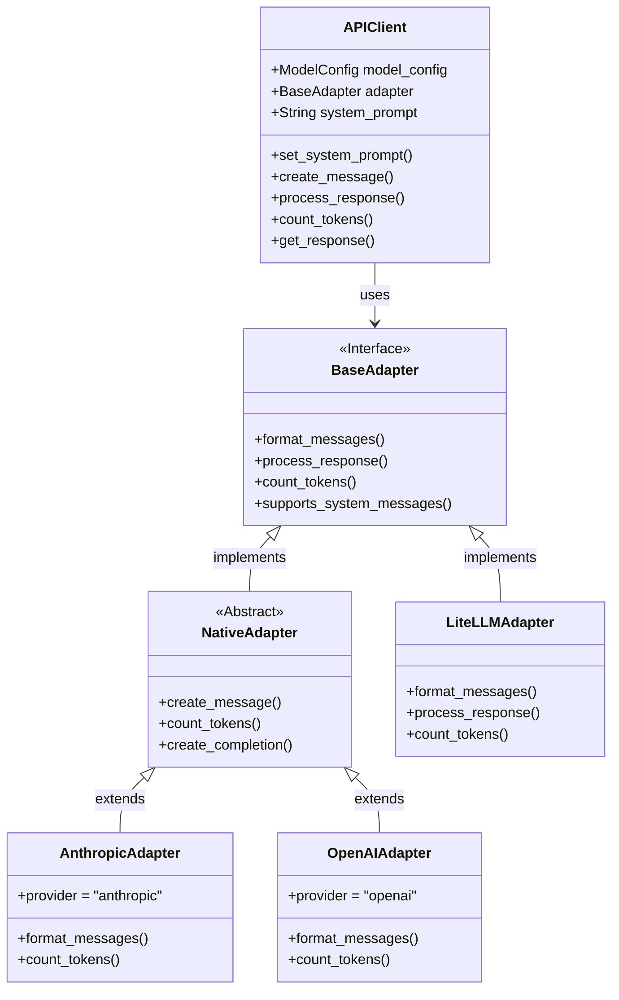
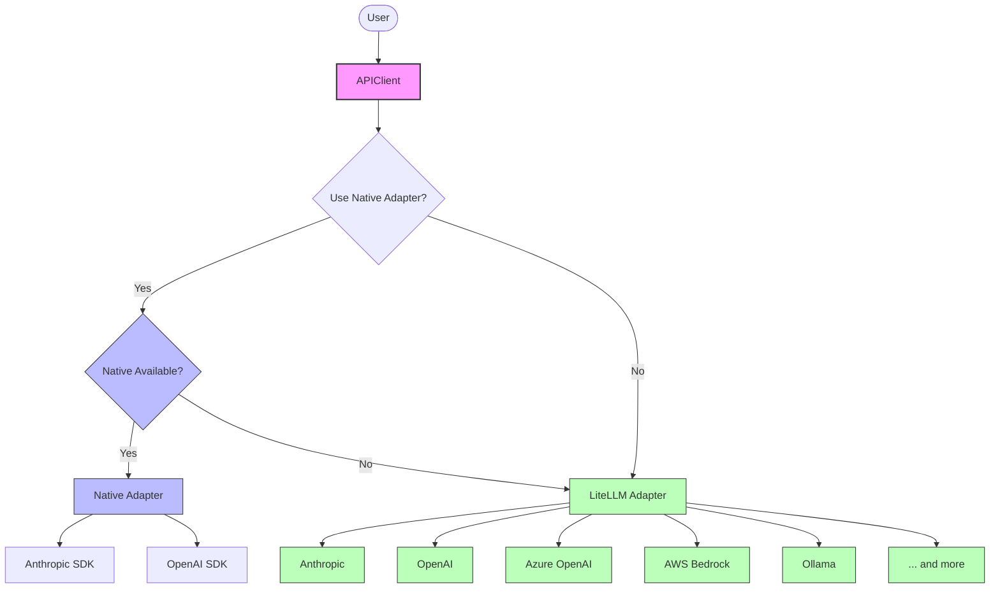
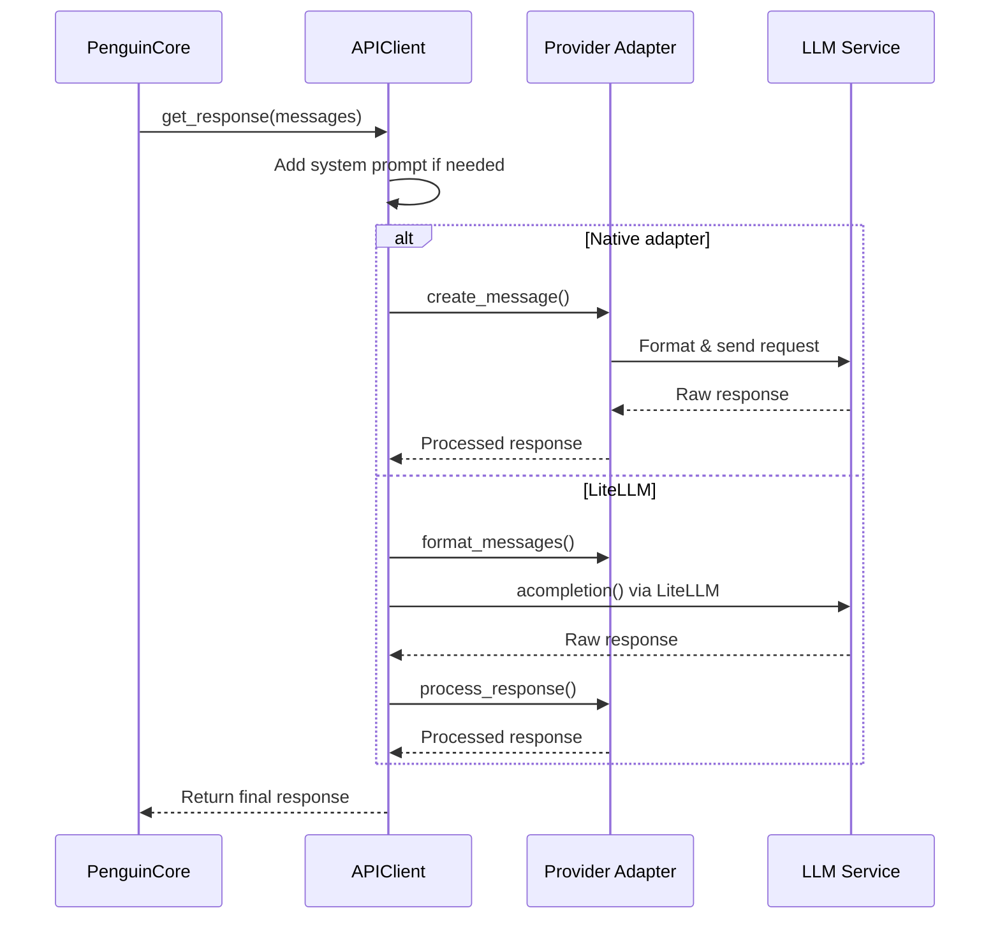

# API Client

The `APIClient` class provides a unified interface for interacting with various AI model APIs, handling both native provider-specific implementations and generic model access through LiteLLM.

## Architecture

The API client architecture consists of:

1. **APIClient** - Main interface for model interactions
2. **Provider Adapters** - Provider-specific implementations for each LLM service 
3. **Native Adapters** - Direct SDK implementations for optimal performance



## Provider Architecture



## Message Flow



## Initialization

```python
def __init__(self, model_config: ModelConfig):
    """
    Initialize the APIClient.

    Args:
        model_config (ModelConfig): Configuration for the AI model.
    """
```

The client automatically attempts to use the most appropriate adapter:
1. First tries to use a native, provider-specific adapter (e.g., direct Anthropic SDK)
2. Falls back to generic provider adapters via LiteLLM if native adapter isn't available

## Key Methods

### Message Creation

```python
async def create_message(
    self,
    messages: List[Dict[str, Any]],
    max_tokens: Optional[int] = None,
    temperature: Optional[float] = None,
) -> Any
```

Creates a message using the configured model and appropriate adapter.

### Response Processing

```python
def process_response(self, response: Any) -> tuple[str, List[Any]]
```

Processes the raw response from the AI model using the provider-specific adapter.

### Token Counting

```python
def count_tokens(self, content: Union[str, List, Dict]) -> int
```

Counts tokens for content, using the provider's specific tokenizer when available.

### Message Streaming

```python
async def get_response(
    self,
    messages: List[Dict[str, Any]],
    max_tokens: Optional[int] = None,
    temperature: Optional[float] = None,
    stream: Optional[bool] = None,
    stream_callback: Optional[Callable[[str], None]] = None
) -> str
```

Unified interface for both streaming and non-streaming responses.

### System Prompt Management

```python
def set_system_prompt(self, prompt: str) -> None
```

Sets the system prompt and updates assistant if using Assistants API.

## Multi-Provider Support

The `APIClient` supports multiple providers through adapter architecture:

1. **Native Adapters**: Direct SDK implementations for:
   - Anthropic (Claude models)
   - OpenAI (GPT models)
   - More to come

2. **Generic Adapters** via LiteLLM:
   - OpenAI
   - Anthropic
   - Ollama
   - AWS Bedrock
   - Azure OpenAI
   - And many more

The selection between native and generic adapters is controlled by the `use_native_adapter` flag in the model configuration.

## Provider-Specific Features

### Anthropic

```python
class AnthropicAdapter(BaseAdapter):
    # Direct implementation using Anthropic's SDK
```

- Native multi-modal support
- Streaming implementation
- Direct token counting

### OpenAI

```python
class OpenAIAdapter(BaseAdapter):
    # Direct implementation using OpenAI's SDK
```

- Native tool calling
- Function calling support
- Multi-modal content
- Optional Assistants API

## Configuration

Configure the API client through `ModelConfig`:

```python
@dataclass
class ModelConfig:
    model: str
    provider: str
    api_base: Optional[str] = None
    api_key: Optional[str] = None
    api_version: Optional[str] = None
    max_tokens: Optional[int] = None
    max_history_tokens: Optional[int] = None
    temperature: float = 0.7
    use_assistants_api: bool = False
    use_native_adapter: bool = True  # Controls adapter selection
    streaming_enabled: bool = False
```

Setting `use_native_adapter=False` forces the use of LiteLLM adapters.

## Usage Example

```python
# Initialize with native Anthropic adapter
model_config = ModelConfig(
    model="claude-3-5-sonnet",
    provider="anthropic",
    use_native_adapter=True
)

# Create client
api_client = APIClient(model_config=model_config)

# Set system prompt
api_client.set_system_prompt("You are a helpful assistant.")

# Prepare messages
messages = [
    {"role": "user", "content": "Hello, how are you?"}
]

# Get response (non-streaming)
response = await api_client.get_response(messages)
print(response)

# Get streaming response with callback
def on_chunk(chunk: str):
    print(chunk, end="", flush=True)

streaming_response = await api_client.get_response(
    messages, 
    stream=True,
    stream_callback=on_chunk
)
```

## Multi-modal Content

The client supports images and other multi-modal content:

```python
# Encode image to base64
base64_image = api_client.encode_image_to_base64("path/to/image.jpg")

# Create multi-modal message
messages = [
    {
        "role": "user",
        "content": [
            {"type": "text", "text": "What's in this image?"},
            {
                "type": "image_url",
                "image_url": {
                    "url": f"data:image/jpeg;base64,{base64_image}"
                }
            }
        ]
    }
]

# Process normally
response = await api_client.get_response(messages)
```

## Extension Points

To add a new provider:

1. Create a new native adapter implementing `BaseAdapter` interface
2. Ensure it's registered in the provider-to-module mapping in `adapters/__init__.py`
3. For generic support, add to provider_adapters.py 