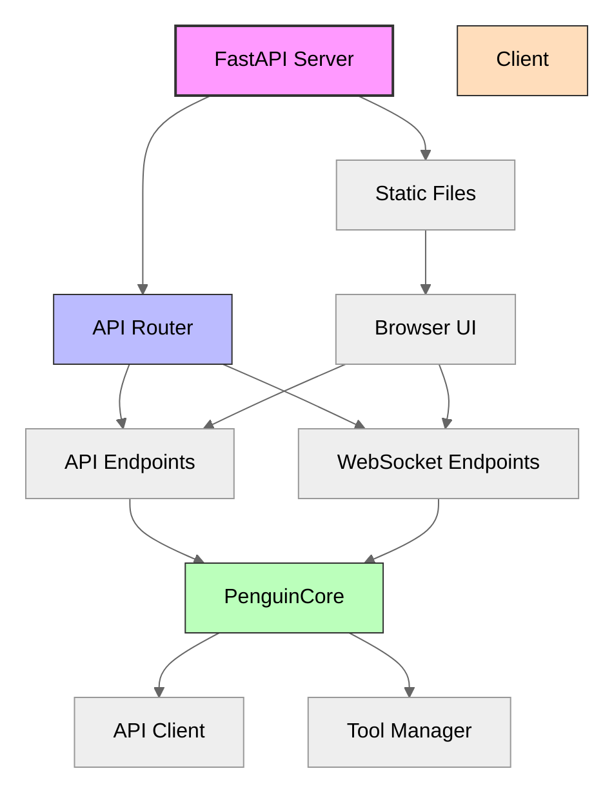
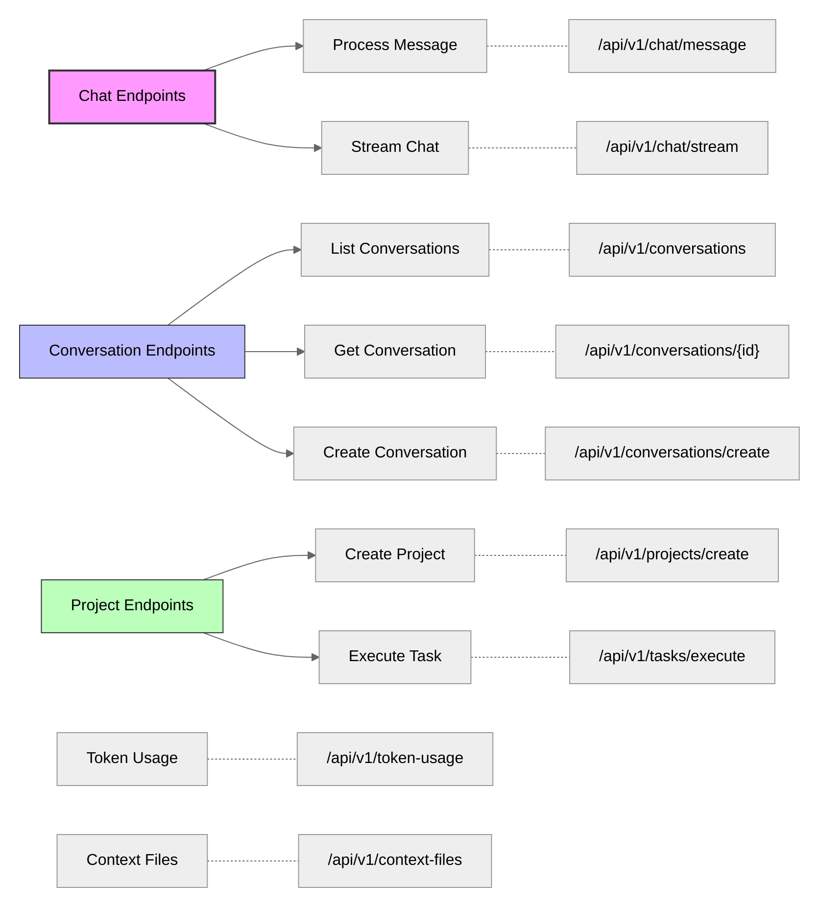
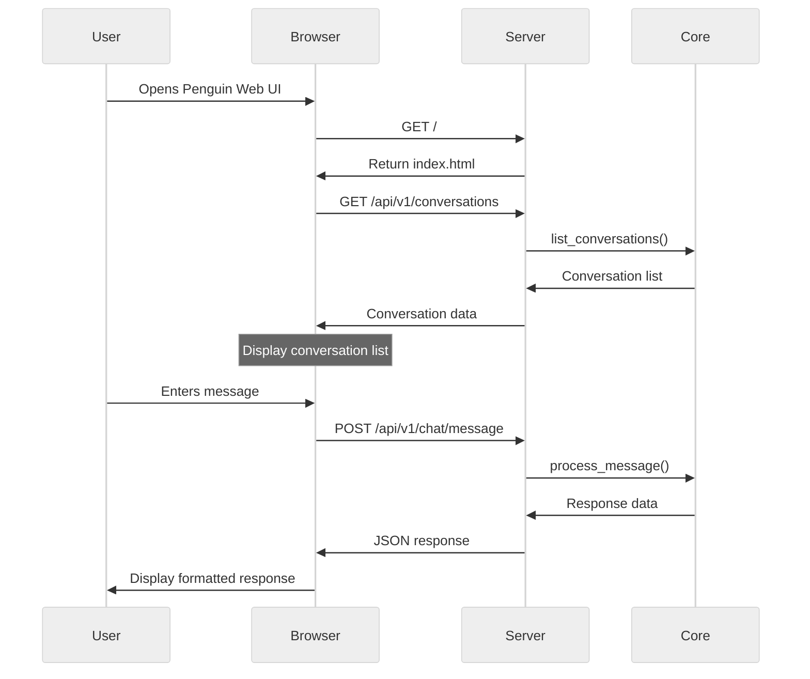

# API Server

The Penguin API Server provides a web-based interface for interacting with the Penguin AI assistant, enabling both programmatic access and a browser-based user interface.

## Architecture



## Server Initialization

The API server is built using FastAPI and initializes the core components:

```python
def create_app():
    app = FastAPI(title="Penguin AI", docs_url="/api/docs", redoc_url="/api/redoc")

    # Configure CORS
    app.add_middleware(
        CORSMiddleware,
        allow_origins=["*"],
        allow_credentials=True,
        allow_methods=["*"],
        allow_headers=["*"],
    )

    # Initialize core and attach to router
    core = init_core()
    router.core = core

    # Include routes
    app.include_router(router)

    # Mount static files for web UI
    static_dir = Path(__file__).parent / "static"
    if static_dir.exists():
        app.mount("/static", StaticFiles(directory=str(static_dir)), name="static")
```

## API Endpoints



### Chat Endpoints

#### POST `/api/v1/chat/message`

Process a chat message with optional conversation support.

**Request Body:**
```json
{
  "text": "Hello, how can you help me with Python development?",
  "conversation_id": "optional-conversation-id",
  "context": {"key": "value"},
  "context_files": ["path/to/file1.py", "path/to/file2.py"],
  "streaming": false,
  "max_iterations": 5
}
```

**Response:**
```json
{
  "response": "I can help you with Python development in several ways...",
  "action_results": [
    {
      "action": "code_execution",
      "result": "Execution result...",
      "status": "completed"
    }
  ]
}
```

#### WebSocket `/api/v1/chat/stream`

Stream chat responses in real-time for a more interactive experience.

**WebSocket Events:**
- `start`: Indicates the start of a response
- `token`: Individual tokens as they're generated
- `complete`: Complete response with all action results
- `error`: Error information if something goes wrong

### Conversation Endpoints

#### GET `/api/v1/conversations`

List all available conversations.

#### GET `/api/v1/conversations/{conversation_id}`

Retrieve a specific conversation by ID.

#### POST `/api/v1/conversations/create`

Create a new conversation.

### Project Management

#### POST `/api/v1/projects/create`

Create a new project.

**Request Body:**
```json
{
  "name": "My New Project",
  "description": "Optional project description"
}
```

#### POST `/api/v1/tasks/execute`

Execute a task in the background.

**Request Body:**
```json
{
  "name": "Task name",
  "description": "Task description",
  "continuous": false,
  "time_limit": 30
}
```

### Utility Endpoints

#### GET `/api/v1/token-usage`

Get current token usage statistics.

#### GET `/api/v1/context-files`

List all available context files.

#### POST `/api/v1/context-files/load`

Load a context file into the current conversation.

**Request Body:**
```json
{
  "file_path": "path/to/context/file.md"
}
```

## Web Interface

Penguin includes a simple web-based chat interface for interacting with the assistant directly in the browser.



### Web UI Features

The browser interface provides a simple chat experience with:

- Conversation history management
- Markdown rendering for formatted responses
- Code syntax highlighting
- Real-time updates
- Conversation switching and creation

## Integration with Core Components

The API server integrates with Penguin's core components:

```python
def init_core():
    model_config = ModelConfig(
        model=config["model"]["default"],
        provider=config["model"]["provider"],
        api_base=config["api"]["base_url"],
        streaming_enabled=True,
        use_native_adapter=config["model"].get("use_native_adapter", True),
    )

    api_client = APIClient(model_config=model_config)
    api_client.set_system_prompt(SYSTEM_PROMPT)
    tool_manager = ToolManager(log_error)

    core = PenguinCore(
        api_client=api_client, 
        tool_manager=tool_manager, 
        model_config=model_config
    )
    
    return core
```

This integration ensures that the API server has access to:

1. The `ModelConfig` for configuring model behavior
2. The `APIClient` for communication with LLM providers
3. The `ToolManager` for executing tools and actions
4. The `PenguinCore` for coordinating all subsystems

## Running the Server

To start the API server:

```bash
python -m penguin.api.server
```

By default, the server runs on port 8000 and is accessible at:
- Web UI: http://localhost:8000/
- API documentation: http://localhost:8000/api/docs

## API Documentation

FastAPI automatically generates OpenAPI documentation for all endpoints, available at:
- Swagger UI: http://localhost:8000/api/docs
- ReDoc: http://localhost:8000/api/redoc