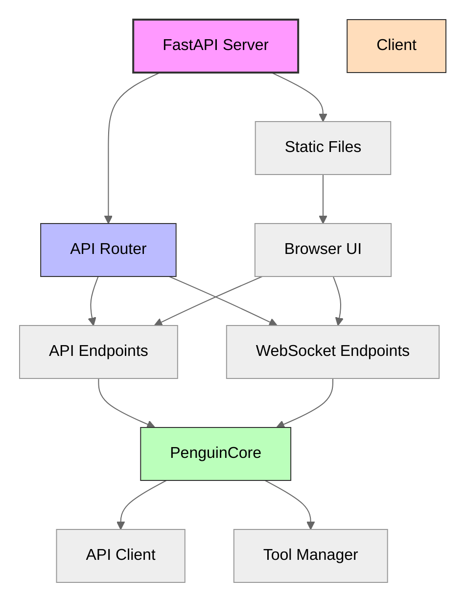
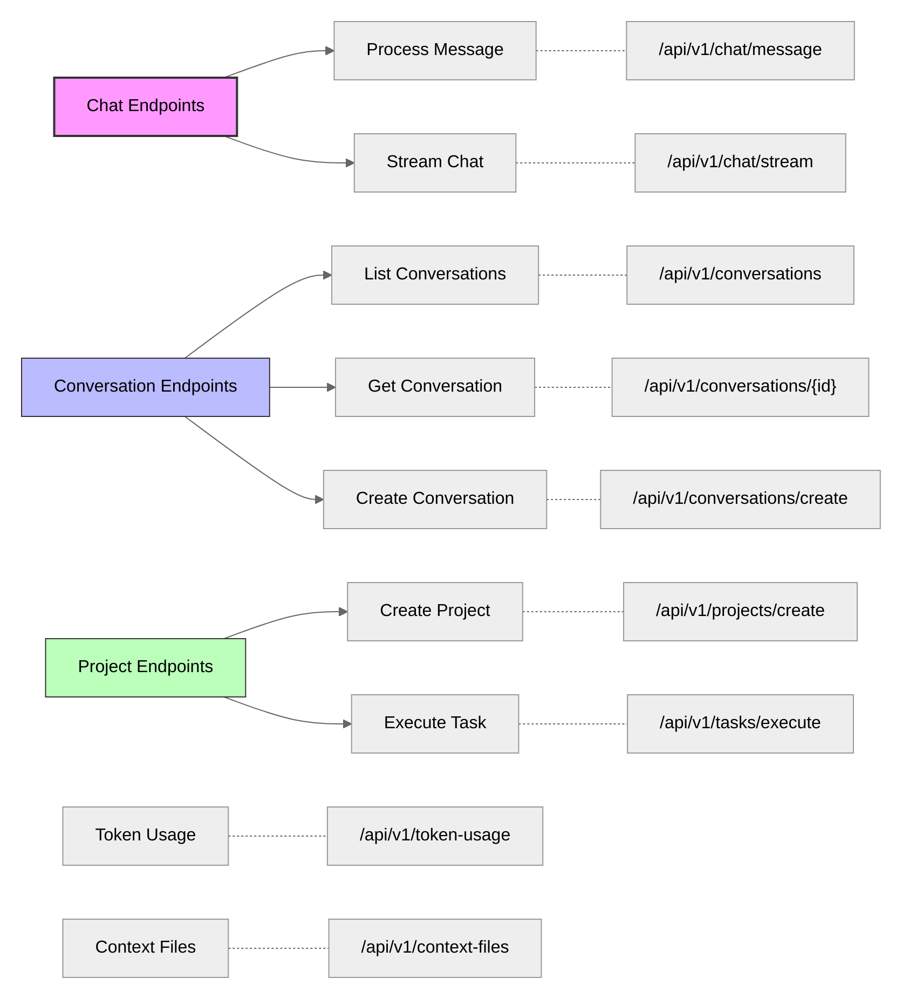
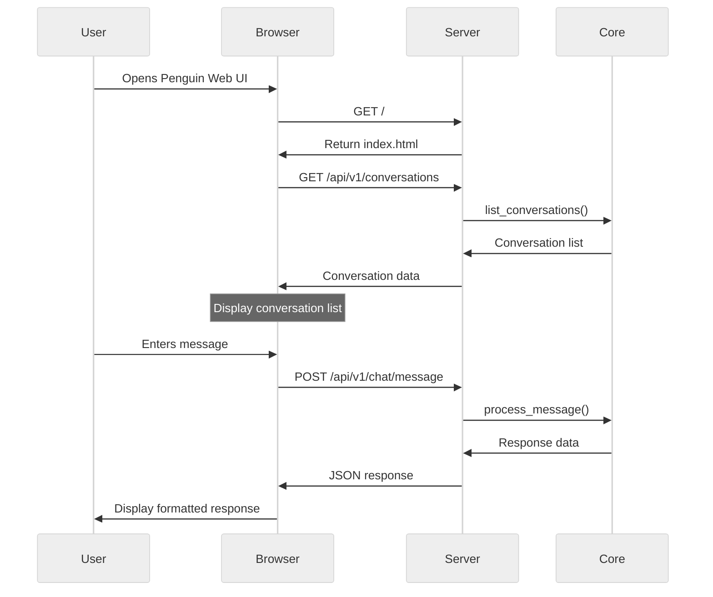

# API Server

The Penguin API Server provides a web-based interface for interacting with the Penguin AI assistant, enabling both programmatic access and a browser-based user interface.

## Architecture



## Server Initialization

The API server is built using FastAPI and initializes the core components:

```python
def create_app():
    app = FastAPI(title="Penguin AI", docs_url="/api/docs", redoc_url="/api/redoc")

    # Configure CORS
    app.add_middleware(
        CORSMiddleware,
        allow_origins=["*"],
        allow_credentials=True,
        allow_methods=["*"],
        allow_headers=["*"],
    )

    # Initialize core and attach to router
    core = init_core()
    router.core = core

    # Include routes
    app.include_router(router)

    # Mount static files for web UI
    static_dir = Path(__file__).parent / "static"
    if static_dir.exists():
        app.mount("/static", StaticFiles(directory=str(static_dir)), name="static")
```

## API Endpoints



### Chat Endpoints

#### POST `/api/v1/chat/message`

Process a chat message with optional conversation support, including multi-modal capabilities.

**Request Body:**
```json
{
  "text": "Hello, how can you help me with Python development?",
  "conversation_id": "optional-conversation-id",
  "context": {"key": "value"},
  "context_files": ["path/to/file1.py", "path/to/file2.py"],
  "streaming": false,
  "max_iterations": 5,
  "image_path": "/path/to/image.png"
}
```

**Response:**
```json
{
  "response": "I can help you with Python development in several ways...",
  "action_results": [
    {
      "action": "code_execution",
      "result": "Execution result...",
      "status": "completed"
    }
  ]
}
```

**New Features:**
- `image_path`: Optional path to an image file for vision-enabled models
- Enhanced streaming support with improved buffering
- Better error handling and response consistency

#### WebSocket `/api/v1/chat/stream`

Stream chat responses in real-time for a more interactive experience.

**WebSocket Events:**
- `start`: Indicates the start of a response
- `token`: Individual tokens as they're generated
- `complete`: Complete response with all action results
- `error`: Error information if something goes wrong

### Conversation Endpoints

#### GET `/api/v1/conversations`

List all available conversations.

#### GET `/api/v1/conversations/{conversation_id}`

Retrieve a specific conversation by ID.

#### POST `/api/v1/conversations/create`

Create a new conversation.

### Project Management

#### POST `/api/v1/projects/create`

Create a new project.

**Request Body:**
```json
{
  "name": "My New Project",
  "description": "Optional project description"
}
```

#### POST `/api/v1/tasks/execute`

Execute a task in the background.

**Request Body:**
```json
{
  "name": "Task name",
  "description": "Task description",
  "continuous": false,
  "time_limit": 30
}
```

### Utility Endpoints

#### GET `/api/v1/token-usage`

Get current token usage statistics.

#### GET `/api/v1/context-files`

List all available context files.

#### POST `/api/v1/context-files/load`

Load a context file into the current conversation.

**Request Body:**
```json
{
  "file_path": "path/to/context/file.md"
}
```

### Checkpoint Management

Penguin now supports conversation checkpointing for branching and rollback functionality.

#### POST `/api/v1/checkpoints/create`

Create a manual checkpoint of the current conversation state.

**Request Body:**
```json
{
  "name": "Before refactoring",
  "description": "Checkpoint before starting code refactoring"
}
```

**Response:**
```json
{
  "checkpoint_id": "ckpt_abc123",
  "status": "created",
  "name": "Before refactoring",
  "description": "Checkpoint before starting code refactoring"
}
```

#### GET `/api/v1/checkpoints`

List available checkpoints with optional filtering.

**Query Parameters:**
- `session_id`: Filter by session ID (optional)
- `limit`: Maximum number of checkpoints (default: 50)

**Response:**
```json
{
  "checkpoints": [
    {
      "id": "ckpt_abc123",
      "name": "Before refactoring",
      "description": "Checkpoint before starting code refactoring",
      "created_at": "2024-01-01T10:00:00Z",
      "type": "manual",
      "session_id": "session_xyz"
    }
  ]
}
```

#### POST `/api/v1/checkpoints/{checkpoint_id}/rollback`

Rollback conversation to a specific checkpoint.

**Response:**
```json
{
  "status": "success",
  "checkpoint_id": "ckpt_abc123",
  "message": "Successfully rolled back to checkpoint ckpt_abc123"
}
```

#### POST `/api/v1/checkpoints/{checkpoint_id}/branch`

Create a new conversation branch from a checkpoint.

**Request Body:**
```json
{
  "name": "Alternative approach",
  "description": "Exploring different solution path"
}
```

**Response:**
```json
{
  "branch_id": "conv_branch_xyz",
  "source_checkpoint_id": "ckpt_abc123",
  "status": "created",
  "name": "Alternative approach",
  "description": "Exploring different solution path"
}
```

#### GET `/api/v1/checkpoints/stats`

Get statistics about the checkpointing system.

**Response:**
```json
{
  "enabled": true,
  "total_checkpoints": 25,
  "auto_checkpoints": 20,
  "manual_checkpoints": 4,
  "branch_checkpoints": 1,
  "config": {
    "frequency": 1,
    "retention_hours": 24,
    "max_age_days": 30
  }
}
```

#### POST `/api/v1/checkpoints/cleanup`

Clean up old checkpoints according to retention policy.

**Response:**
```json
{
  "status": "completed",
  "cleaned_count": 5,
  "message": "Cleaned up 5 old checkpoints"
}
```

### Model Management

Penguin supports runtime model switching and model discovery.

#### GET `/api/v1/models`

List all available models from configuration.

**Response:**
```json
{
  "models": [
    {
      "id": "claude-3-sonnet",
      "name": "anthropic/claude-3-sonnet-20240229",
      "provider": "anthropic",
      "vision_enabled": true,
      "max_tokens": 4000,
      "current": true
    },
    {
      "id": "gpt-4",
      "name": "openai/gpt-4",
      "provider": "openai",
      "vision_enabled": false,
      "max_tokens": 8000,
      "current": false
    }
  ]
}
```

#### POST `/api/v1/models/load`

Switch to a different model at runtime.

**Request Body:**
```json
{
  "model_id": "gpt-4"
}
```

**Response:**
```json
{
  "status": "success",
  "model_id": "gpt-4",
  "current_model": "openai/gpt-4",
  "message": "Successfully loaded model: gpt-4"
}
```

#### GET `/api/v1/models/current`

Get information about the currently loaded model.

**Response:**
```json
{
  "model": "anthropic/claude-3-sonnet-20240229",
  "provider": "anthropic",
  "client_preference": "native",
  "max_tokens": 4000,
  "temperature": 0.7,
  "streaming_enabled": true,
  "vision_enabled": true
}
```

### Enhanced Task Execution

#### POST `/api/v1/tasks/execute-sync`

Execute a task synchronously using the Engine layer with enhanced error handling.

**Request Body:**
```json
{
  "name": "Create API endpoint",
  "description": "Create a REST API endpoint for user management",
  "continuous": false,
  "time_limit": 300
}
```

**Response:**
```json
{
  "status": "completed",
  "response": "I've created a REST API endpoint for user management...",
  "iterations": 3,
  "execution_time": 45.2,
  "action_results": [
    {
      "action": "file_creation",
      "result": "Created api/users.py",
      "status": "completed"
    }
  ],
  "task_metadata": {
    "name": "Create API endpoint",
    "continuous": false
  }
}
```

#### WebSocket `/api/v1/tasks/stream`

Stream task execution events in real-time for long-running tasks.

**WebSocket Events:**
- `start`: Task execution started
- `progress`: Progress updates during execution
- `action`: Individual action execution results
- `complete`: Task completed successfully
- `error`: Error occurred during execution

### System Diagnostics

#### GET `/api/v1/system/info`

Get comprehensive system information including component status.

**Response:**
```json
{
  "penguin_version": "0.3.0",
  "engine_available": true,
  "checkpoints_enabled": true,
  "current_model": {
    "model": "anthropic/claude-3-sonnet-20240229",
    "provider": "anthropic",
    "streaming_enabled": true,
    "vision_enabled": true
  },
  "conversation_manager": {
    "active": true,
    "current_session_id": "session_xyz",
    "total_messages": 42
  },
  "tool_manager": {
    "active": true,
    "total_tools": 15
  },
  "memory_provider": {
    "initialized": true,
    "provider_type": "LanceProvider"
  }
}
```

#### GET `/api/v1/system/status`

Get current system status and runtime information.

**Response:**
```json
{
  "status": "active",
  "runmode_status": "RunMode idle.",
  "continuous_mode": false,
  "streaming_active": false,
  "token_usage": {
    "total": {"input": 1500, "output": 800},
    "session": {"input": 300, "output": 150}
  },
  "timestamp": "2024-01-01T12:00:00Z",
  "initialization": {
    "core_initialized": true,
    "fast_startup_enabled": true
  }
}
```

### Enhanced Capabilities Discovery

#### GET `/api/v1/capabilities`

Get comprehensive model and system capabilities.

**Response:**
```json
{
  "capabilities": {
    "vision_enabled": true,
    "streaming_enabled": true,
    "checkpoint_management": true,
    "model_switching": true,
    "file_upload": true,
    "websocket_support": true,
    "task_execution": true,
    "run_mode": true,
    "multi_modal": true,
    "context_files": true
  },
  "current_model": {
    "model": "anthropic/claude-3-sonnet-20240229",
    "provider": "anthropic",
    "vision_enabled": true
  },
  "api_version": "v1",
  "penguin_version": "0.3.0"
}
```

### File Upload and Multi-Modal Support

#### POST `/api/v1/upload`

Upload files (primarily images) for use in conversations.

**Request Body:** (multipart/form-data)
- `file`: The file to upload

**Response:**
```json
{
  "path": "/workspace/uploads/abc123.png",
  "filename": "image.png",
  "content_type": "image/png"
}
```

## Web Interface

Penguin includes a simple web-based chat interface for interacting with the assistant directly in the browser.



### Web UI Features

The browser interface provides a simple chat experience with:

- Conversation history management
- Markdown rendering for formatted responses
- Code syntax highlighting
- Real-time updates
- Conversation switching and creation

## Integration with Core Components

The API server integrates with Penguin's core components:

```python
def init_core():
    model_config = ModelConfig(
        model=config["model"]["default"],
        provider=config["model"]["provider"],
        api_base=config["api"]["base_url"],
        streaming_enabled=True,
        use_native_adapter=config["model"].get("use_native_adapter", True),
    )

    api_client = APIClient(model_config=model_config)
    api_client.set_system_prompt(SYSTEM_PROMPT)
    tool_manager = ToolManager(log_error)

    core = PenguinCore(
        api_client=api_client, 
        tool_manager=tool_manager, 
        model_config=model_config
    )
    
    return core
```

This integration ensures that the API server has access to:

1. The `ModelConfig` for configuring model behavior
2. The `APIClient` for communication with LLM providers
3. The `ToolManager` for executing tools and actions
4. The `PenguinCore` for coordinating all subsystems

## Running the Server

To start the API server:

```bash
python -m penguin.api.server
```

By default, the server runs on port 8000 and is accessible at:
- Web UI: http://localhost:8000/
- API documentation: http://localhost:8000/api/docs

## API Documentation

FastAPI automatically generates OpenAPI documentation for all endpoints, available at:
- Swagger UI: http://localhost:8000/api/docs
- ReDoc: http://localhost:8000/api/redoc