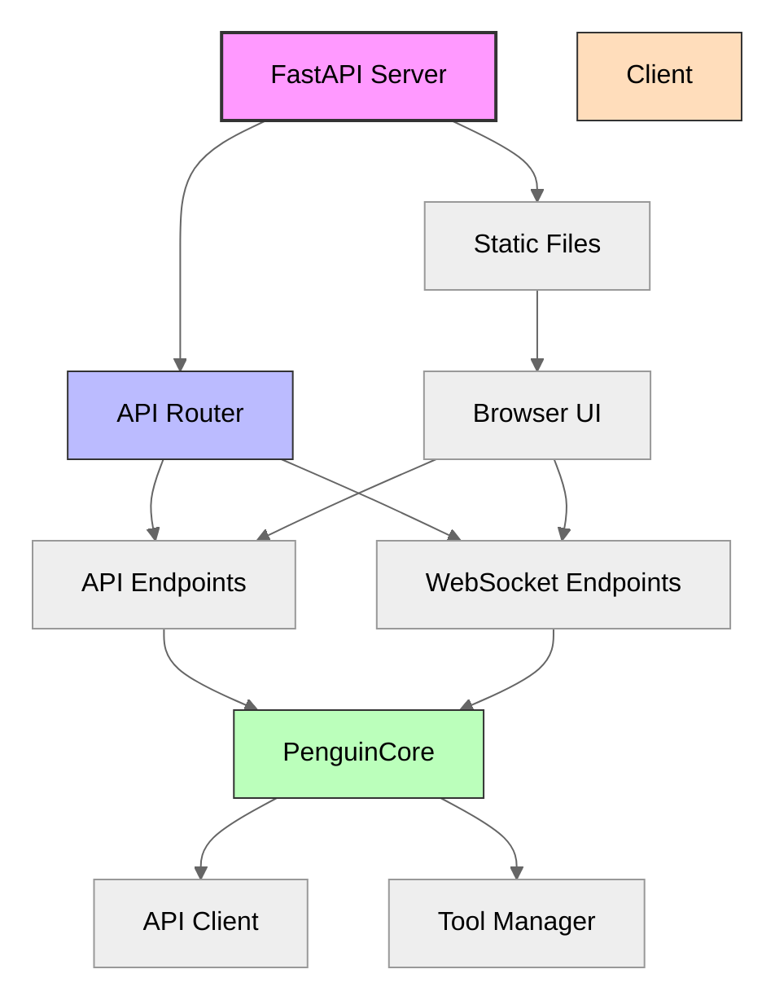
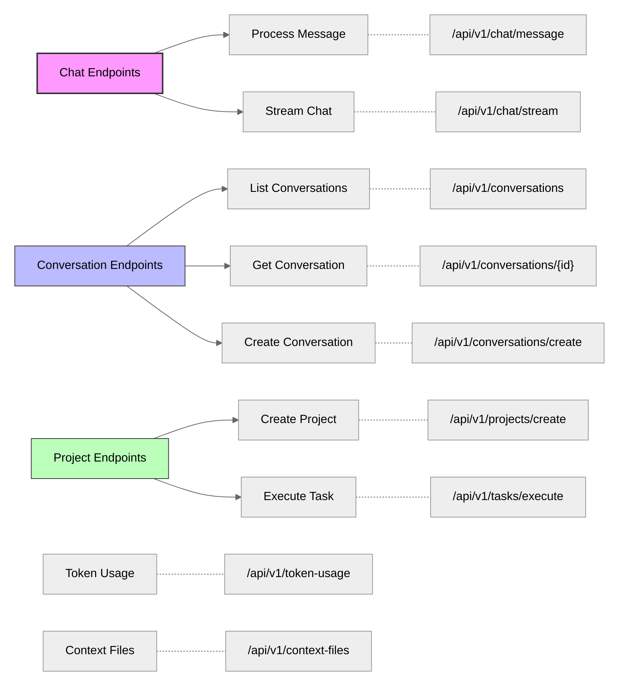
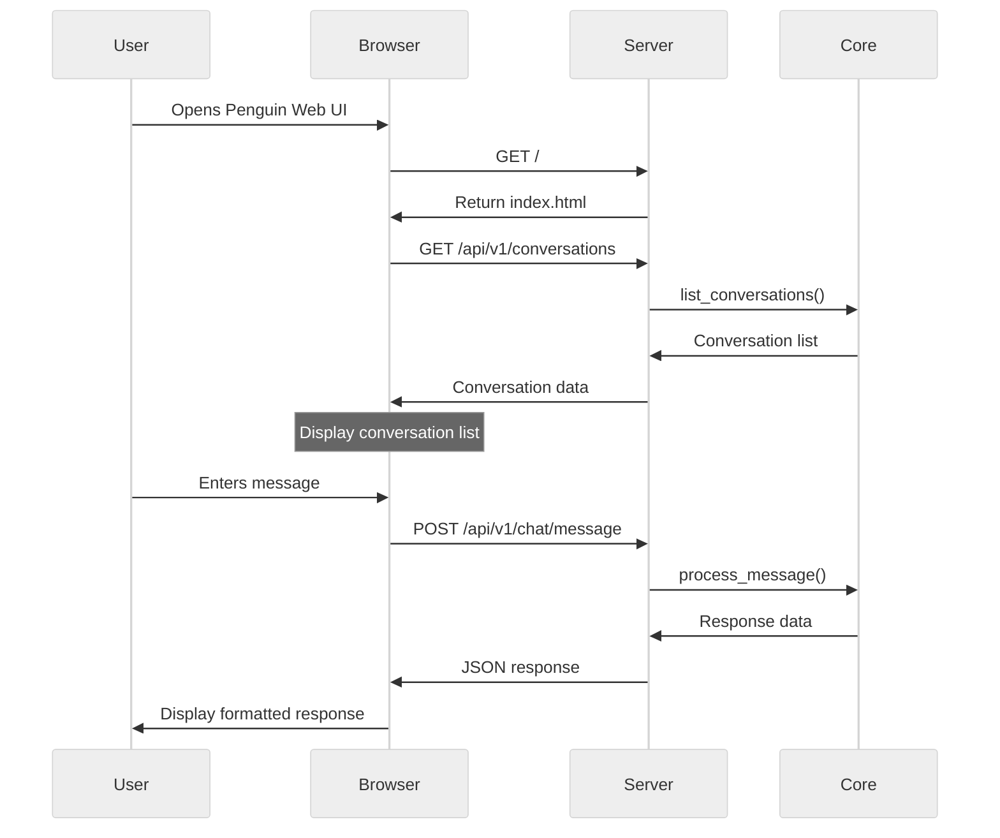

# API Server

The Penguin API Server provides a web-based interface for interacting with the Penguin AI agent, enabling both programmatic access and a browser-based user interface.

## Architecture



## Server Initialization

The API server is built using FastAPI and initializes the core components using a factory pattern with reusable core instances:

```python
def create_app() -> FastAPI:
    """Create and configure the FastAPI application."""
    app = FastAPI(
        title="Penguin AI",
        description="AI Assistant with reasoning, memory, and tool use capabilities",
        version=__version__,
        docs_url="/api/docs",
        redoc_url="/api/redoc"
    )

    # Configure CORS with environment-based origins
    origins_env = os.getenv("PENGUIN_CORS_ORIGINS", "").strip()
    origins_list = [o.strip() for o in origins_env.split(",") if o.strip()] or ["*"]
    app.add_middleware(
        CORSMiddleware,
        allow_origins=origins_list,
        allow_credentials=True,
        allow_methods=["*"],
        allow_headers=["*"],
    )

    # Initialize or reuse core instance
    core = get_or_create_core()
    router.core = core
    github_webhook_router.core = core

    # Include API routes
    app.include_router(router)
    app.include_router(github_webhook_router)

    # Mount static files for web UI
    static_dir = Path(__file__).parent / "static"
    if static_dir.exists():
        app.mount("/static", StaticFiles(directory=str(static_dir)), name="static")

    return app
```

### Core Instance Management

The server uses a global core instance pattern for efficient resource usage:

```python
_core_instance: Optional[PenguinCore] = None

def get_or_create_core() -> PenguinCore:
    """Get the global core instance or create it if it doesn't exist."""
    global _core_instance
    if _core_instance is None:
        _core_instance = _create_core()
    return _core_instance
```

## API Endpoints



### Chat Endpoints

#### POST `/api/v1/chat/message`

Process a chat message with optional conversation support, multi-modal capabilities, and agent routing.

**Request Body:**
```json
{
  "text": "Hello, how can you help me with Python development?",
  "conversation_id": "optional-conversation-id",
  "agent_id": "code-expert",
  "context": {"key": "value"},
  "context_files": ["path/to/file1.py", "path/to/file2.py"],
  "streaming": true,
  "max_iterations": 5,
  "image_path": "/path/to/image.png",
  "include_reasoning": false
}
```

**Parameters:**
- `text` (required): The message content
- `conversation_id` (optional): Continue an existing conversation
- `agent_id` (optional): Route to a specific agent
- `context` (optional): Additional context dictionary
- `context_files` (optional): Files to load as context
- `streaming` (optional): Enable streaming response (default: true)
- `max_iterations` (optional): Maximum reasoning iterations (default: 5)
- `image_path` (optional): Path to image for vision models
- `include_reasoning` (optional): Include reasoning content in response

**Response:**
```json
{
  "response": "I can help you with Python development in several ways...",
  "action_results": [
    {
      "action": "code_execution",
      "result": "Execution result...",
      "status": "completed"
    }
  ],
  "reasoning": "First, I'll analyze the requirements..."
}
```

**New Features:**
- `agent_id`: Route messages to specific agents for specialized handling
- `include_reasoning`: Capture extended reasoning for reasoning-capable models
- Enhanced streaming with reasoning support
- Improved error handling and response consistency
- Per-agent conversation tracking

#### WebSocket `/api/v1/chat/stream`

Stream chat responses in real-time with support for reasoning models and multiple agents.

**Connection:**
```javascript
const ws = new WebSocket('ws://localhost:8000/api/v1/chat/stream');
```

**Send Message:**
```json
{
  "text": "Explain this code",
  "agent_id": "code-expert",
  "conversation_id": "conv_123",
  "include_reasoning": true,
  "max_iterations": 5,
  "context_files": ["main.py"]
}
```

**WebSocket Events:**
- `start`: Response stream started
- `token`: Individual content tokens (coalesced for performance)
  ```json
  {"event": "token", "data": {"token": "Hello"}}
  ```
- `reasoning`: Reasoning tokens (if `include_reasoning: true`)
  ```json
  {"event": "reasoning", "data": {"token": "Analyzing code structure..."}}
  ```
- `progress`: Iteration progress updates
  ```json
  {"event": "progress", "data": {"iteration": 2, "max_iterations": 5}}
  ```
- `complete`: Final response with all results
  ```json
  {
    "event": "complete",
    "data": {
      "response": "Complete response text...",
      "action_results": [...],
      "reasoning": "Full reasoning content..."
    }
  }
  ```
- `error`: Error information
  ```json
  {"event": "error", "data": {"message": "Error details"}}
  ```

**Features:**
- Token coalescing for improved UI performance (5-character buffer)
- Separate reasoning token stream for reasoning-capable models
- Progress tracking for multi-iteration processing
- Agent-scoped conversations
- Automatic buffer flushing on timeout (100ms)

### Multi-Agent Endpoints

Penguin now supports multi-agent orchestration with per-agent conversations, model configs, and tool defaults.

#### GET `/api/v1/agents`

List all registered agents with their configurations.

**Query Parameters:**
- `simple`: Return simplified agent list (optional, default: false)

**Response:**
```json
[
  {
    "id": "default",
    "persona": null,
    "persona_description": null,
    "model": {
      "model": "openai/gpt-5",
      "provider": "openai",
      "max_tokens": 399000
    },
    "parent": null,
    "children": ["sub-agent-1"],
    "default_tools": ["file_read", "bash"],
    "active": true,
    "paused": false,
    "is_sub_agent": false
  }
]
```

#### POST `/api/v1/agents`

Create a new agent with optional model config and persona.

**Request Body:**
```json
{
  "id": "code-reviewer",
  "model_config_id": "claude-opus",
  "persona": "code-review-expert",
  "system_prompt": "You are a code review expert...",
  "activate": true,
  "default_tools": ["file_read", "grep"],
  "initial_prompt": "Ready to review code"
}
```

**Response:**
```json
{
  "id": "code-reviewer",
  "persona": "code-review-expert",
  "model": {
    "model": "anthropic/claude-opus-20240229",
    "provider": "anthropic"
  },
  "active": true
}
```

#### GET `/api/v1/agents/{agent_id}`

Get detailed information about a specific agent.

#### PATCH `/api/v1/agents/{agent_id}`

Update agent state (e.g., pause/resume).

**Request Body:**
```json
{
  "paused": true
}
```

#### DELETE `/api/v1/agents/{agent_id}`

Remove an agent from the registry.

**Query Parameters:**
- `preserve_conversation`: Keep conversation history (default: true)

#### POST `/api/v1/agents/{agent_id}/delegate`

Delegate a task to a specific agent (parent→child delegation pattern).

**Request Body:**
```json
{
  "content": "Review this code for security issues",
  "parent": "default",
  "channel": "code-review",
  "metadata": {"priority": "high"}
}
```

#### GET `/api/v1/agents/{agent_id}/history`

Get conversation history for a specific agent.

**Query Parameters:**
- `include_system`: Include system messages (default: true)
- `limit`: Maximum number of messages

#### GET `/api/v1/agents/{agent_id}/sessions`

List all sessions for a specific agent.

#### GET `/api/v1/agents/{agent_id}/sessions/{session_id}/history`

Get history for a specific agent session.

### Message Routing Endpoints

#### POST `/api/v1/messages`

Send a message to a specific recipient (agent or human).

**Request Body:**
```json
{
  "recipient": "code-reviewer",
  "content": "Please review this PR",
  "message_type": "message",
  "channel": "code-review",
  "metadata": {"pr_id": "123"}
}
```

#### POST `/api/v1/messages/to-agent`

Send a message directly to an agent.

#### POST `/api/v1/messages/to-human`

Send a message to the human user (for agent-initiated communication).

#### POST `/api/v1/messages/human-reply`

Send a human reply to a specific agent.

### WebSocket Event Stream

#### WebSocket `/api/v1/events/ws`

Stream real-time events from agents and system with filtering.

**Query Parameters:**
- `agent_id`: Filter by agent ID (optional)
- `message_type`: Filter by message type (message|action|status)
- `channel`: Filter by channel (optional)
- `include_ui`: Include UI events (default: true)
- `include_bus`: Include MessageBus events (default: true)

**Event Types:**
- `bus.message`: MessageBus protocol messages
- `message`: User/assistant messages
- `stream_chunk`: Streaming response chunks
- `human_message`: Messages to human user

#### WebSocket `/api/v1/ws/messages`

Alias of `/api/v1/events/ws` for message streaming (backward compatibility).

### Telemetry Endpoints

#### GET `/api/v1/telemetry`

Get comprehensive telemetry summary including per-agent token usage.

**Response:**
```json
{
  "agents": {
    "default": {
      "messages_sent": 42,
      "tasks_completed": 5
    }
  },
  "tokens": {
    "total": {"prompt": 15000, "completion": 8000},
    "per_agent": {
      "default": {"prompt": 12000, "completion": 6000},
      "code-reviewer": {"prompt": 3000, "completion": 2000}
    }
  },
  "uptime_seconds": 3600
}
```

#### WebSocket `/api/v1/ws/telemetry`

Stream telemetry updates in real-time.

**Query Parameters:**
- `agent_id`: Filter by agent ID (optional)
- `interval`: Update interval in seconds (default: 2)

### Multi-Agent Coordinator Endpoints

The coordinator provides role-based routing and workflow orchestration across agents.

#### POST `/api/v1/coord/send-role`

Send a message to all agents with a specific role.

**Request Body:**
```json
{
  "role": "code-reviewer",
  "content": "Review the latest commit",
  "message_type": "message"
}
```

#### POST `/api/v1/coord/broadcast`

Broadcast a message to multiple roles simultaneously.

**Request Body:**
```json
{
  "roles": ["code-reviewer", "tester"],
  "content": "New PR ready for review",
  "message_type": "message"
}
```

#### POST `/api/v1/coord/rr-workflow`

Execute a round-robin workflow across agents with a specific role.

**Request Body:**
```json
{
  "role": "worker",
  "prompts": [
    "Process task 1",
    "Process task 2",
    "Process task 3"
  ]
}
```

#### POST `/api/v1/coord/role-chain`

Execute a sequential workflow across different roles.

**Request Body:**
```json
{
  "roles": ["analyzer", "implementer", "tester"],
  "content": "Implement feature X with full testing"
}
```

#### POST `/api/v1/agents/{agent_id}/register`

Register an existing agent with a coordinator role.

**Request Body:**
```json
{
  "role": "code-reviewer"
}
```

### GitHub Integration Endpoints

Penguin includes built-in GitHub webhook support for automated workflows.

#### POST `/api/v1/github/webhook`

Receive GitHub webhook events (configured in GitHub repository settings).

**Supported Events:**
- `push`: Code push events
- `pull_request`: PR creation, updates, and merges
- `issues`: Issue creation and updates
- `issue_comment`: Comments on issues
- `pull_request_review`: PR reviews
- `workflow_run`: GitHub Actions workflow results

**Event Processing:**
The webhook handler automatically:
1. Validates webhook signatures (if `GITHUB_WEBHOOK_SECRET` is set)
2. Routes events to appropriate agents based on configuration
3. Triggers automated analysis, review, or response workflows
4. Logs events for debugging and auditing

**Configuration:**
Set these environment variables:
```bash
GITHUB_WEBHOOK_SECRET=your-webhook-secret
GITHUB_APP_ID=your-app-id  # Optional
GITHUB_APP_PRIVATE_KEY_PATH=/path/to/key.pem  # Optional
```

### Conversation Endpoints

#### GET `/api/v1/conversations`

List all available conversations.

#### GET `/api/v1/conversations/{conversation_id}`

Retrieve a specific conversation by ID.

#### GET `/api/v1/conversations/{conversation_id}/history`

Get the message history for a specific conversation.

**Query Parameters:**
- `include_system`: Include system messages (default: true)
- `limit`: Maximum number of messages
- `agent_id`: Filter by agent ID (optional)
- `channel`: Filter by channel (optional)
- `message_type`: Filter by message type (optional)

#### POST `/api/v1/conversations/create`

Create a new conversation.

### Project Management

#### POST `/api/v1/projects/create`

Create a new project.

**Request Body:**
```json
{
  "name": "My New Project",
  "description": "Optional project description"
}
```

#### POST `/api/v1/tasks/execute`

Execute a task in the background.

**Request Body:**
```json
{
  "name": "Task name",
  "description": "Task description",
  "continuous": false,
  "time_limit": 30
}
```

### Utility Endpoints

#### GET `/api/v1/token-usage`

Get current token usage statistics.

#### GET `/api/v1/context-files`

List all available context files.

#### POST `/api/v1/context-files/load`

Load a context file into the current conversation.

**Request Body:**
```json
{
  "file_path": "path/to/context/file.md"
}
```

### Checkpoint Management

Penguin now supports conversation checkpointing for branching and rollback functionality.

#### POST `/api/v1/checkpoints/create`

Create a manual checkpoint of the current conversation state.

**Request Body:**
```json
{
  "name": "Before refactoring",
  "description": "Checkpoint before starting code refactoring"
}
```

**Response:**
```json
{
  "checkpoint_id": "ckpt_abc123",
  "status": "created",
  "name": "Before refactoring",
  "description": "Checkpoint before starting code refactoring"
}
```

#### GET `/api/v1/checkpoints`

List available checkpoints with optional filtering.

**Query Parameters:**
- `session_id`: Filter by session ID (optional)
- `limit`: Maximum number of checkpoints (default: 50)

**Response:**
```json
{
  "checkpoints": [
    {
      "id": "ckpt_abc123",
      "name": "Before refactoring",
      "description": "Checkpoint before starting code refactoring",
      "created_at": "2024-01-01T10:00:00Z",
      "type": "manual",
      "session_id": "session_xyz"
    }
  ]
}
```

#### POST `/api/v1/checkpoints/{checkpoint_id}/rollback`

Rollback conversation to a specific checkpoint.

**Response:**
```json
{
  "status": "success",
  "checkpoint_id": "ckpt_abc123",
  "message": "Successfully rolled back to checkpoint ckpt_abc123"
}
```

#### POST `/api/v1/checkpoints/{checkpoint_id}/branch`

Create a new conversation branch from a checkpoint.

**Request Body:**
```json
{
  "name": "Alternative approach",
  "description": "Exploring different solution path"
}
```

**Response:**
```json
{
  "branch_id": "conv_branch_xyz",
  "source_checkpoint_id": "ckpt_abc123",
  "status": "created",
  "name": "Alternative approach",
  "description": "Exploring different solution path"
}
```

#### GET `/api/v1/checkpoints/stats`

Get statistics about the checkpointing system.

**Response:**
```json
{
  "enabled": true,
  "total_checkpoints": 25,
  "auto_checkpoints": 20,
  "manual_checkpoints": 4,
  "branch_checkpoints": 1,
  "config": {
    "frequency": 1,
    "retention_hours": 24,
    "max_age_days": 30
  }
}
```

#### POST `/api/v1/checkpoints/cleanup`

Clean up old checkpoints according to retention policy.

**Response:**
```json
{
  "status": "completed",
  "cleaned_count": 5,
  "message": "Cleaned up 5 old checkpoints"
}
```

### Model Management

Penguin supports runtime model switching and model discovery.

#### GET `/api/v1/models`

List all available models from configuration.

**Response:**
```json
{
  "models": [
    {
      "id": "claude-3-sonnet",
      "name": "anthropic/claude-3-sonnet-20240229",
      "provider": "anthropic",
      "vision_enabled": true,
      "max_tokens": 4000,
      "current": true
    },
    {
      "id": "gpt-4",
      "name": "openai/gpt-4",
      "provider": "openai",
      "vision_enabled": false,
      "max_tokens": 8000,
      "current": false
    }
  ]
}
```

#### POST `/api/v1/models/load`

Switch to a different model at runtime.

**Request Body:**
```json
{
  "model_id": "gpt-4"
}
```

**Response:**
```json
{
  "status": "success",
  "model_id": "gpt-4",
  "current_model": "openai/gpt-4",
  "message": "Successfully loaded model: gpt-4"
}
```

#### GET `/api/v1/models/current`

Get information about the currently loaded model.

**Response:**
```json
{
  "model": "anthropic/claude-3-sonnet-20240229",
  "provider": "anthropic",
  "client_preference": "native",
  "max_tokens": 4000,
  "temperature": 0.7,
  "streaming_enabled": true,
  "vision_enabled": true
}
```

#### GET `/api/v1/models/discover`

Discover available models from OpenRouter catalogue (requires `OPENROUTER_API_KEY`).

**Response:**
```json
{
  "models": [
    {
      "id": "anthropic/claude-3-opus-20240229",
      "name": "Claude 3 Opus",
      "provider": "anthropic",
      "context_length": 200000,
      "max_output_tokens": 4096,
      "pricing": {
        "prompt": "0.000015",
        "completion": "0.000075"
      }
    },
    {
      "id": "openai/gpt-4-turbo",
      "name": "GPT-4 Turbo",
      "provider": "openai",
      "context_length": 128000,
      "max_output_tokens": 4096,
      "pricing": {
        "prompt": "0.00001",
        "completion": "0.00003"
      }
    }
  ]
}
```

**Configuration:**
Set environment variables for attribution:
```bash
OPENROUTER_API_KEY=your-key
OPENROUTER_SITE_URL=https://your-app.com  # Optional
OPENROUTER_SITE_TITLE=YourAppName  # Optional
```

### Enhanced Task Execution

#### POST `/api/v1/tasks/execute-sync`

Execute a task synchronously using the Engine layer with enhanced error handling.

**Request Body:**
```json
{
  "name": "Create API endpoint",
  "description": "Create a REST API endpoint for user management",
  "continuous": false,
  "time_limit": 300
}
```

**Response:**
```json
{
  "status": "completed",
  "response": "I've created a REST API endpoint for user management...",
  "iterations": 3,
  "execution_time": 45.2,
  "action_results": [
    {
      "action": "file_creation",
      "result": "Created api/users.py",
      "status": "completed"
    }
  ],
  "task_metadata": {
    "name": "Create API endpoint",
    "continuous": false
  }
}
```

#### WebSocket `/api/v1/tasks/stream`

Stream task execution events in real-time for long-running tasks.

**WebSocket Events:**
- `start`: Task execution started
- `progress`: Progress updates during execution
- `action`: Individual action execution results
- `complete`: Task completed successfully
- `error`: Error occurred during execution

### System Diagnostics

#### GET `/api/v1/system/info`

Get comprehensive system information including component status.

**Response:**
```json
{
  "penguin_version": "0.3.0",
  "engine_available": true,
  "checkpoints_enabled": true,
  "current_model": {
    "model": "anthropic/claude-3-sonnet-20240229",
    "provider": "anthropic",
    "streaming_enabled": true,
    "vision_enabled": true
  },
  "conversation_manager": {
    "active": true,
    "current_session_id": "session_xyz",
    "total_messages": 42
  },
  "tool_manager": {
    "active": true,
    "total_tools": 15
  },
  "memory_provider": {
    "initialized": true,
    "provider_type": "LanceProvider"
  }
}
```

#### GET `/api/v1/system/status`

Get current system status and runtime information.

**Response:**
```json
{
  "status": "active",
  "runmode_status": "RunMode idle.",
  "continuous_mode": false,
  "streaming_active": false,
  "token_usage": {
    "total": {"input": 1500, "output": 800},
    "session": {"input": 300, "output": 150}
  },
  "timestamp": "2024-01-01T12:00:00Z",
  "initialization": {
    "core_initialized": true,
    "fast_startup_enabled": true
  }
}
```

### Enhanced Capabilities Discovery

#### GET `/api/v1/capabilities`

Get comprehensive model and system capabilities.

**Response:**
```json
{
  "capabilities": {
    "vision_enabled": true,
    "streaming_enabled": true,
    "checkpoint_management": true,
    "model_switching": true,
    "file_upload": true,
    "websocket_support": true,
    "task_execution": true,
    "run_mode": true,
    "multi_modal": true,
    "context_files": true
  },
  "current_model": {
    "model": "anthropic/claude-3-sonnet-20240229",
    "provider": "anthropic",
    "vision_enabled": true
  },
  "api_version": "v1",
  "penguin_version": "0.3.0"
}
```

### File Upload and Multi-Modal Support

#### POST `/api/v1/upload`

Upload files (primarily images) for use in conversations.

**Request Body:** (multipart/form-data)
- `file`: The file to upload

**Response:**
```json
{
  "path": "/workspace/uploads/abc123.png",
  "filename": "image.png",
  "content_type": "image/png"
}
```

## Web Interface

Penguin includes a simple web-based chat interface for interacting with the assistant directly in the browser.



### Web UI Features

The browser interface provides a simple chat experience with:

- Conversation history management
- Markdown rendering for formatted responses
- Code syntax highlighting
- Real-time updates
- Conversation switching and creation

## PenguinAPI - Programmatic Access

The `PenguinAPI` class provides a Python interface for embedding Penguin in other applications:

```python
from penguin.web import PenguinAPI

# Create API instance (reuses or creates core)
api = PenguinAPI()

# Send a message with streaming
response = await api.chat(
    message="Help me debug this function",
    agent_id="code-expert",
    streaming=True,
    include_reasoning=True,
    on_chunk=lambda chunk, msg_type: print(f"[{msg_type}] {chunk}")
)

print(response["assistant_response"])
print(response["reasoning"])

# Stream responses
async for msg_type, chunk in api.stream_chat(
    message="Explain this code",
    agent_id="code-expert"
):
    print(f"[{msg_type}] {chunk}", end="")

# Manage conversations
conversation_id = await api.create_conversation(name="Debug Session")
conversations = await api.list_conversations()
history = await api.get_conversation_history(conversation_id)

# Execute tasks via Engine
result = await api.run_task(
    task_description="Implement user authentication",
    max_iterations=10,
    project_id="my-project"
)
```

### Key Features

- **Async/Await Support**: Full async support for non-blocking operations
- **Streaming Callbacks**: Real-time token streaming with `on_chunk` callback
- **Agent Routing**: Direct messages to specific agents via `agent_id`
- **Reasoning Support**: Capture extended reasoning with `include_reasoning`
- **Conversation Management**: Create, list, and manage conversation history
- **Task Execution**: High-level task execution via Engine layer
- **Health Monitoring**: Check system health and component status

## Integration with Core Components

The API server integrates with Penguin's core components using a factory pattern:

```python
def _create_core() -> PenguinCore:
    """Create a new PenguinCore instance with proper configuration."""
    config_obj = Config.load_config()
    model_config = config_obj.model_config

    # Initialize components
    api_client = APIClient(model_config=model_config)
    api_client.set_system_prompt(SYSTEM_PROMPT)

    config_dict = config_obj.to_dict() if hasattr(config_obj, 'to_dict') else {}
    tool_manager = ToolManager(config_dict, log_error)

    # Create core with proper Config object
    core = PenguinCore(
        config=config_obj,
        api_client=api_client,
        tool_manager=tool_manager,
        model_config=model_config
    )

    return core
```

This integration ensures:

1. **ModelConfig**: Configures model behavior with provider abstraction
2. **APIClient**: Handles LLM communication with streaming and reasoning support
3. **ToolManager**: Executes tools with lazy loading and fast startup
4. **PenguinCore**: Coordinates multi-agent system with event-driven architecture
5. **ConversationManager**: Manages per-agent sessions with checkpointing
6. **Engine**: Provides high-level task orchestration and stop conditions

## Running the Server

### Command Line

Start the server using the CLI:

```bash
# Using the penguin-web command
penguin-web

# Or using Python module
python -m penguin.web.server
```

### Programmatic Startup

Start the server from Python code:

```python
from penguin.web import start_server

# Start with custom settings
start_server(
    host="0.0.0.0",
    port=8000,
    debug=False  # Enable auto-reload in development
)
```

### Environment Variables

Configure the server via environment variables:

```bash
# Server settings
HOST=0.0.0.0
PORT=8000
DEBUG=false

# CORS configuration
PENGUIN_CORS_ORIGINS=http://localhost:3000,https://myapp.com

# GitHub webhook integration
GITHUB_WEBHOOK_SECRET=your-secret
GITHUB_APP_ID=123456
GITHUB_APP_PRIVATE_KEY_PATH=/path/to/key.pem

# Model configuration
OPENROUTER_API_KEY=your-key  # For model discovery
```

### Access Points

By default, the server runs on port 8000 and provides:

- **Web UI**: http://localhost:8000/
- **API Documentation (Swagger)**: http://localhost:8000/api/docs
- **API Documentation (ReDoc)**: http://localhost:8000/api/redoc
- **GitHub Webhook**: http://localhost:8000/api/v1/github/webhook
- **WebSocket Events**: ws://localhost:8000/api/v1/events/ws
- **WebSocket Chat**: ws://localhost:8000/api/v1/chat/stream

## API Documentation

FastAPI automatically generates OpenAPI documentation for all endpoints, available at:
- Swagger UI: http://localhost:8000/api/docs
- ReDoc: http://localhost:8000/api/redoc