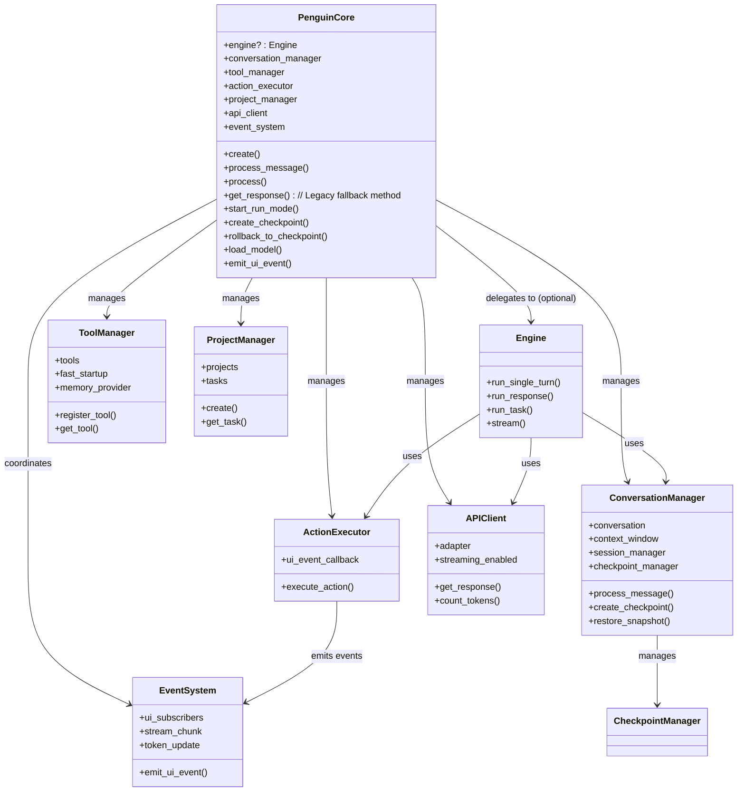
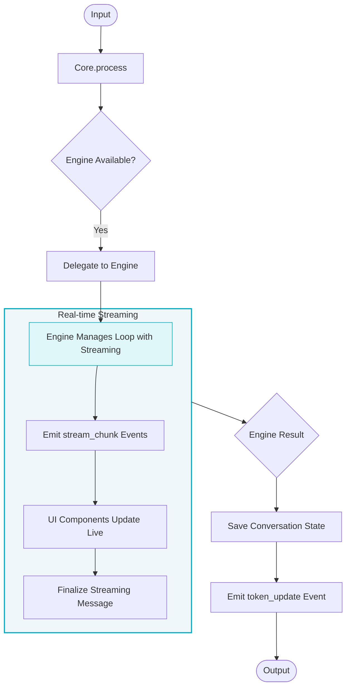
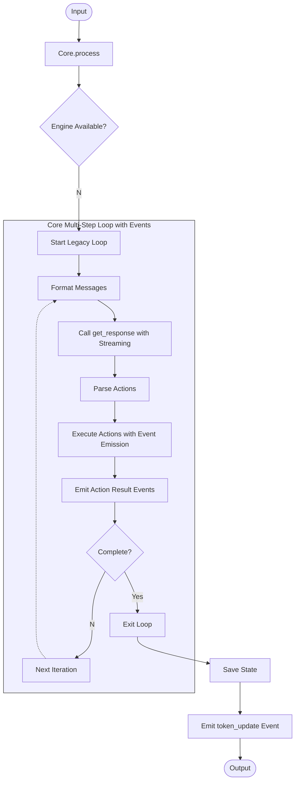

# Core API Reference

The `PenguinCore` class serves as the central coordinator for the entire Penguin AI assistant, orchestrating interactions between various subsystems with event-driven architecture and advanced conversation management.

## Overview

PenguinCore v0.3.3.3.post1 acts as an integration point between:
- **Engine (Optional)**: A high-level coordinator for reasoning/action loops (used when available).
- **ConversationManager**: Handles messages, context, conversation state, and checkpointing.
- **ToolManager**: Provides access to available tools and actions with lazy initialization.
- **ActionExecutor**: Executes actions and processes results with UI event callbacks.
- **ProjectManager**: Manages projects and tasks with SQLite persistence.
- **APIClient**: Handles direct communication with LLMs with streaming support.
- **Event System**: Coordinates UI updates and real-time streaming across components.

Rather than implementing functionality directly, PenguinCore focuses on coordination. It initializes and holds references to these components. **Crucially, if the `Engine` is successfully initialized, `PenguinCore` delegates the primary reasoning and execution loops to it.** Otherwise, it falls back to managing the loop internally using `get_response`.

<!-- ## Key Features

- **Event-Driven Architecture**: Real-time streaming and UI updates via event system
- **Project Management**: 
- **Checkpoint Management**: Save, restore, and branch conversation states
- **Enhanced Token Management**: Context window optimization with category-based budgets
- **Fast Startup**: Optional deferred initialization for improved performance
- **Model Switching**: Runtime model switching with automatic configuration updates
- **Comprehensive Diagnostics**: Performance monitoring and startup reporting -->



## Processing Flow

The primary processing flow depends on whether the `Engine` is available, with enhanced event-driven streaming and real-time UI updates.

**With Engine (Preferred):**



**Without Engine (Legacy Fallback):**



## Event System

PenguinCore includes a comprehensive event system for real-time UI updates and streaming coordination:

- **`stream_chunk`**: Real-time streaming content with message type and role information
- **`token_update`**: Token usage updates for UI display
- **`message`**: User and assistant message events
- **`status`**: Status updates for UI components
- **`error`**: Error events with source and details

Events are emitted throughout the processing pipeline to enable live UI updates in CLI, web interface, and other clients.

## Factory Method

```python
@classmethod
async def create(
    cls,
    config: Optional[Config] = None,
    model: Optional[str] = None,
    provider: Optional[str] = None,
    workspace_path: Optional[str] = None,
    enable_cli: bool = False,
) -> Union["PenguinCore", Tuple["PenguinCore", "PenguinCLI"]]
```

Creates a new PenguinCore instance with optional CLI. This method handles the initialization of all subsystems, **including attempting to initialize the `Engine`**.

`create` reads standard environment variables to load API keys and defaults. Common variables include `OPENROUTER_API_KEY`, `OPENAI_API_KEY`, `ANTHROPIC_API_KEY`, and optional overrides such as `PENGUIN_MODEL`, `PENGUIN_PROVIDER`, `PENGUIN_CLIENT_PREFERENCE`, and `PENGUIN_API_BASE`.

## Core Methods

### Execution Root (ToolManager)
File tools and command execution operate against an “execution root” that is separate from Penguin’s workspace:

- Project root: the current repo (CWD/git root) for edits, shell commands, diffs, and code analysis
- Workspace root: assistant state (conversations, notes, logs, memory) under `WORKSPACE_PATH`

Selection precedence:
- CLI flag: `--root project|workspace`
- Env var: `PENGUIN_WRITE_ROOT=project|workspace`
- Config: `defaults.write_root`
- Default: `project`

The CLI prints the active root at startup. Tools can switch roots at runtime via:
```python
tm.set_execution_root("project")  # or "workspace"
```

### `__init__`

```python
def __init__(
    self,
    config: Optional[Config] = None,
    api_client: Optional[APIClient] = None,
    tool_manager: Optional[ToolManager] = None,
    model_config: Optional[ModelConfig] = None
)
```

Initializes the core with configuration and required components. **This constructor is also responsible for attempting to create and store the `Engine` instance (`self.engine`).**

### `process_message`

```python
async def process_message(
    self,
    message: str,
    context: Optional[Dict[str, Any]] = None,
    conversation_id: Optional[str] = None,
    context_files: Optional[List[str]] = None,
    streaming: bool = False
) -> str
```

Processes a user message primarily through the `ConversationManager`. This is a simplified interface, potentially bypassing the `Engine` for basic exchanges, focusing on conversation history management and direct LLM calls via `ConversationManager`.

### `process`

```python
async def process(
    self,
    input_data: Union[Dict[str, Any], str],
    context: Optional[Dict[str, Any]] = None,
    conversation_id: Optional[str] = None,
    max_iterations: int = 5, # Note: max_iterations primarily relevant for legacy fallback
    context_files: Optional[List[str]] = None,
    streaming: Optional[bool] = None,
    stream_callback: Optional[Callable[[str], None]] = None # Note: Used by Engine/APIClient
) -> Dict[str, Any]
```

**Primary interface for processing input.** If `self.engine` is available, this method **delegates the execution** to `Engine.run_single_turn` or potentially `Engine.run_task` based on internal logic or future configuration. If the `Engine` is not available, it falls back to the legacy multi-step loop managed within `PenguinCore` itself, using `get_response` iteratively. Returns a dictionary containing the assistant's final response and any accumulated action results.

### `get_response`

```python
async def get_response(
    self,
    current_iteration: Optional[int] = None,
    max_iterations: Optional[int] = None,
    stream_callback: Optional[Callable[[str], None]] = None,
    streaming: Optional[bool] = None
) -> Tuple[Dict[str, Any], bool]
```

**Legacy Fallback Method.** Generates one turn of response using the current conversation context and executes actions found within that response. This method is primarily used **internally by the legacy processing loop** when the `Engine` is not available. It directly calls the `APIClient` and `ActionExecutor`. Returns the response data for the *single turn* and a continuation flag (e.g., if `TASK_COMPLETION_PHRASE` is found).

### `start_run_mode`

```python
async def start_run_mode(
    self,
    name: Optional[str] = None,
    description: Optional[str] = None,
    context: Optional[Dict[str, Any]] = None,
    continuous: bool = False,
    time_limit: Optional[int] = None,
    mode_type: str = "task",
    stream_callback_for_cli: Optional[Callable[[str], Awaitable[None]]] = None,
    ui_update_callback_for_cli: Optional[Callable[[], Awaitable[None]]] = None
) -> None
```

Starts autonomous run mode by creating and running a `RunMode` instance. The `RunMode` instance will internally use `self.engine` if available.

**Parameters**

- `name` – Name of the task to run.
- `description` – Optional description when creating a new task.
- `context` – Extra context passed to the task.
- `continuous` – Run continuously rather than a single task.
- `time_limit` – Optional time limit in minutes.
- `mode_type` – Either `"task"` or `"project"`.
- `stream_callback_for_cli` – Async callback for streaming output in the CLI.
- `ui_update_callback_for_cli` – Async callback to refresh CLI UI elements.

## Checkpoint Management

### `create_checkpoint`

```python
async def create_checkpoint(
    self,
    name: Optional[str] = None,
    description: Optional[str] = None
) -> Optional[str]
```

Creates a checkpoint of the current conversation state.

**Parameters**

- `name` – Optional name for the checkpoint
- `description` – Optional description

**Returns**: Checkpoint ID if successful, None otherwise

### `rollback_to_checkpoint`

```python
async def rollback_to_checkpoint(self, checkpoint_id: str) -> bool
```

Rollbacks conversation to a specific checkpoint.

**Parameters**

- `checkpoint_id` – ID of the checkpoint to rollback to

**Returns**: True if successful, False otherwise

### `branch_from_checkpoint`

```python
async def branch_from_checkpoint(
    self,
    checkpoint_id: str,
    name: Optional[str] = None,
    description: Optional[str] = None
) -> Optional[str]
```

Creates a new conversation branch from a checkpoint.

**Parameters**

- `checkpoint_id` – ID of the checkpoint to branch from
- `name` – Optional name for the branch
- `description` – Optional description

**Returns**: New branch checkpoint ID if successful, None otherwise

### `list_checkpoints`

```python
def list_checkpoints(
    self,
    session_id: Optional[str] = None,
    limit: int = 50
) -> List[Dict[str, Any]]
```

Lists available checkpoints with optional filtering.

**Parameters**

- `session_id` – Filter by session ID
- `limit` – Maximum number of checkpoints to return

**Returns**: List of checkpoint information

## Model Management

### `load_model`

```python
async def load_model(self, model_id: str) -> bool
```

Switches to a different model at runtime with automatic configuration updates.

**Parameters**

- `model_id` – Model identifier (e.g., "anthropic/claude-3-5-sonnet-20240620")

**Returns**: True if successful, False otherwise

**Features**:

- Fetches model specifications from OpenRouter API
- Updates context window settings automatically
- Supports both explicit config models and provider/model format
- Updates config.yml with new model settings

## Event System Methods

### `emit_ui_event`

```python
async def emit_ui_event(self, event_type: str, data: Dict[str, Any]) -> None
```

Emits UI events to all registered subscribers.

**Parameters**

- `event_type` – Type of event (stream_chunk, token_update, message, etc.)
- `data` – Event data relevant to the event type

### `register_ui`

```python
def register_ui(self, handler: Callable[[str, Dict[str, Any]], Any]) -> None
```

Registers a UI component to receive events.

**Parameters**

- `handler` – Function or coroutine to handle events

### `unregister_ui`

```python
def unregister_ui(self, handler: EventHandler) -> None
```

Unregisters a UI component from receiving events.

**Parameters**

- `handler` – Handler function to remove

## Conversation Management

### `list_conversations`

```python
def list_conversations(self, limit: int = 20, offset: int = 0) -> List[Dict[str, Any]]
```

Lists available conversations with pagination.

### `get_conversation`

```python
def get_conversation(self, conversation_id: str) -> Optional[Dict[str, Any]]
```

Gets a specific conversation by ID.

### `create_conversation`

```python
def create_conversation(self) -> str
```

Creates a new conversation and returns its ID.

### `delete_conversation`

```python
def delete_conversation(self, conversation_id: str) -> bool
```

Deletes a conversation by ID.

## State Management

### `reset_context`

```python
def reset_context(self) -> None
```

Resets conversation context and diagnostics.

### `reset_state`

```python
async def reset_state(self) -> None
```

Resets core state including messages, tools, and external resources.

## Properties

### `total_tokens_used`

```python
@property
def total_tokens_used(self) -> int
```

Gets total tokens used in current session.

### `get_token_usage`

```python
def get_token_usage(self) -> Dict[str, Dict[str, int]]
```

Gets detailed token usage statistics.

```python
stats = core.get_token_usage()
print(stats["session"]["prompt_tokens"], stats["session"]["completion_tokens"])
```

## Action Handling

### `execute_action`

```python
async def execute_action(self, action) -> Dict[str, Any]
```

Executes a single action via the `ActionExecutor`. **Note:** In the preferred flow (with Engine), action execution is handled within the `Engine`'s loop. This method might be used by the legacy fallback loop or potentially for direct action calls outside the main loops.

## Diagnostics and Performance

### `get_system_info`

```python
def get_system_info(self) -> Dict[str, Any]
```

Returns comprehensive system information including model config, component status, and capabilities.

### `get_system_status`

```python
def get_system_status(self) -> Dict[str, Any]
```

Returns current system status including runtime state and performance metrics.

### `get_startup_stats`

```python
def get_startup_stats(self) -> Dict[str, Any]
```

Returns comprehensive startup performance statistics and profiling data.

### `print_startup_report`

```python
def print_startup_report(self) -> None
```

Prints a comprehensive startup performance report to console.

### `enable_fast_startup_globally`

```python
def enable_fast_startup_globally(self) -> None
```

Enables fast startup mode for future operations by deferring heavy initialization.

### `get_memory_provider_status`

```python
def get_memory_provider_status(self) -> Dict[str, Any]
```

Returns current status of memory provider and indexing operations.

## Configuration and Model Management

### `list_available_models`

```python
def list_available_models(self) -> List[Dict[str, Any]]
```

Returns a list of model metadata derived from config.yml with current model highlighted.

### `get_current_model`

```python
def get_current_model(self) -> Optional[Dict[str, Any]]
```

Returns information about the currently loaded model including all configuration parameters.

### `get_token_usage`

```python
def get_token_usage(self) -> Dict[str, Dict[str, int]]
```

Returns detailed token usage statistics with enhanced structure for CLI and UI display.

## Usage Examples

### Basic Usage

```python
# Create a core instance with fast startup
core = await PenguinCore.create(fast_startup=True)

# Process a user message with streaming
response = await core.process(
    "Write a Python function to calculate factorial",
    streaming=True,
    stream_callback=my_callback
)
print(response['assistant_response'])
```

### Model Switching

```python
# Switch to a different model at runtime
success = await core.load_model("openai/gpt-4o")
if success:
    print(f"Switched to: {core.get_current_model()['model']}")
```

### Checkpoint Management

```python
# Create a checkpoint
checkpoint_id = await core.create_checkpoint(
    name="Before refactoring",
    description="Saving state before major changes"
)

# List available checkpoints
checkpoints = core.list_checkpoints(limit=10)

# Rollback to a previous state
success = await core.rollback_to_checkpoint(checkpoint_id)
```

### Event-Driven UI Integration

```python
# Register for real-time updates
def handle_stream_chunk(event_type, data):
    if event_type == "stream_chunk":
        print(f"Streaming: {data['chunk']}")

core.register_ui(handle_stream_chunk)

# Events will be emitted automatically during processing
response = await core.process("Hello!", streaming=True)
```

### Advanced Configuration

```python
# Get comprehensive system information
info = core.get_system_info()
print(f"Current model: {info['current_model']['model']}")
print(f"Context window: {info['current_model']['max_tokens']}")

# Enable diagnostics
core.print_startup_report()
```
