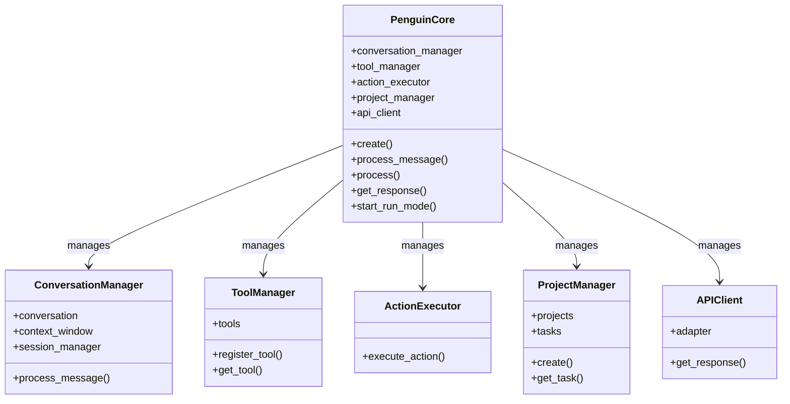
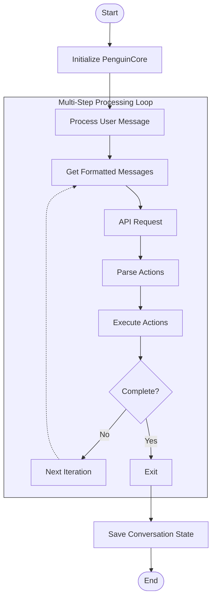

# Core API Reference

The `PenguinCore` class serves as the central coordinator for the entire Penguin AI assistant, orchestrating interactions between various subsystems.

## Overview

PenguinCore acts as an integration point between:
- **ConversationManager**: Handles messages, context, and conversation state
- **ToolManager**: Provides access to available tools and actions
- **ActionExecutor**: Executes actions and processes results
- **ProjectManager**: Manages projects and tasks

Rather than implementing functionality directly, PenguinCore focuses on coordination, delegating most functionality to specialized components.



## Processing Flow



## Factory Method

```python
@classmethod
async def create(
    cls,
    config: Optional[Config] = None,
    model: Optional[str] = None,
    provider: Optional[str] = None,
    workspace_path: Optional[str] = None,
    enable_cli: bool = False,
) -> Union["PenguinCore", Tuple["PenguinCore", "PenguinCLI"]]
```

Creates a new PenguinCore instance with optional CLI. This is the recommended way to initialize PenguinCore.

## Core Methods

### `__init__`

```python
def __init__(
    self,
    config: Optional[Config] = None,
    api_client: Optional[APIClient] = None,
    tool_manager: Optional[ToolManager] = None,
    model_config: Optional[ModelConfig] = None
)
```

Initializes the core with configuration and required components.

### `process_message`

```python
async def process_message(
    self,
    message: str,
    context: Optional[Dict[str, Any]] = None,
    conversation_id: Optional[str] = None,
    context_files: Optional[List[str]] = None,
    streaming: bool = False
) -> str
```

Processes a user message and returns a formatted response. This is a simplified interface for handling basic message exchanges.

### `process`

```python
async def process(
    self,
    input_data: Union[Dict[str, Any], str],
    context: Optional[Dict[str, Any]] = None,
    conversation_id: Optional[str] = None,
    max_iterations: int = 5,
    context_files: Optional[List[str]] = None,
    streaming: Optional[bool] = None
) -> Dict[str, Any]
```

Processes input with multi-step reasoning and action execution. This is the primary interface for external systems to interact with Penguin's capabilities.

### `get_response`

```python
async def get_response(
    self,
    current_iteration: Optional[int] = None,
    max_iterations: Optional[int] = None
) -> Tuple[Dict[str, Any], bool]
```

Generates a response using conversation context and executes any actions. Returns response data and a continuation flag.

### `start_run_mode`

```python
async def start_run_mode(
    self,
    name: Optional[str] = None,
    description: Optional[str] = None,
    context: Optional[Dict[str, Any]] = None,
    continuous: bool = False,
    time_limit: Optional[int] = None
) -> None
```

Starts autonomous run mode for task execution.

## Conversation Management

### `list_conversations`

```python
def list_conversations(self, limit: int = 20, offset: int = 0) -> List[Dict[str, Any]]
```

Lists available conversations with pagination.

### `get_conversation`

```python
def get_conversation(self, conversation_id: str) -> Optional[Dict[str, Any]]
```

Gets a specific conversation by ID.

### `create_conversation`

```python
def create_conversation(self) -> str
```

Creates a new conversation and returns its ID.

### `delete_conversation`

```python
def delete_conversation(self, conversation_id: str) -> bool
```

Deletes a conversation by ID.

## State Management

### `reset_context`

```python
def reset_context(self) -> None
```

Resets conversation context and diagnostics.

### `reset_state`

```python
async def reset_state(self) -> None
```

Resets core state including messages, tools, and external resources.

## Properties

### `total_tokens_used`

```python
@property
def total_tokens_used(self) -> int
```

Gets total tokens used in current session.

### `get_token_usage`

```python
def get_token_usage(self) -> Dict[str, Dict[str, int]]
```

Gets detailed token usage statistics.

## Action Handling

### `execute_action`

```python
async def execute_action(self, action) -> Dict[str, Any]
```

Executes an action and returns structured result.

## Usage Example

```python
# Create a core instance with default settings
core = await PenguinCore.create()

# Process a user message
response = await core.process_message("Write a Python function to calculate factorial")

# Execute a task in autonomous mode
await core.start_run_mode(name="create_factorial_library", 
                          description="Implement a factorial library with tests")
```
