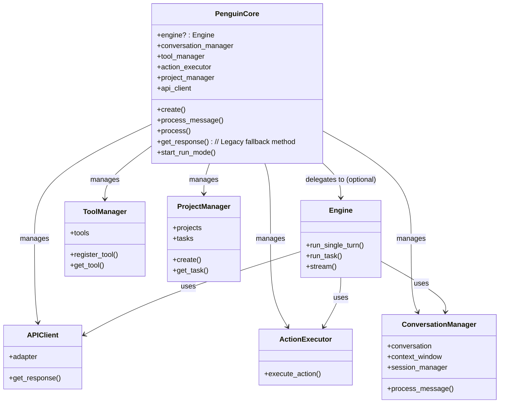
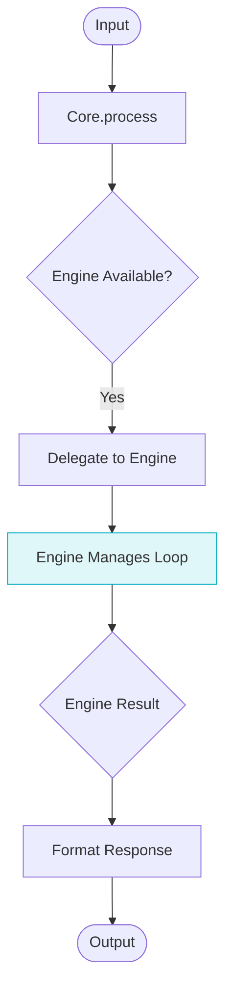
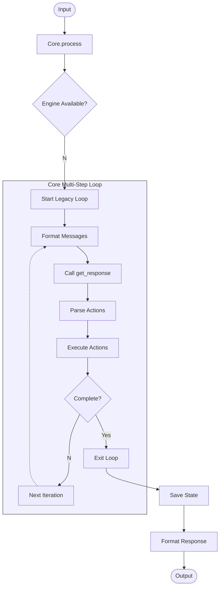

# Core API Reference

The `PenguinCore` class serves as the central coordinator for the entire Penguin AI assistant, orchestrating interactions between various subsystems.

## Overview

PenguinCore acts as an integration point between:
- **Engine (Optional)**: A high-level coordinator for reasoning/action loops (used when available).
- **ConversationManager**: Handles messages, context, and conversation state.
- **ToolManager**: Provides access to available tools and actions.
- **ActionExecutor**: Executes actions and processes results.
- **ProjectManager**: Manages projects and tasks.
- **APIClient**: Handles direct communication with the LLM.

Rather than implementing functionality directly, PenguinCore focuses on coordination. It initializes and holds references to these components. **Crucially, if the `Engine` is successfully initialized, `PenguinCore` delegates the primary reasoning and execution loops to it.** Otherwise, it falls back to managing the loop internally using `get_response`.



## Processing Flow

The primary processing flow depends on whether the `Engine` is available.

**With Engine (Preferred):**



**Without Engine (Legacy Fallback):**



## Factory Method

```python
@classmethod
async def create(
    cls,
    config: Optional[Config] = None,
    model: Optional[str] = None,
    provider: Optional[str] = None,
    workspace_path: Optional[str] = None,
    enable_cli: bool = False,
) -> Union["PenguinCore", Tuple["PenguinCore", "PenguinCLI"]]
```

Creates a new PenguinCore instance with optional CLI. This method handles the initialization of all subsystems, **including attempting to initialize the `Engine`**.

## Core Methods

### `__init__`

```python
def __init__(
    self,
    config: Optional[Config] = None,
    api_client: Optional[APIClient] = None,
    tool_manager: Optional[ToolManager] = None,
    model_config: Optional[ModelConfig] = None
)
```

Initializes the core with configuration and required components. **This constructor is also responsible for attempting to create and store the `Engine` instance (`self.engine`).**

### `process_message`

```python
async def process_message(
    self,
    message: str,
    context: Optional[Dict[str, Any]] = None,
    conversation_id: Optional[str] = None,
    context_files: Optional[List[str]] = None,
    streaming: bool = False
) -> str
```

Processes a user message primarily through the `ConversationManager`. This is a simplified interface, potentially bypassing the `Engine` for basic exchanges, focusing on conversation history management and direct LLM calls via `ConversationManager`.

### `process`

```python
async def process(
    self,
    input_data: Union[Dict[str, Any], str],
    context: Optional[Dict[str, Any]] = None,
    conversation_id: Optional[str] = None,
    max_iterations: int = 5, # Note: max_iterations primarily relevant for legacy fallback
    context_files: Optional[List[str]] = None,
    streaming: Optional[bool] = None,
    stream_callback: Optional[Callable[[str], None]] = None # Note: Used by Engine/APIClient
) -> Dict[str, Any]
```

**Primary interface for processing input.** If `self.engine` is available, this method **delegates the execution** to `Engine.run_single_turn` or potentially `Engine.run_task` based on internal logic or future configuration. If the `Engine` is not available, it falls back to the legacy multi-step loop managed within `PenguinCore` itself, using `get_response` iteratively. Returns a dictionary containing the assistant's final response and any accumulated action results.

### `get_response`

```python
async def get_response(
    self,
    current_iteration: Optional[int] = None,
    max_iterations: Optional[int] = None,
    stream_callback: Optional[Callable[[str], None]] = None,
    streaming: Optional[bool] = None
) -> Tuple[Dict[str, Any], bool]
```

**Legacy Fallback Method.** Generates one turn of response using the current conversation context and executes actions found within that response. This method is primarily used **internally by the legacy processing loop** when the `Engine` is not available. It directly calls the `APIClient` and `ActionExecutor`. Returns the response data for the *single turn* and a continuation flag (e.g., if `TASK_COMPLETION_PHRASE` is found).

### `start_run_mode`

```python
async def start_run_mode(
    self,
    name: Optional[str] = None,
    description: Optional[str] = None,
    context: Optional[Dict[str, Any]] = None,
    continuous: bool = False,
    time_limit: Optional[int] = None,
    mode_type: str = "task", # Added mode_type
) -> None
```

Starts autonomous run mode by creating and running a `RunMode` instance. The `RunMode` instance will internally use `self.engine` if available.

## Conversation Management

### `list_conversations`

```python
def list_conversations(self, limit: int = 20, offset: int = 0) -> List[Dict[str, Any]]
```

Lists available conversations with pagination.

### `get_conversation`

```python
def get_conversation(self, conversation_id: str) -> Optional[Dict[str, Any]]
```

Gets a specific conversation by ID.

### `create_conversation`

```python
def create_conversation(self) -> str
```

Creates a new conversation and returns its ID.

### `delete_conversation`

```python
def delete_conversation(self, conversation_id: str) -> bool
```

Deletes a conversation by ID.

## State Management

### `reset_context`

```python
def reset_context(self) -> None
```

Resets conversation context and diagnostics.

### `reset_state`

```python
async def reset_state(self) -> None
```

Resets core state including messages, tools, and external resources.

## Properties

### `total_tokens_used`

```python
@property
def total_tokens_used(self) -> int
```

Gets total tokens used in current session.

### `get_token_usage`

```python
def get_token_usage(self) -> Dict[str, Dict[str, int]]
```

Gets detailed token usage statistics.

## Action Handling

### `execute_action`

```python
async def execute_action(self, action) -> Dict[str, Any]
```

Executes a single action via the `ActionExecutor`. **Note:** In the preferred flow (with Engine), action execution is handled within the `Engine`'s loop. This method might be used by the legacy fallback loop or potentially for direct action calls outside the main loops.

## Usage Example

```python
# Create a core instance (which attempts Engine initialization)
core = await PenguinCore.create()

# Process a user message (may use Engine or ConversationManager directly)
response = await core.process("Write a Python function to calculate factorial")
print(response['assistant_response'])

# Execute a task in autonomous mode (RunMode will use Engine if available)
await core.start_run_mode(name="create_factorial_library",
                          description="Implement a factorial library with tests")
```
