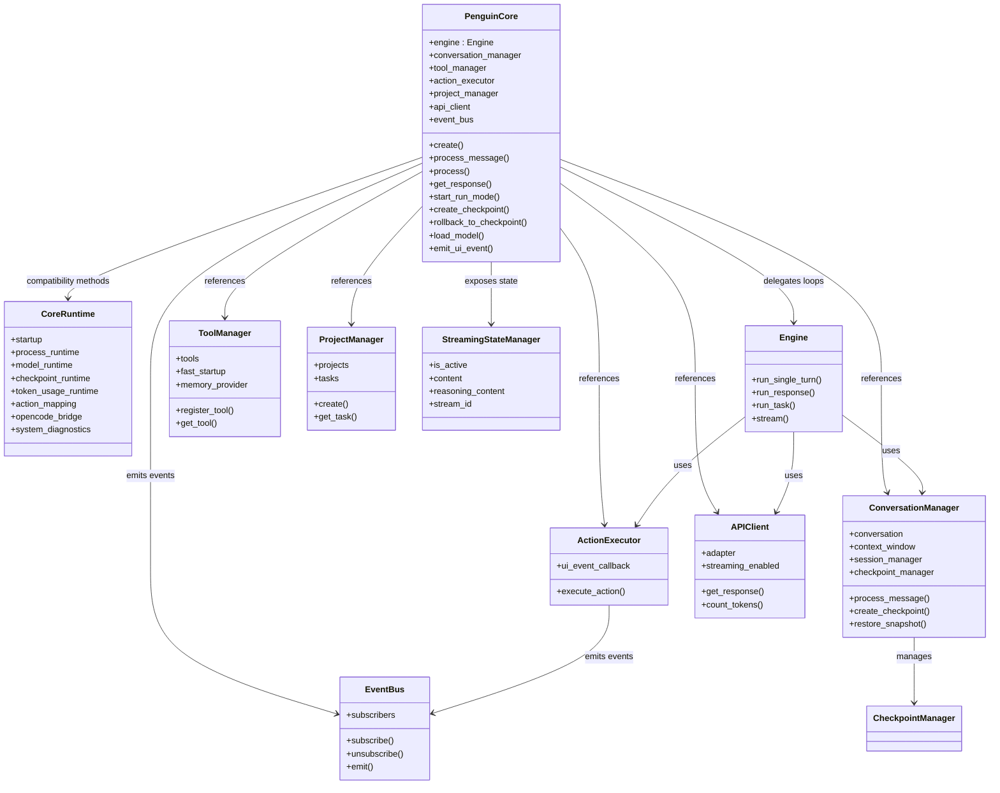
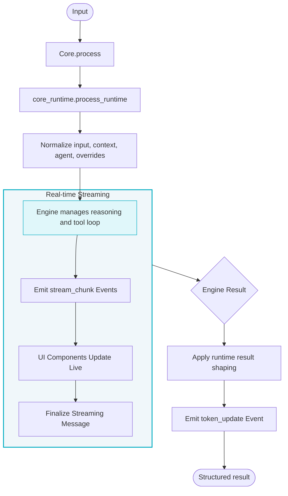

# Core API Reference

`PenguinCore` is Penguin's low-level public runtime object. It wires the core collaborators, exposes compatibility methods that existing CLI/web/API/Python callers depend on, and delegates runtime behavior to owned modules.

## Overview

The current boundary is intentionally thin:

- **`penguin.core.PenguinCore`**: construction, collaborator references, public compatibility methods.
- **`penguin.core_runtime.startup`**: initialization and dependency wiring.
- **`penguin.core_runtime.process_runtime`**: public `process(...)` flow, retry behavior, scoped runtime overrides.
- **`penguin.core_runtime.message_processing` / `response_generation`**: single-message and direct response helpers.
- **`penguin.core_runtime.model_runtime`**: model/provider selection, canonical runtime IDs, OpenAI/OpenRouter-compatible payloads.
- **`penguin.core_runtime.token_usage_runtime`**: runtime/session/agent token and context-window telemetry.
- **`penguin.core_runtime.checkpoint_runtime`**: checkpoint, branch, rollback, and retention operations.
- **`penguin.core_runtime.action_mapping`**: tool/action result metadata, diff/todo/task-card payload shaping, TUI bridge payloads.
- **`penguin.core_runtime.opencode_bridge`**: OpenCode/TUI event and transcript translation.
- **`penguin.core_runtime.stream_events` / `action_events`**: streaming,
  status, todo, LSP, and user-message event bridge helpers.
- **`penguin.core_runtime.session_lookup`**: session store lookup and ownership helpers.
- **`penguin.core_runtime.system_diagnostics`**: status, diagnostics, and startup payloads.
- **`penguin.system.runtime_events` / `runtime_event_ledger`**: canonical
  runtime event envelopes, redaction, durable replay, and retention policy.
- **`Engine`**: reasoning loops, tool execution, native tool-call replay, task execution, MessageBus routing.
- **`RunMode`**: autonomous task/project lifecycle on top of Engine.
- **`ConversationManager`**: message history, session state, checkpoints, and context-window trimming by category priority and recency.

The compatibility mixins in `penguin.core_runtime` preserve historical `PenguinCore` method names. New domain behavior should be implemented in the owning runtime/service module and exposed through a narrow `PenguinCore` method only when public compatibility requires it.

## Ownership Boundary

| Concern | Owner |
|---------|-------|
| Core construction and collaborator wiring | `penguin.core_runtime.startup` |
| Chat/task processing entrypoint | `penguin.core_runtime.process_runtime` + `Engine` |
| Provider/model normalization | `penguin.core_runtime.model_runtime`, `penguin.llm` |
| Token usage and context-window telemetry | `penguin.core_runtime.token_usage_runtime` |
| Checkpoints, forks, rollback | `penguin.core_runtime.checkpoint_runtime`, `ConversationManager` |
| OpenCode/TUI action and event translation | `penguin.core_runtime.action_mapping`, `opencode_bridge`, `stream_events`, `action_events` |
| Runtime event envelope and durable SSE replay | `penguin.system.runtime_events`, `penguin.system.runtime_event_ledger`, `penguin.web.sse_events` |
| Web/API payload and credential services | `penguin.web.services.*` |
| Project/run transition rules | `penguin.project`, `penguin.orchestration`, `RunMode` |
| Multi-agent coordination | `penguin.multi`, `Engine`, `ConversationManager` |


```mermaid
classDiagram
    class PenguinCore {
        +engine : Engine
        +conversation_manager
        +tool_manager
        +action_executor
        +project_manager
        +api_client
        +event_bus
        +create()
        +process_message()
        +process()
        +get_response()
        +start_run_mode()
        +create_checkpoint()
        +rollback_to_checkpoint()
        +load_model()
        +emit_ui_event()
    }

    class CoreRuntime {
        +startup
        +process_runtime
        +model_runtime
        +checkpoint_runtime
        +token_usage_runtime
        +action_mapping
        +opencode_bridge
        +system_diagnostics
    }

    class Engine {
      +run_single_turn()
      +run_response()
      +run_task()
      +stream()
    }

    class ConversationManager {
        +conversation
        +context_window
        +session_manager
        +checkpoint_manager
        +process_message()
        +create_checkpoint()
        +restore_snapshot()
    }

    class ToolManager {
        +tools
        +register_tool()
        +get_tool()
        +fast_startup
        +memory_provider
    }

    class ActionExecutor {
        +execute_action()
        +ui_event_callback
    }

    class ProjectManager {
        +projects
        +tasks
        +create()
        +get_task()
    }

    class APIClient {
        +adapter
        +get_response()
        +count_tokens()
        +streaming_enabled
    }

    class EventBus {
        +subscribers
        +subscribe()
        +unsubscribe()
        +emit()
    }

    class StreamingStateManager {
        +is_active
        +content
        +reasoning_content
        +stream_id
    }

    PenguinCore --> CoreRuntime : compatibility methods
    PenguinCore --> Engine : delegates loops
    PenguinCore --> ConversationManager : references
    PenguinCore --> ToolManager : references
    PenguinCore --> ActionExecutor : references
    PenguinCore --> ProjectManager : references
    PenguinCore --> APIClient : references
    PenguinCore --> EventBus : emits events
    PenguinCore --> StreamingStateManager : exposes state
    Engine --> APIClient : uses
    Engine --> ActionExecutor : uses
    Engine --> ConversationManager : uses
    ConversationManager --> CheckpointManager : manages
    ActionExecutor --> EventBus : emits events
```

## Processing Flow

The public `PenguinCore.process(...)` method is now a compatibility entrypoint backed by `penguin.core_runtime.process_runtime`. That runtime layer normalizes input, applies scoped overrides, and delegates the reasoning/action loop to `Engine`.


```mermaid
flowchart TD
    Start([Input])-->CoreProcess[Core.process]
    CoreProcess-->Runtime[core_runtime.process_runtime]
    Runtime-->Normalize[Normalize input, context, agent, overrides]
    Normalize-->EngineHandlesLoop[Engine manages reasoning and tool loop]

    subgraph Streaming[Real-time Streaming]
        EngineHandlesLoop-->EmitStreamEvents[Emit stream_chunk Events]
        EmitStreamEvents-->UIUpdates[UI Components Update Live]
        UIUpdates-->FinalizeStreaming[Finalize Streaming Message]
    end

    Streaming-->EngineResult{Engine Result}
    EngineResult-->RuntimeFinalize[Apply runtime result shaping]
    RuntimeFinalize-->EmitTokenEvent[Emit token_update Event]
    EmitTokenEvent-->End([Structured result])

    style EngineHandlesLoop fill:#e0f7fa,stroke:#00acc1
    style Streaming fill:#f0f7fa,stroke:#00acc1,stroke-width:2px
```

`get_response(...)` remains available as a compatibility helper for direct single-response/action paths, but new processing behavior should not be added to `PenguinCore`.

## Event System

PenguinCore exposes UI events through the shared `EventBus`. Translation and payload shaping live in runtime helpers where possible, especially for OpenCode/TUI compatibility:

- **`stream_chunk`**: Real-time streaming content with message type and role information
- **`token_update`**: Token usage updates for UI display
- **`message`**: User and assistant message events
- **`status`**: Status updates for UI components
- **`error`**: Error events with source and details

Events are emitted throughout the processing pipeline to enable live UI updates
in CLI, web interface, and other clients. OpenCode/SSE-compatible events should
derive from Penguin's canonical `RuntimeEvent` envelope:

- envelope construction and redaction live in `penguin.system.runtime_events`
- durable append/replay/retention lives in `penguin.system.runtime_event_ledger`
- SSE replay and the EventBus recording hook live in `penguin.web.sse_events`
- OpenCode public payloads use the runtime event `id` as replay identity

`PenguinCore` keeps the shared `EventBus` reference and compatibility methods;
it should not own runtime event schema decisions or replay policy. See
[Runtime Events and Durable Replay](../system/runtime-events.md).

## Factory Method

```python
@classmethod
async def create(
    cls,
    config: Optional[Config] = None,
    model: Optional[str] = None,
    provider: Optional[str] = None,
    workspace_path: Optional[str] = None,
    enable_cli: bool = False,
) -> Union["PenguinCore", Tuple["PenguinCore", "PenguinCLI"]]
```

Creates a new PenguinCore instance with optional CLI. This method delegates startup to `penguin.core_runtime.startup`, which loads config, wires collaborators, initializes Engine, creates managers, and applies fast-startup behavior.

`create` reads standard environment variables to load API keys and defaults. Common variables include `OPENROUTER_API_KEY`, `OPENAI_API_KEY`, `ANTHROPIC_API_KEY`, and optional overrides such as `PENGUIN_MODEL`, `PENGUIN_PROVIDER`, `PENGUIN_CLIENT_PREFERENCE`, and `PENGUIN_API_BASE`.

## Core Methods

### Execution Root (ToolManager)
File tools and command execution operate against an “execution root” that is separate from Penguin’s workspace:

- Project root: the current repo (CWD/git root) for edits, shell commands, diffs, and code analysis
- Workspace root: assistant state (conversations, notes, logs, memory) under `WORKSPACE_PATH`

Selection precedence:
- CLI flag: `--root project|workspace`
- Env var: `PENGUIN_WRITE_ROOT=project|workspace`
- Config: `defaults.write_root`
- Default: `project`

The CLI prints the active root at startup. Tools can switch roots at runtime via:
```python
tm.set_execution_root("project")  # or "workspace"
```

### `__init__`

```python
def __init__(
    self,
    config: Optional[Config] = None,
    api_client: Optional[APIClient] = None,
    tool_manager: Optional[ToolManager] = None,
    model_config: Optional[ModelConfig] = None
)
```

Initializes the core with configuration and required components by delegating to `penguin.core_runtime.startup.initialize_core_instance_state`. The constructor should remain wiring-only; domain/runtime behavior belongs in the owning runtime or service module.

### `process_message`

```python
async def process_message(
    self,
    message: str,
    context: Optional[Dict[str, Any]] = None,
    conversation_id: Optional[str] = None,
    context_files: Optional[List[str]] = None,
    streaming: bool = False
) -> str
```

Processes a single user message through the message-processing runtime. The implementation lives in `penguin.core_runtime.message_processing` and resolves the correct conversation/session scope before delegating to the underlying runtime components.

### `process`

```python
async def process(
    self,
    input_data: Union[Dict[str, Any], str],
    context: Optional[Dict[str, Any]] = None,
    conversation_id: Optional[str] = None,
    max_iterations: Optional[int] = None,
    context_files: Optional[List[str]] = None,
    streaming: Optional[bool] = None,
    stream_callback: Optional[Callable[[str], None]] = None # Note: Used by Engine/APIClient
) -> Dict[str, Any]
```

**Primary low-level processing interface.** This compatibility method delegates to `penguin.core_runtime.process_runtime.process_with_retry`, which normalizes input, applies scoped runtime overrides, and routes execution through Engine-backed runtime flows. `max_iterations` is an explicit opt-in limit; when it is omitted, the runtime has no Penguin-local iteration ceiling. Returns a dictionary containing the assistant response and any accumulated action/tool results.

### `get_response`

```python
async def get_response(
    self,
    current_iteration: Optional[int] = None,
    max_iterations: Optional[int] = None,
    stream_callback: Optional[Callable[[str], None]] = None,
    streaming: Optional[bool] = None
) -> Tuple[Dict[str, Any], bool]
```

Generates one response using the current conversation context and executes actions found within that response. This method is retained as a compatibility helper around `penguin.core_runtime.response_generation`; it is not the preferred place to add new processing behavior. Returns response data for the turn and a continuation flag.

### `start_run_mode`

```python
async def start_run_mode(
    self,
    name: Optional[str] = None,
    description: Optional[str] = None,
    context: Optional[Dict[str, Any]] = None,
    continuous: bool = False,
    time_limit: Optional[int] = None,
    mode_type: str = "task",
    stream_callback_for_cli: Optional[Callable[[str], Awaitable[None]]] = None,
    ui_update_callback_for_cli: Optional[Callable[[], Awaitable[None]]] = None
) -> None
```

Starts autonomous run mode by delegating to `penguin.core_runtime.runmode_lifecycle`, which creates and runs a `RunMode` instance. RunMode uses the Engine-backed task execution path.

**Parameters**

- `name` – Name of the task to run.
- `description` – Optional description when creating a new task.
- `context` – Extra context passed to the task.
- `continuous` – Run continuously rather than a single task.
- `time_limit` – Optional time limit in minutes.
- `mode_type` – Either `"task"` or `"project"`.
- `stream_callback_for_cli` – Async callback for streaming output in the CLI.
- `ui_update_callback_for_cli` – Async callback to refresh CLI UI elements.

## Checkpoint Management

### `create_checkpoint`

```python
async def create_checkpoint(
    self,
    name: Optional[str] = None,
    description: Optional[str] = None
) -> Optional[str]
```

Creates a checkpoint of the current conversation state.

**Parameters**

- `name` – Optional name for the checkpoint
- `description` – Optional description

**Returns**: Checkpoint ID if successful, None otherwise

### `rollback_to_checkpoint`

```python
async def rollback_to_checkpoint(self, checkpoint_id: str) -> bool
```

Rollbacks conversation to a specific checkpoint.

**Parameters**

- `checkpoint_id` – ID of the checkpoint to rollback to

**Returns**: True if successful, False otherwise

### `branch_from_checkpoint`

```python
async def branch_from_checkpoint(
    self,
    checkpoint_id: str,
    name: Optional[str] = None,
    description: Optional[str] = None
) -> Optional[str]
```

Creates a new conversation branch from a checkpoint.

**Parameters**

- `checkpoint_id` – ID of the checkpoint to branch from
- `name` – Optional name for the branch
- `description` – Optional description

**Returns**: New branch checkpoint ID if successful, None otherwise

### `list_checkpoints`

```python
def list_checkpoints(
    self,
    session_id: Optional[str] = None,
    limit: int = 50
) -> List[Dict[str, Any]]
```

Lists available checkpoints with optional filtering.

**Parameters**

- `session_id` – Filter by session ID
- `limit` – Maximum number of checkpoints to return

**Returns**: List of checkpoint information

## Model Management

### `load_model`

```python
async def load_model(self, model_id: str) -> bool
```

Switches to a different model at runtime through PenguinCore's model methods. Provider inference, provider-local model IDs, OpenRouter/OpenAI-compatible normalization, and payload shaping live in `penguin.core_runtime.model_runtime` and `penguin.llm`.

**Parameters**

- `model_id` – Model identifier (e.g., "anthropic/claude-3-5-sonnet-20240620")

**Returns**: True if successful, False otherwise

**Features**:

- Resolves provider/model selectors without leaking provider-local IDs across adapters
- Preserves OpenAI/OpenRouter/OAuth prepared-request contracts
- Updates runtime model configuration and context-window metadata
- Keeps live provider checks opt-in; deterministic contract tests use fake providers

## Event System Methods

PenguinCore uses an `EventBus` for all UI event delivery. The legacy `register_ui`/`unregister_ui` methods have been removed in favor of the centralized EventBus pattern.

### `emit_ui_event`

```python
async def emit_ui_event(self, event_type: str, data: Dict[str, Any]) -> None
```

Emits UI events via the EventBus to all subscribed handlers.

**Parameters**

- `event_type` – Type of event (stream_chunk, token_update, message, etc.)
- `data` – Event data relevant to the event type

### Using EventBus Directly

For components that need to receive events, subscribe via the EventBus:

```python
from penguin.cli.events import EventBus, EventType

# Get the singleton EventBus
event_bus = EventBus.get_sync()

# Subscribe to specific events
async def my_handler(event_type: str, data: dict):
    print(f"Received {event_type}: {data}")

for event_type in EventType:
    event_bus.subscribe(event_type.value, my_handler)

# Unsubscribe when done
event_bus.unsubscribe("stream_chunk", my_handler)
```

## Streaming Properties

PenguinCore provides read-only properties for accessing streaming state:

### `streaming_active`

```python
@property
def streaming_active(self) -> bool
```

Returns whether streaming is currently active.

### `streaming_content`

```python
@property
def streaming_content(self) -> str
```

Returns the accumulated assistant content from the current stream.

### `streaming_reasoning_content`

```python
@property
def streaming_reasoning_content(self) -> str
```

Returns the accumulated reasoning content from the current stream (for models with extended thinking).

### `streaming_stream_id`

```python
@property
def streaming_stream_id(self) -> Optional[str]
```

Returns the unique ID of the current stream, or None if not streaming.

## Conversation Management

### `list_conversations`

```python
def list_conversations(self, limit: int = 20, offset: int = 0) -> List[Dict[str, Any]]
```

Lists available conversations with pagination.

### `get_conversation`

```python
def get_conversation(self, conversation_id: str) -> Optional[Dict[str, Any]]
```

Gets a specific conversation by ID.

### `create_conversation`

```python
def create_conversation(self) -> str
```

Creates a new conversation and returns its ID.

### `delete_conversation`

```python
def delete_conversation(self, conversation_id: str) -> bool
```

Deletes a conversation by ID.

## State Management

### `reset_context`

```python
def reset_context(self) -> None
```

Resets conversation context and diagnostics.

### `reset_state`

```python
async def reset_state(self) -> None
```

Resets core state including messages, tools, and external resources.

## Properties

### `total_tokens_used`

```python
@property
def total_tokens_used(self) -> int
```

Gets total tokens used in current session.

### `get_token_usage`

```python
def get_token_usage(
    self,
    session_id: Optional[str] = None,
    conversation_id: Optional[str] = None,
    agent_id: Optional[str] = None,
) -> Dict[str, Any]
```

Returns runtime or scoped token/context-window telemetry.

- With no identifiers, returns runtime/global core telemetry with
  `scope="runtime"`.
- With `session_id` or `conversation_id`, returns persisted session/conversation
  telemetry with `scope="session"`; missing scoped lookups return
  `scope="missing"` data for HTTP layers to translate to `404`.
- With `agent_id`, scoped usage is filtered by `Message.agent_id`. Penguin does
  not return whole-session totals for a missing agent scope.

```python
runtime_stats = core.get_token_usage()
session_stats = core.get_token_usage(session_id="sess_abc")

print(runtime_stats["scope"])
print(session_stats["current_total_tokens"])
```

## Action Handling

### `execute_action`

```python
async def execute_action(self, action) -> Dict[str, Any]
```

Executes a single action via the `ActionExecutor`. Normal chat/task flows execute actions inside Engine; this method remains a direct compatibility hook for callers that explicitly need one-off action execution.

## Diagnostics and Performance

### `get_system_info`

```python
def get_system_info(self) -> Dict[str, Any]
```

Returns comprehensive system information including model config, component status, and capabilities.

### `get_system_status`

```python
def get_system_status(self) -> Dict[str, Any]
```

Returns current system status including runtime state and performance metrics.

### `get_startup_stats`

```python
def get_startup_stats(self) -> Dict[str, Any]
```

Returns comprehensive startup performance statistics and profiling data.

### `print_startup_report`

```python
def print_startup_report(self) -> None
```

Prints a comprehensive startup performance report to console.

### `enable_fast_startup_globally`

```python
def enable_fast_startup_globally(self) -> None
```

Enables fast startup mode for future operations by deferring heavy initialization.

### `get_memory_provider_status`

```python
def get_memory_provider_status(self) -> Dict[str, Any]
```

Returns current status of memory provider and indexing operations.

## Configuration and Model Management

### `list_available_models`

```python
def list_available_models(self) -> List[Dict[str, Any]]
```

Returns a list of model metadata derived from config.yml with current model highlighted.

### `get_current_model`

```python
def get_current_model(self) -> Optional[Dict[str, Any]]
```

Returns information about the currently loaded model including all configuration parameters.

### `get_token_usage`

```python
def get_token_usage(
    self,
    session_id: Optional[str] = None,
    conversation_id: Optional[str] = None,
    agent_id: Optional[str] = None,
) -> Dict[str, Any]
```

Returns runtime/global usage or session-scoped context-window telemetry for CLI
and UI display. Transcript-specific UI should require `scope="session"`.

## Usage Examples

### Basic Usage

```python
# Create a core instance with fast startup
core = await PenguinCore.create(fast_startup=True)

# Process a user message with streaming
response = await core.process(
    "Write a Python function to calculate factorial",
    streaming=True,
    stream_callback=my_callback
)
print(response['assistant_response'])
```

### Model Switching

```python
# Switch to a different model at runtime
success = await core.load_model("openai/gpt-4o")
if success:
    print(f"Switched to: {core.get_current_model()['model']}")
```

### Checkpoint Management

```python
# Create a checkpoint
checkpoint_id = await core.create_checkpoint(
    name="Before refactoring",
    description="Saving state before major changes"
)

# List available checkpoints
checkpoints = core.list_checkpoints(limit=10)

# Rollback to a previous state
success = await core.rollback_to_checkpoint(checkpoint_id)
```

### Event-Driven UI Integration

```python
from penguin.cli.events import EventBus, EventType

# Get the EventBus singleton
event_bus = EventBus.get_sync()

# Register for real-time updates
async def handle_stream_chunk(event_type, data):
    if event_type == "stream_chunk":
        print(f"Streaming: {data.get('content', '')}")

event_bus.subscribe(EventType.STREAM_CHUNK.value, handle_stream_chunk)

# Events will be emitted automatically during processing
response = await core.process("Hello!", streaming=True)

# Check streaming state via properties
if core.streaming_active:
    print(f"Current content: {core.streaming_content}")
```

### Advanced Configuration

```python
# Get comprehensive system information
info = core.get_system_info()
print(f"Current model: {info['current_model']['model']}")
print(f"Context window: {info['current_model']['max_context_window_tokens']}")

# Enable diagnostics
core.print_startup_report()
```
