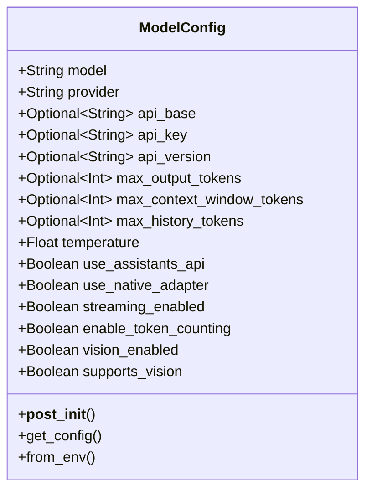

# ModelConfig

The `ModelConfig` class provides configuration for AI model interactions, including provider selection, parameters, and feature flags.

## Overview



## Properties

| Property | Type | Default | Description |
|----------|------|---------|-------------|
| `model` | `str` | Required | The model identifier (e.g., "claude-3-sonnet-20240229") |
| `provider` | `str` | Required | The provider name (e.g., "anthropic", "openai") |
| `api_base` | `Optional[str]` | `None` | Custom API base URL |
| `api_key` | `Optional[str]` | `None` | API key for authentication |
| `api_version` | `Optional[str]` | `None` | API version identifier |
| `max_output_tokens` | `Optional[int]` | `None` | Maximum tokens to generate in response |
| `max_context_window_tokens` | `Optional[int]` | `None` | Maximum context window capacity |
| `max_history_tokens` | `Optional[int]` | `200000` | Maximum tokens to retain in history |
| `temperature` | `float` | `0.7` | Temperature for sampling (0.0-1.0) |
| `use_assistants_api` | `bool` | `False` | Whether to use OpenAI Assistants API |
| `use_native_adapter` | `bool` | `True` | Whether to use native SDK adapters |
| `streaming_enabled` | `bool` | `False` | Whether to enable streaming responses |
| `enable_token_counting` | `bool` | `True` | Whether to track token usage |
| `vision_enabled` | `Optional[bool]` | `None` | Whether to enable vision capabilities |

## Methods

### \_\_post_init\_\_

```python
def __post_init__(self):
```

This method is called after initialization to:
- Set default values for max_history_tokens
- Set up assistants API configuration
- Auto-detect vision capabilities based on model name
- Set backward compatibility properties

### get_config

```python
def get_config(self) -> Dict[str, Any]:
```

Returns a dictionary with the configuration values.

### from_env

```python
@classmethod
def from_env(cls):
```

Creates a ModelConfig instance from environment variables:

| Environment Variable | Property |
|---------------------|----------|
| `PENGUIN_MODEL` | `model` |
| `PENGUIN_PROVIDER` | `provider` |
| `PENGUIN_API_BASE` | `api_base` |
| `PENGUIN_MAX_OUTPUT_TOKENS` | `max_output_tokens` |
| `PENGUIN_MAX_CONTEXT_WINDOW_TOKENS` | `max_context_window_tokens` |
| `PENGUIN_TEMPERATURE` | `temperature` |
| `PENGUIN_MAX_HISTORY_TOKENS` | `max_history_tokens` |
| `PENGUIN_USE_ASSISTANTS_API` | `use_assistants_api` |
| `PENGUIN_USE_NATIVE_ADAPTER` | `use_native_adapter` |
| `PENGUIN_STREAMING_ENABLED` | `streaming_enabled` |
| `PENGUIN_VISION_ENABLED` | `vision_enabled` |

## Auto-Detection Features

### Vision Capabilities

The `vision_enabled` property is auto-detected if not explicitly set:
- For Anthropic: True if model name contains "claude-3"
- For OpenAI: True if model name contains "gpt-4" and "vision"
- Default: False for other models

## Usage Examples

### Basic Configuration

```python
from penguin.llm.model_config import ModelConfig

# Create basic config
config = ModelConfig(
    model="claude-3-5-sonnet",
    provider="anthropic",
    temperature=0.7
)
```

### Configuration with Advanced Options

```python
# Create config with advanced options
config = ModelConfig(
    model="claude-3-5-sonnet",
    provider="anthropic",
    max_output_tokens=4096,
    temperature=0.5,
    use_native_adapter=True,
    streaming_enabled=True,
    vision_enabled=True
)
```

### Loading from Environment

```python
# Set environment variables
os.environ["PENGUIN_MODEL"] = "gpt-4-turbo"
os.environ["PENGUIN_PROVIDER"] = "openai"
os.environ["PENGUIN_TEMPERATURE"] = "0.8"

# Load from environment
config = ModelConfig.from_env()
```

## Provider-Specific Features

### Anthropic Models

For Anthropic Claude models:
- Vision automatically enabled for Claude 3 models
- Native adapter (when `use_native_adapter=True`) uses Anthropic's Python SDK directly
- Direct token counting for accurate token usage tracking

### OpenAI Models

For OpenAI GPT models:
- Vision automatically enabled for GPT-4 Vision models
- Assistants API optionally available through `use_assistants_api=True`
- Will use OpenAI's native SDK in future updates (currently uses LiteLLM) 