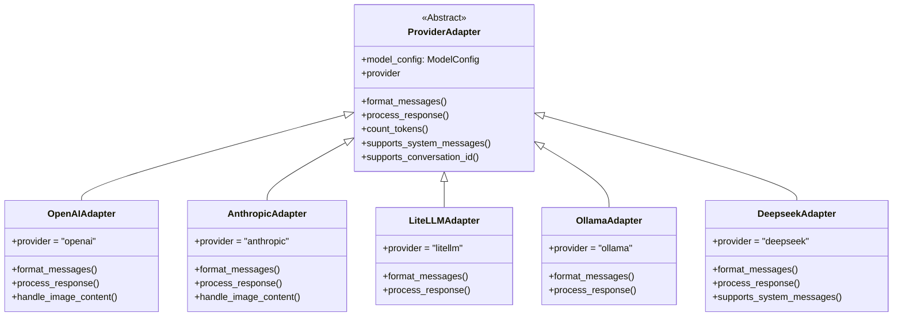
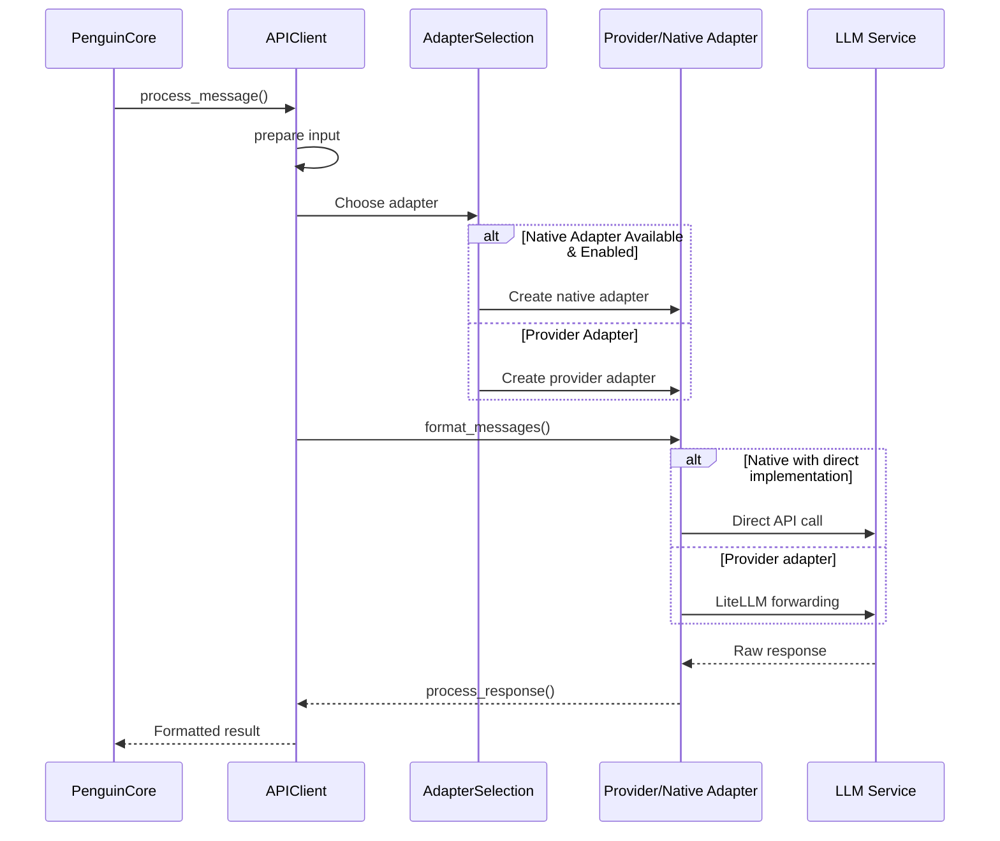

# Provider Adapters

The Provider Adapters system provides a flexible architecture for supporting multiple LLM providers through a unified interface.

## Overview



## Base Adapter Interface

```python
class ProviderAdapter(ABC):
    def __init__(self, model_config: ModelConfig):
        self.model_config = model_config

    @abstractmethod
    def format_messages(self, messages: List[Dict[str, Any]]) -> List[Dict[str, Any]]:
        pass

    @abstractmethod
    def process_response(self, response: Any) -> tuple[str, List[Any]]:
        pass

    def supports_conversation_id(self) -> bool:
        return False

    def count_tokens(self, text: str) -> int:
        return diagnostics.count_tokens(text)

    def supports_system_messages(self) -> bool:
        """Return True if provider natively supports system role messages"""
        return True

    @property
    @abstractmethod
    def provider(self) -> str:
        """Return lowercase provider name string"""
        pass
```

The base adapter defines the interface all provider adapters must implement.

## Adapter Selection

Provider adapters are selected and instantiated through the `get_provider_adapter` function:

```python
def get_provider_adapter(provider: str, model_config: ModelConfig) -> ProviderAdapter:
    adapters = {
        "openai": OpenAIAdapter(model_config),
        "litellm": LiteLLMAdapter(model_config),
        "anthropic": AnthropicAdapter(model_config),
        "ollama": OllamaAdapter(model_config),
        "deepseek": DeepseekAdapter(model_config),
    }
    return adapters.get(
        provider.lower(), LiteLLMAdapter(model_config)
    )  # Default to LiteLLMAdapter if provider not found
```

## Supported Adapters

### OpenAI Adapter

```python
class OpenAIAdapter(ProviderAdapter):
    @property
    def provider(self) -> str:
        return "openai"
```

The OpenAI adapter provides support for:
- OpenAI GPT models (3.5-turbo, 4, etc.)
- Image handling for multi-modal interactions
- System message support
- Optional Assistants API integration through ModelConfig

#### Message Formatting

The OpenAI adapter formats messages with special handling for:
- Multi-modal content (images + text)
- Proper OpenAI message structure
- Automatic image conversion from paths to base64

### Anthropic Adapter

```python
class AnthropicAdapter(ProviderAdapter):
    @property
    def provider(self) -> str:
        return "anthropic"
```

The Anthropic adapter provides support for:
- Claude models (Claude 3, etc.)
- Native image handling for multi-modal interactions
- System message support

#### Message Formatting

Anthropic adapter formats messages with special handling for:
- Formatting image content in the Anthropic-specific format
- Converting simple string content to Anthropic's structured format
- Converting image paths to properly formatted base64 content

### LiteLLM Adapter

```python
class LiteLLMAdapter(ProviderAdapter):
    @property
    def provider(self) -> str:
        return "litellm"
```

The LiteLLM adapter is a generic adapter that acts as a fallback for other providers. It:
- Provides basic message formatting
- Handles diverse response formats from LiteLLM
- Offers a consistent interface for any provider

#### Response Processing

LiteLLM adapter handles various response formats:
- Dictionary responses with choices
- LiteLLM response objects
- String responses
- Fallback string conversion

### Ollama Adapter

```python
class OllamaAdapter(ProviderAdapter):
    @property
    def provider(self) -> str:
        return "ollama"
```

The Ollama adapter provides support for:
- Local model deployment via Ollama
- Models like Llama, Mistral, etc.
- Simple message formatting compatible with OpenAI format

### DeepSeek Adapter

```python
class DeepseekAdapter(ProviderAdapter):
    @property
    def provider(self) -> str:
        return "deepseek"
```

The DeepSeek adapter provides support for:
- DeepSeek's large language models
- Special handling for system messages (max 1 allowed)
- Role alternation enforcement

#### System Message Handling

DeepSeek only allows one system message at the start. The adapter:
- Extracts the first system message
- Converts subsequent system messages to user messages with prefix
- Ensures strict role alternation in messages

## Native vs. Provider Adapters

Penguin supports two types of adapters:

1. **Provider Adapters** - Generic adapters implemented in `provider_adapters.py`
   - Used as fallbacks or for providers without native adapters
   - Compatible with LiteLLM for wide provider support
   - Simpler implementation with fewer features

2. **Native Adapters** - SDK-specific adapters in the `adapters/` directory
   - Currently only Anthropic has a full native adapter
   - Provide deeper integration with provider features
   - Support streaming, token counting, and other advanced features

The selection between native and provider adapters is controlled by the `use_native_adapter` flag in ModelConfig.

## Message Flow



## Extending with New Providers

To add support for a new provider:

1. Create a new adapter class that extends `ProviderAdapter`
2. Implement the required methods:
   - `format_messages` - Format messages for the provider API
   - `process_response` - Extract response content from API output
   - `provider` property - Return the provider identifier
3. Add the adapter to the dictionary in `get_provider_adapter`

Example:

```python
class NewProviderAdapter(ProviderAdapter):
    @property
    def provider(self) -> str:
        return "new-provider"
        
    def format_messages(self, messages: List[Dict[str, Any]]) -> List[Dict[str, Any]]:
        # Format messages for this provider
        return formatted_messages
        
    def process_response(self, response: Any) -> tuple[str, List[Any]]:
        # Extract content from the response
        return response_content, []
        
    def supports_system_messages(self) -> bool:
        # Does this provider support system messages?
        return True
```

Then register the adapter:

```python
def get_provider_adapter(provider: str, model_config: ModelConfig) -> ProviderAdapter:
    adapters = {
        # ... existing adapters
        "new-provider": NewProviderAdapter(model_config),
    }
    return adapters.get(provider.lower(), LiteLLMAdapter(model_config))
``` 