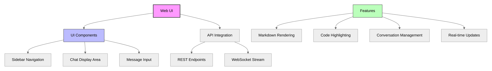

# Web Interface

Penguin includes a browser-based chat interface for interacting with the AI assistant without additional tools or code.

## Overview



## User Interface

The Penguin Web UI provides a clean, modern interface with:

1. **Sidebar** - Conversation list and management
2. **Chat Area** - Message history with formatting
3. **Input Area** - Message composition

### Screenshot

*Screenshot image would be here*

## Implementation

The web interface is built with:

- Vue.js 3 for reactive UI components
- Tailwind CSS for styling
- Marked.js for Markdown rendering
- Highlight.js for code syntax highlighting

These dependencies are loaded from CDNs, requiring no build step for the interface.

## Main Components

### Conversation Management

```javascript
const conversations = ref([])
const selectedConversationId = ref(null)

const refreshConversations = async () => {
    try {
        const response = await fetch('/api/v1/conversations')
        const data = await response.json()
        conversations.value = data.conversations
    } catch (error) {
        console.error('Error fetching conversations:', error)
    }
}

const startNewConversation = async () => {
    try {
        const response = await fetch('/api/v1/conversations/create', {
            method: 'POST',
            headers: {
                'Content-Type': 'application/json'
            }
        });
        const data = await response.json();
        selectedConversationId.value = data.conversation_id;
        // Initialize with welcome message
        messages.value = [{
            role: 'system',
            content: 'Welcome to Penguin AI! How can I help you today?',
            timestamp: new Date()
        }];
        await refreshConversations();
    } catch (error) {
        console.error('Error creating new conversation:', error);
    }
}
```

### Message Handling

```javascript
const sendMessage = async () => {
    const message = newMessage.value.trim()
    if (!message || isTyping.value) return

    try {
        isTyping.value = true
        messages.value.push({ 
            role: 'user', 
            content: message,
            timestamp: new Date(),
            status: 'sending'
        })
        newMessage.value = ''
        await scrollToBottom()

        const response = await fetch('/api/v1/chat/message', {
            method: 'POST',
            headers: { 'Content-Type': 'application/json' },
            body: JSON.stringify({
                text: message,
                conversation_id: selectedConversationId.value
            })
        })
        
        // Process response
        const data = await response.json()
        messages.value.push({
            role: 'assistant',
            content: data.response,
            timestamp: new Date()
        })
        
        await refreshConversations()
    } catch (err) {
        error.value = `Error: ${err.message}`
    } finally {
        isTyping.value = false
    }
}
```

### Markdown Rendering

```javascript
const renderMarkdown = (content) => {
    try {
        const html = marked.parse(content)
        nextTick(() => {
            document.querySelectorAll('pre code').forEach((block) => {
                hljs.highlightElement(block)
            })
        })
        return html
    } catch (e) {
        return content
    }
}
```

## Keyboard Shortcuts

The interface includes several keyboard shortcuts for efficient interaction:

- `Enter` - Send message
- `Shift+Enter` - Add new line
- `Escape` - Clear input field

## Real-time Updates

For a more responsive experience, the web interface leverages WebSockets for real-time updates:

```javascript
const setupWebSocket = () => {
    ws.value = new WebSocket(`ws://${window.location.host}/api/v1/chat/stream`)
    
    ws.value.onopen = () => {
        console.log('WebSocket connection established')
    }
    
    ws.value.onmessage = (event) => {
        const data = JSON.parse(event.data)
        
        if (data.event === 'token') {
            // Append token to the current message
            appendToCurrentMessage(data.data.token)
        } else if (data.event === 'complete') {
            // Update with final message
            finalizeMessage(data.data.response)
        }
    }
}
```

## Styling

The interface uses a clean, dark theme by default with variables for customization:

```css
:root {
    --background: 224 71% 4%;
    --foreground: 213 31% 91%;
    --primary: 210 40% 98%;
    --primary-foreground: 222.2 47.4% 1.2%;
    --muted: 223 47% 11%;
    --muted-foreground: 215.4 16.3% 56.9%;
    --border: 216 34% 17%;
    --radius: 0.5rem;
}
```

## Usage

To access the web interface:

1. Start the Penguin API server:
   ```bash
   python -m penguin.api.server
   ```

2. Navigate to http://localhost:8000 in your browser

## Mobile Support

The interface uses responsive design principles to work well on both desktop and mobile devices:

- Flexible layout that adapts to screen size
- Touch-friendly input controls
- Mobile-optimized message display

## Future Enhancements

Planned improvements to the web interface:

1. File upload support for sharing documents and images
2. Context file management UI
3. Project and task management interface
4. Theme customization options
5. Persistent user preferences
6. Offline capability with local storage 