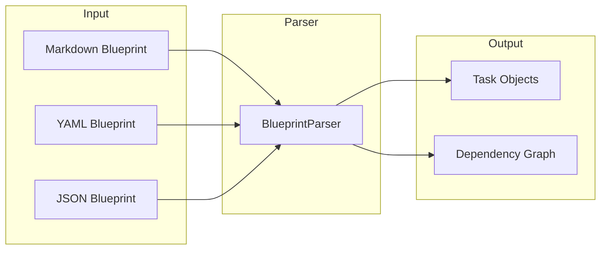
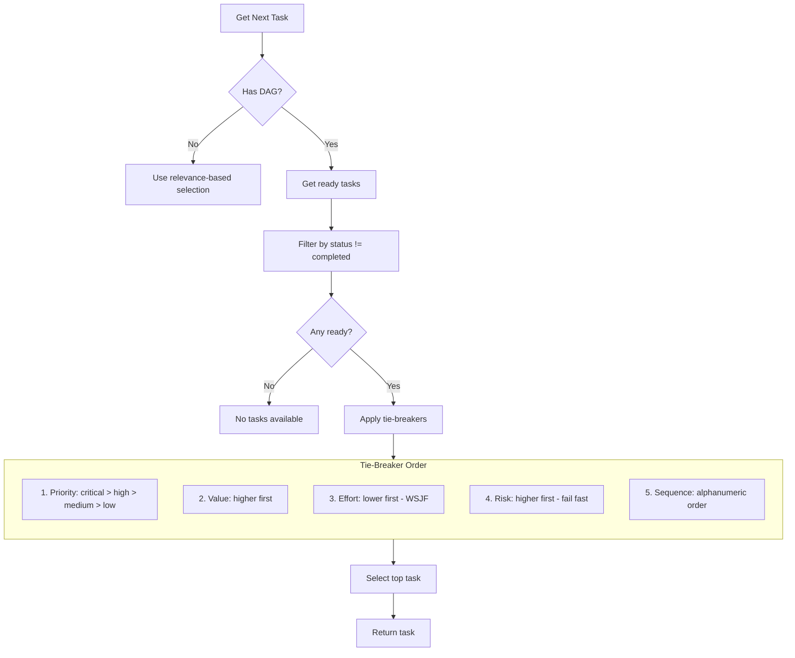

# Blueprints

Blueprints are structured specification documents that define tasks, dependencies, and acceptance criteria for Penguin projects. They enable spec-driven development where documentation drives task creation and execution.

## Overview

Blueprints provide:

- **Structured task definitions** with metadata, dependencies, and acceptance criteria
- **DAG-based scheduling** using NetworkX for dependency-aware task ordering
- **ITUV lifecycle support** (Implement → Test → Use → Verify)
- **Multiple formats** (Markdown, YAML, JSON)
- **Agent routing hints** for multi-agent workflows



## Blueprint Format

### Markdown with YAML Frontmatter (Recommended)

The most human-readable format combines Markdown content with YAML frontmatter for metadata:

```markdown
---
id: auth-system
title: Authentication System
version: 1.0.0
priority: high
effort: 8
value: 9

# ITUV Lifecycle Settings
ituv:
  enabled: true
  phase_timebox_sec:
    implement: 1800
    test: 600
    use: 300
    verify: 300

# Agent Routing Defaults
agent_role: implementer
required_tools:
  - file_operations
  - code_execution
skills:
  - python
  - security
---

# Authentication System

Implement secure user authentication with JWT tokens.

## Tasks

### 1. Create User Model
- **ID:** `user-model`
- **Priority:** high
- **Effort:** 3
- **Dependencies:** none
- **Agent:** implementer
- **Tools:** file_operations, code_execution

Create the User database model with password hashing.

#### Acceptance Criteria
- [ ] User model with email, password_hash fields
- [ ] Password hashing using bcrypt
- [ ] Email validation

#### Recipe: test-user-model
```shell
pytest tests/test_user_model.py -v
```

### 2. JWT Token Service
- **ID:** `jwt-service`
- **Priority:** high
- **Effort:** 5
- **Dependencies:** user-model
- **Agent:** implementer

Implement JWT token generation and validation.

#### Acceptance Criteria
- [ ] Token generation with configurable expiry
- [ ] Token validation and refresh
- [ ] Secure secret key management

## Usage Recipes

### test-user-model
```shell
pytest tests/test_user_model.py -v
```

### run-auth-server
```shell
uvicorn app.main:app --reload
```
```

### YAML Format

Pure YAML for programmatic generation:

```yaml
id: auth-system
title: Authentication System
version: 1.0.0
priority: high
effort: 8
value: 9

ituv:
  enabled: true
  phase_timebox_sec:
    implement: 1800
    test: 600
    use: 300
    verify: 300

default_agent_role: implementer
default_required_tools:
  - file_operations
  - code_execution
default_skills:
  - python

items:
  - id: user-model
    title: Create User Model
    description: Create the User database model with password hashing.
    priority: high
    effort: 3
    dependencies: []
    acceptance_criteria:
      - User model with email, password_hash fields
      - Password hashing using bcrypt
      - Email validation
    recipe: test-user-model

  - id: jwt-service
    title: JWT Token Service
    description: Implement JWT token generation and validation.
    priority: high
    effort: 5
    dependencies:
      - user-model
    acceptance_criteria:
      - Token generation with configurable expiry
      - Token validation and refresh

recipes:
  test-user-model:
    - type: shell
      command: pytest tests/test_user_model.py -v
```

### JSON Format

For API integrations and tooling:

```json
{
  "id": "auth-system",
  "title": "Authentication System",
  "version": "1.0.0",
  "priority": "high",
  "items": [
    {
      "id": "user-model",
      "title": "Create User Model",
      "description": "Create the User database model",
      "priority": "high",
      "effort": 3,
      "dependencies": []
    },
    {
      "id": "jwt-service",
      "title": "JWT Token Service",
      "description": "Implement JWT tokens",
      "dependencies": ["user-model"]
    }
  ]
}
```

## Task Metadata Fields

| Field | Type | Description |
|-------|------|-------------|
| `id` | string | Unique task identifier |
| `title` | string | Human-readable task name |
| `description` | string | Detailed task description |
| `priority` | string | `critical`, `high`, `medium`, `low` |
| `effort` | int | Story points or complexity (1-13) |
| `value` | int | Business value score (1-10) |
| `risk` | int | Risk level (1-5) |
| `sequence` | string | Execution order hint |
| `dependencies` | list | Task IDs this depends on |
| `acceptance_criteria` | list | Conditions for completion |
| `agent_role` | string | `implementer`, `qa`, `planner`, `reviewer` |
| `required_tools` | list | Tools needed for execution |
| `skills` | list | Required agent capabilities |
| `parallelizable` | bool | Can run concurrently |
| `batch` | string | Group ID for batch execution |
| `recipe` | string | Usage recipe name |

## CLI Commands

### Sync Blueprint to Tasks

```bash
# Sync a blueprint file to create/update tasks
/blueprint sync context/specs/auth-system.md

# Sync to a specific project
/blueprint sync context/specs/auth-system.md project-123
```

### View Blueprint Status

```bash
# Show sync status and task mapping
/blueprint status project-123
```

### DAG Operations

```bash
# View task dependencies
/task deps task-123

# Export dependency graph (DOT format)
/task graph project-123

# List ready tasks (no blocking dependencies)
/task ready project-123

# Get execution frontier (next tasks to run)
/task frontier project-123
```

## Python API

### Parsing Blueprints

```python
from penguin.project.blueprint_parser import BlueprintParser

# Parse from file
parser = BlueprintParser()
blueprint = parser.parse_file("context/specs/auth-system.md")

print(f"Blueprint: {blueprint.title}")
print(f"Tasks: {len(blueprint.items)}")

for item in blueprint.items:
    print(f"  - {item.id}: {item.title}")
    print(f"    Dependencies: {item.dependencies}")
```

### Syncing to Project

```python
from penguin.project import ProjectManager

pm = ProjectManager()

# Sync blueprint to project
stats = pm.sync_blueprint(blueprint, project_id="my-project")

print(f"Created: {stats['created']}")
print(f"Updated: {stats['updated']}")
print(f"Unchanged: {stats['unchanged']}")
```

### DAG Operations

```python
# Check if project has DAG
if pm.has_dag(project_id):
    # Get ready tasks (no pending dependencies)
    ready = pm.get_ready_tasks(project_id)
    
    # Get next task using tie-breakers
    next_task = pm.get_next_task_dag(project_id)
    
    # Get DAG statistics
    stats = pm.get_dag_stats(project_id)
    print(f"Total nodes: {stats['total_nodes']}")
    print(f"Completed: {stats['completed']}")
    print(f"Ready: {stats['ready']}")
    
    # Export to DOT format
    dot = pm.export_dag_dot(project_id)
```

## DAG-Based Task Selection

When a project has a Blueprint-generated DAG, task selection follows this algorithm:



### Tie-Breaker Logic

When multiple tasks are ready, selection uses weighted shortest job first (WSJF):

1. **Priority** - Critical tasks first
2. **Value/Effort ratio** - Higher value, lower effort wins
3. **Risk** - Higher risk first (fail fast)
4. **Sequence** - Explicit ordering from blueprint

## ITUV Lifecycle Integration

Blueprints integrate with the ITUV (Implement, Test, Use, Verify) workflow:

```yaml
ituv:
  enabled: true
  phase_timebox_sec:
    implement: 1800  # 30 minutes
    test: 600        # 10 minutes
    use: 300         # 5 minutes
    verify: 300      # 5 minutes
```

Each task progresses through phases:

```
PENDING → IMPLEMENT → TEST → USE → VERIFY → DONE
                ↓
             BLOCKED (on failure)
```

See [Orchestration](./orchestration.md) for workflow execution details.

## Best Practices

### Blueprint Organization

1. **One blueprint per feature** - Keep blueprints focused
2. **Clear task IDs** - Use descriptive, kebab-case IDs
3. **Explicit dependencies** - Don't rely on implicit ordering
4. **Acceptance criteria** - Define clear, testable conditions
5. **Recipes** - Include verification commands

### Task Granularity

1. **Atomic tasks** - Each task should be independently completable
2. **2-8 hour effort** - Break larger tasks into subtasks
3. **Single responsibility** - One clear outcome per task
4. **Testable output** - Every task should have verifiable results

### Dependency Management

1. **Minimize dependencies** - Reduce coupling where possible
2. **Avoid cycles** - DAG parser will reject circular dependencies
3. **Use batches** - Group parallelizable tasks with `batch`
4. **Document blockers** - Note why dependencies exist

## Storage Location

Blueprints are stored in `context/specs/` by convention:

```
project/
├── context/
│   └── specs/
│       ├── auth-system.md
│       ├── payment-flow.md
│       └── user-dashboard.yaml
├── src/
└── tests/
```

## Template

A blueprint template is available at `context/blueprint.template.md` for creating new blueprints.

## See Also

- [Orchestration](./orchestration.md) - ITUV workflow execution
- [Run Mode](./run-mode.md) - Autonomous task execution
- [Project Management](../usage/project_management.md) - Task and project APIs

