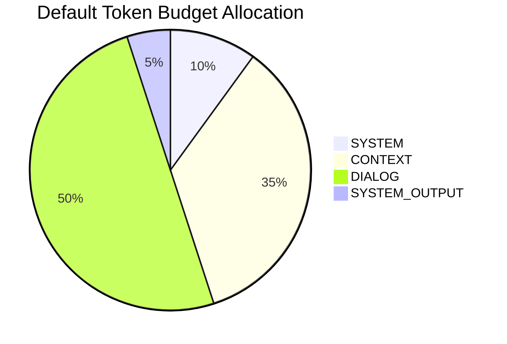
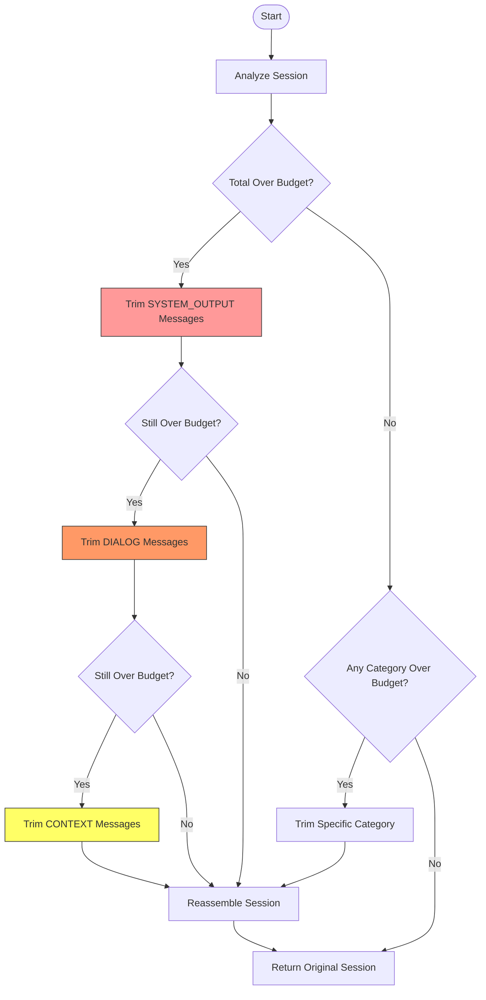

# Context Window Manager

The `ContextWindowManager` handles token budgeting and content trimming for conversation context across different message categories.

## Overview

The ContextWindowManager is responsible for:

1. Tracking token usage across different message categories
2. Managing token budgets based on priority
3. Intelligently trimming content when context windows fill up
4. Handling special content types like images
5. Ensuring conversations don't exceed model token limits

## Message Categories and Priorities

Messages are categorized into four priority levels for trimming:

1. **SYSTEM** (highest priority): System instructions - never trimmed if possible (10% budget)
2. **CONTEXT**: Important reference information like documentation (35% budget)
3. **DIALOG**: Main conversation between user and assistant (50% budget)
4. **SYSTEM_OUTPUT** (lowest priority): Tool outputs, code execution results (5% budget)

When trimming is necessary, messages are removed starting from the lowest priority categories.



## Trimming Strategy



## Special Content Handling

```mermaid
flowchart LR
    subgraph Before["Session with Multiple Images"]
        FirstImage[First Image]
        SecondImage[Second Image]
        ThirdImage[Third Image]
        Text1[Text Content]
        Text2[Text Content]
        Text3[Text Content]
    end
    
    subgraph After["After Image Handling"]
        FirstImage2[First Image]
        Placeholder2[Image Placeholder]
        Placeholder3[Image Placeholder]
        Text1_2[Text Content]
        Text2_2[Text Content]
        Text3_2[Text Content]
    end
    
    Before --> ImageProcessor[Image Processor]
    ImageProcessor --> After
    
    style ImageProcessor fill:#bbf,stroke:#333,stroke-width:2px
    style SecondImage fill:#faa,stroke:#333
    style ThirdImage fill:#faa,stroke:#333
    style Placeholder2 fill:#eee,stroke:#333
    style Placeholder3 fill:#eee,stroke:#333
```



## Initialization

```python
def __init__(
    self,
    model_config = None,
    token_counter: Optional[Callable[[Any], int]] = None,
    api_client=None
)
```

Parameters:
- `model_config`: Optional model configuration with max_tokens
- `token_counter`: Function to count tokens for content
- `api_client`: API client for token counting

## Key Methods

### Token Management

```python
@property
def total_budget(self) -> int
```

Gets the total token budget.

```python
@property
def available_tokens(self) -> int
```

Gets the number of available tokens.

```python
def get_budget(self, category: MessageCategory) -> TokenBudget
```

Gets the token budget for a specific category.

```python
def update_usage(self, category: MessageCategory, tokens: int) -> None
```

Updates token usage for a category.

```python
def reset_usage(self, category: Optional[MessageCategory] = None) -> None
```

Resets token usage for a category or all categories.

```python
def is_over_budget(self, category: Optional[MessageCategory] = None) -> bool
```

Checks if a category or the entire context is over budget.

### Session Processing

```python
def analyze_session(self, session: Session) -> Dict[str, Any]
```

Analyzes a session for token usage statistics and multimodal content.

```python
def trim_session(self, session: Session, preserve_recency: bool = True) -> Session
```

Trims session messages to fit within token budget.

```python
def process_session(self, session: Session) -> Session
```

Processes a session through token budgeting and trimming - main entry point for integration.

### Reporting

```python
def get_token_usage(self) -> Dict[str, int]
```

Gets token usage dictionary for tracking.

```python
def format_token_usage(self) -> str
```

Formats token usage in a human-readable format.

```python
def format_token_usage_rich(self) -> str
```

Formats token usage with rich text for prettier CLI output.

## Trimming Strategy

The trimming strategy follows these steps:

1. Check if session exceeds total budget
2. Identify categories exceeding their individual budgets
3. Trim categories in priority order (SYSTEM_OUTPUT → DIALOG → CONTEXT)
4. Preserve SYSTEM messages at all costs
5. Within each category, trim oldest messages first

For sessions with multiple images:
1. Keep the most recent image intact
2. Replace older images with text placeholders to save tokens

## Example Usage

```python
# Initialize the context manager
context_window = ContextWindowManager(
    model_config=model_config,
    api_client=api_client
)

# Analyze a session
stats = context_window.analyze_session(session)
print(f"Total tokens: {stats['total_tokens']}")
print(f"Over budget: {stats['over_budget']}")

# Process a session (analyze and trim if needed)
trimmed_session = context_window.process_session(session)

# Display token usage
print(context_window.format_token_usage())
```

## Token Budgeting

The default token budget allocation is:
- SYSTEM: 10% (highest priority, preserved longest)
- CONTEXT: 35% (high priority, preserved for reference)
- DIALOG: 50% (medium priority, oldest trimmed first)
- SYSTEM_OUTPUT: 5% (lowest priority, trimmed first)

This allocation ensures that critical system instructions remain intact while maximizing space for actual conversation. 