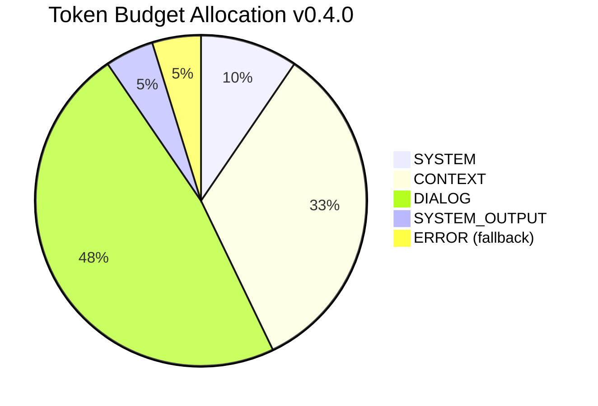
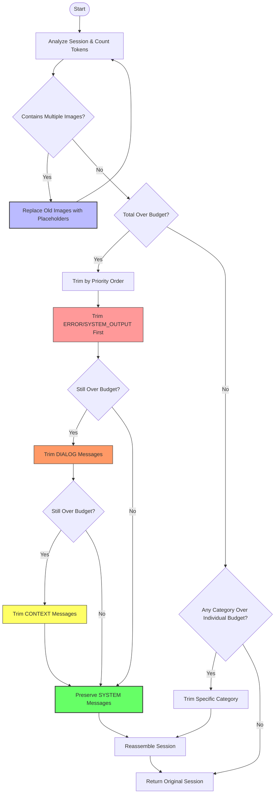

# Context Window Manager

The `ContextWindowManager` v0.4.0 handles advanced token budgeting and content trimming for conversation context with multimodal content handling and dynamic budget allocation.

## Overview

The ContextWindowManager is responsible for:

1. **Advanced Token Budgeting**: Dynamic allocation based on content type and priority
2. **Image Handling**: Intelligent trimming of multimodal content to preserve tokens
3. **Category-Based Management**: Fine-grained control over different message types
4. **Real-time Usage Tracking**: Live monitoring of token consumption
5. **Smart Trimming Strategies**: Context-aware content removal with recency preservation
6. **Multi-Provider Token Counting**: Automatic fallback tokenization strategies
7. **Rich Reporting**: Human-readable and programmatic token usage statistics

## Message Categories and Priorities

Messages are categorized into five priority levels for intelligent trimming:

1. **SYSTEM** (highest priority): System instructions and prompts - **never trimmed** (10% budget)
2. **CONTEXT**: Important reference information, documentation, and context files (35% budget)
3. **DIALOG**: Main conversation between user and assistant (50% budget)
4. **SYSTEM_OUTPUT**: Tool outputs, code execution results, and action responses (5% budget)
5. **ERROR**: Error messages and debugging information (fallback 5% budget)

### Priority System

- **SYSTEM messages**: Guaranteed preservation with strict 10% minimum allocation
- **Chronological trimming**: Within each category, oldest messages are trimmed first to preserve recency
- **Dynamic budget management**: Automatic budget redistribution when categories are under-utilized
- **Image-aware processing**: Special handling for multimodal content with token-intensive elements
- **Fallback categories**: Automatic handling of new message types with default budgets



## Trimming Strategy



## Special Content Handling

```mermaid
flowchart LR
    subgraph Before["Session with Multiple Images"]
        FirstImage[First Image]
        SecondImage[Second Image]
        ThirdImage[Third Image]
        Text1[Text Content]
        Text2[Text Content]
        Text3[Text Content]
    end
    
    subgraph After["After Image Handling"]
        FirstImage2[First Image]
        Placeholder2[Image Placeholder]
        Placeholder3[Image Placeholder]
        Text1_2[Text Content]
        Text2_2[Text Content]
        Text3_2[Text Content]
    end
    
    Before --> ImageProcessor[Image Processor]
    ImageProcessor --> After
    
    style ImageProcessor fill:#bbf,stroke:#333,stroke-width:2px
    style SecondImage fill:#faa,stroke:#333
    style ThirdImage fill:#faa,stroke:#333
    style Placeholder2 fill:#eee,stroke:#333
    style Placeholder3 fill:#eee,stroke:#333
```



## Initialization

```python
def __init__(
    self,
    model_config=None,
    token_counter: Optional[Callable[[Any], int]] = None,
    api_client=None,
    config_obj: Optional[Any] = None,
)
```

### Smart Configuration Resolution

The ContextWindowManager automatically resolves configuration from multiple sources in priority order:

1. **Model Configuration**: `model_config.max_context_window_tokens` (if provided)
2. **Live Config Object**: `config_obj.model_config.max_history_tokens` (preferred)
3. **Global Config**: `config.yml` model settings
4. **Fallback**: Default 150,000 tokens

### Intelligent Token Counter Selection

The system automatically selects the best available token counter:

1. **API Client Counter**: `api_client.count_tokens()` (provider-specific)
2. **Diagnostics Counter**: `diagnostics.count_tokens()` (tiktoken-based)
3. **Fallback Counter**: Rough estimation (4 chars per token)

### Features

- **Dynamic Max Tokens**: Adapts to model capabilities automatically
- **Multi-source Configuration**: Supports live config updates
- **Provider-aware Tokenization**: Uses provider-specific token counting when available
- **Robust Fallbacks**: Graceful degradation when components are unavailable

### Clamp Notices (Sub-Agents)

When a sub-agent is created with an isolated context window and a `shared_context_window_max_tokens` value, the child's `ContextWindowManager.max_context_window_tokens` is set to the lower of the parent’s max and the provided clamp. A system note with metadata `type=cw_clamp_notice` is recorded on both the parent and child conversations to make this visible in transcripts and dashboards. The metadata includes:

- `sub_agent`: child agent id
- `child_max`: effective child max tokens
- `parent_max`: parent’s max tokens at time of spawn
- `clamped`: true if the child was reduced relative to parent

## Key Methods

### Token Management

```python
@property
def total_budget(self) -> int
```

Gets the total token budget.

```python
@property
def available_tokens(self) -> int
```

Gets the number of available tokens.

```python
def get_budget(self, category: MessageCategory) -> TokenBudget
```

Gets the token budget for a specific category.

```python
def update_usage(self, category: MessageCategory, tokens: int) -> None
```

Updates token usage for a category.

```python
def reset_usage(self, category: Optional[MessageCategory] = None) -> None
```

Resets token usage for a category or all categories.

```python
def is_over_budget(self, category: Optional[MessageCategory] = None) -> bool
```

Checks if a category or the entire context is over budget.

### Session Processing

```python
def analyze_session(self, session: Session) -> Dict[str, Any]
```

Analyzes a session for token usage statistics and multimodal content.

```python
def trim_session(self, session: Session, preserve_recency: bool = True) -> Session
```

Trims session messages to fit within token budget.

```python
def process_session(self, session: Session) -> Session
```

Processes a session through token budgeting and trimming - main entry point for integration.

### Advanced Reporting and Analytics

```python
def get_token_usage(self) -> Dict[str, int]
```

Returns comprehensive token usage statistics with structure:

```python
{
    "total": 45000,
    "available": 105000,
    "max": 150000,
    "usage_percentage": 30.0,
    "MessageCategory.SYSTEM": 5000,
    "MessageCategory.CONTEXT": 15000,
    "MessageCategory.DIALOG": 20000,
    "MessageCategory.SYSTEM_OUTPUT": 5000
}
```

```python
def format_token_usage(self) -> str
```

Returns human-readable token usage summary with category breakdowns.

```python
def format_token_usage_rich(self) -> str
```

Returns rich-formatted token usage with progress bars and color coding.

```python
def get_current_allocations(self) -> Dict[MessageCategory, float]
```

Returns current token allocations as percentages for monitoring.

```python
def get_usage(self, category: MessageCategory) -> int
```

Returns current token usage for a specific category.

## Advanced Trimming Strategy

The trimming strategy v0.4.0 follows a sophisticated multi-pass approach:

### Phase 1: Image Optimization
1. **Multi-image Detection**: Identify sessions with multiple images
2. **Recency Preservation**: Keep the most recent image intact
3. **Token-Efficient Replacement**: Replace older images with placeholders
4. **Metadata Preservation**: Store original image references for context

### Phase 2: Budget Analysis
1. **Total Budget Check**: Compare session tokens against model limits
2. **Category Budget Analysis**: Check individual category limits
3. **Priority Queue Creation**: Order categories by trim priority

### Phase 3: Intelligent Trimming
1. **Chronological Trimming**: Remove oldest messages first within each category
2. **Minimum Budget Enforcement**: Respect minimum token allocations
3. **SYSTEM Protection**: Never trim SYSTEM messages
4. **Iterative Reduction**: Continue trimming until budget is met

### Phase 4: Session Reconstruction
1. **Order Preservation**: Maintain original message ordering
2. **Category Integrity**: Keep messages in their logical categories
3. **Metadata Updates**: Update session statistics and metadata

## Image Handling

The system includes specialized handling for multimodal content:

### Image Token Estimation
- **Claude Models**: ~4,000 tokens per image (higher for safety)
- **Vision Models**: Provider-specific token calculations
- **Fallback Estimation**: Character-based approximation

### Smart Image Trimming
```python
def _handle_image_trimming(self, session: Session) -> Session:
    """
    Replace all but the most recent image with placeholders.
    Preserves conversation context while saving significant tokens.
    """
```

### Placeholder Generation
- **Context Preservation**: Maintains conversation flow
- **Reference Tracking**: Stores original image metadata
- **User-Friendly Messages**: Clear indication of image removal

## Token Counter Fallback Chain

The system implements a robust fallback strategy for token counting:

1. **Provider-Specific Counter**: Uses native model tokenizer (optimal accuracy)
2. **LiteLLM Generic Counter**: Fallback to model-specific tiktoken
3. **Diagnostics Counter**: Uses tiktoken with model mapping
4. **Character Estimation**: Rough fallback (4 chars = 1 token)

This ensures accurate token counting across all scenarios while maintaining performance.

## Advanced Usage Examples

### Basic Setup with Configuration

```python
from penguin.system.context_window import ContextWindowManager
from penguin.llm.model_config import ModelConfig

# Initialize with configuration
context_window = ContextWindowManager(
    model_config=model_config,
    api_client=api_client,
    config_obj=live_config  # Supports live config updates
)

# Automatic configuration resolution from multiple sources
print(f"Max tokens: {context_window.max_context_window_tokens}")
print(f"Available tokens: {context_window.available_tokens}")
```

### Comprehensive Session Analysis

```python
# Analyze session with multimodal content detection
stats = context_window.analyze_session(session)
print(f"Total tokens: {stats['total_tokens']}")
print(f"Images detected: {stats['image_count']}")
print(f"Tokens by category: {stats['per_category']}")
print(f"Over budget: {stats['over_budget']}")

# Detailed breakdown
for category, tokens in stats['per_category'].items():
    percentage = (tokens / stats['total_tokens']) * 100 if stats['total_tokens'] > 0 else 0
    print(f"  {category.name}: {tokens} tokens ({percentage:.1f}%)")
```

### Intelligent Session Processing

```python
# Process session with automatic trimming and optimization
original_token_count = context_window.analyze_session(session)['total_tokens']
trimmed_session = context_window.process_session(session)
final_token_count = context_window.analyze_session(trimmed_session)['total_tokens']

print(f"Original tokens: {original_token_count}")
print(f"Final tokens: {final_token_count}")
print(f"Reduction: {original_token_count - final_token_count} tokens")

# Session integrity preserved
print(f"Messages removed: {len(session.messages) - len(trimmed_session.messages)}")
print(f"SYSTEM messages preserved: {len([m for m in trimmed_session.messages if m.category.name == 'SYSTEM'])}")
```

### Real-time Token Monitoring

```python
# Monitor token usage in real-time
usage = context_window.get_token_usage()
print(context_window.format_token_usage())

# Rich formatting for CLI
if rich_available:
    print(context_window.format_token_usage_rich())

# Programmatic access
for category in MessageCategory:
    budget = context_window.get_budget(category)
    usage = context_window.get_usage(category)
    percentage = (usage / budget.max_category_tokens) * 100 if budget.max_category_tokens > 0 else 0
    print(f"{category.name}: {usage}/{budget.max_category_tokens} ({percentage:.1f}%)")
```

### Advanced Category Management

```python
# Update usage tracking manually
context_window.update_usage(MessageCategory.CONTEXT, 5000)

# Check if any category is over budget
for category in MessageCategory:
    if context_window.is_over_budget(category):
        print(f"Warning: {category.name} is over budget!")

# Reset usage tracking
context_window.reset_usage()  # Reset all
context_window.reset_usage(MessageCategory.DIALOG)  # Reset specific category
```

## Token Budgeting System

The dynamic token budget allocation system v0.4.0 includes:

### Intelligent Budget Distribution
- **SYSTEM**: 10% (guaranteed preservation, strict minimum enforcement)
- **CONTEXT**: 35% (documentation and reference materials)
- **DIALOG**: 50% (main conversation, flexible allocation)
- **SYSTEM_OUTPUT**: 5% (tool results and action outputs)
- **ERROR**: 5% (fallback for error messages and debugging)

### Dynamic Budget Management
- **Automatic Redistribution**: Unused budget from one category can benefit others
- **Minimum Guarantees**: Each category has a minimum token allocation
- **Maximum Limits**: Prevents any category from consuming excessive tokens
- **Runtime Adjustments**: Budgets can be modified during session processing

### Token Efficiency Features
- **Image Optimization**: Intelligent replacement of redundant images
- **Smart Trimming**: Chronological removal preserving conversation coherence
- **Category-Aware Processing**: Different strategies for different content types
- **Metadata Preservation**: Maintains conversation context during optimization

This system ensures optimal token utilization while preserving conversation quality and system functionality. 
