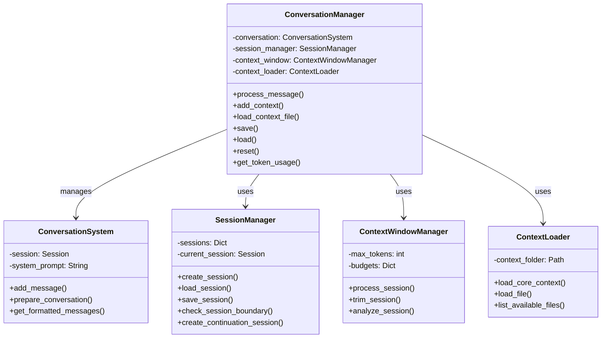
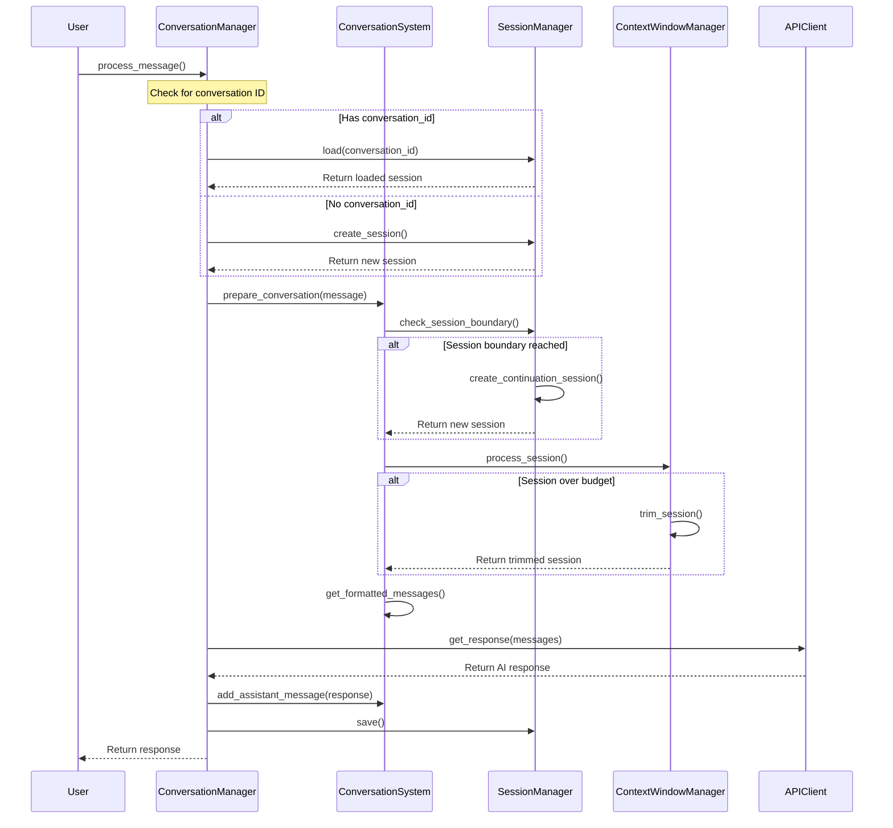
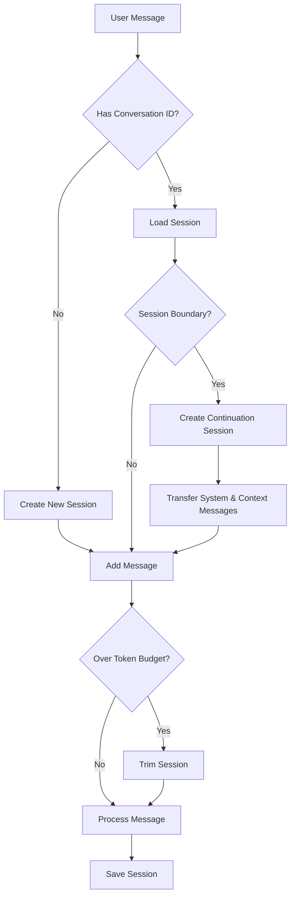

# Conversation Manager

The `ConversationManager` is a high-level coordinator that manages conversation state, handles message exchanges, and provides a simplified interface for PenguinCore to interact with.

## Overview

The ConversationManager coordinates between:

1. **ConversationSystem** - Core message handling
2. **ContextWindowManager** - Token budgeting and trimming
3. **SessionManager** - Session persistence and boundaries
4. **ContextLoader** - Context file management



## Message Flow



## Session Management



## Initialization

```python
def __init__(
    self,
    model_config=None,
    api_client=None,
    workspace_path: Optional[Path] = None,
    system_prompt: str = "",
    max_messages_per_session: int = 5000,
    max_sessions_in_memory: int = 20,
    auto_save_interval: int = 60
)
```

Parameters:
- `model_config`: Configuration for the AI model
- `api_client`: Client for API interactions
- `workspace_path`: Path to workspace directory
- `system_prompt`: Initial system prompt
- `max_messages_per_session`: Maximum messages before creating a new session
- `max_sessions_in_memory`: Maximum sessions to keep in memory cache
- `auto_save_interval`: Seconds between auto-saves (0 to disable)

## Key Methods

### Message Processing

```python
async def process_message(
    self,
    message: str,
    conversation_id: Optional[str] = None,
    image_path: Optional[str] = None,
    streaming: bool = False,
    stream_callback: Optional[Callable[[str], None]] = None,
    context_files: Optional[List[str]] = None
) -> Union[str, AsyncGenerator[str, None]]
```

Processes a user message and gets AI response. Handles both streaming and non-streaming modes.

### Context Management

```python
def add_context(self, content: str, source: Optional[str] = None) -> Message
```

Adds context information to the conversation.

```python
def load_context_file(self, file_path: str) -> bool
```

Loads a context file into the conversation.

```python
def list_context_files(self) -> List[Dict[str, Any]]
```

Lists available context files.

### Conversation State

```python
def save(self) -> bool
```

Saves the current conversation state.

```python
def load(self, conversation_id: str) -> bool
```

Loads a specific conversation by ID.

```python
def list_conversations(
    self, 
    limit: int = 100,
    offset: int = 0,
    search_term: Optional[str] = None
) -> List[Dict]
```

Lists available conversations with search and pagination.

```python
def reset(self) -> None
```

Resets the conversation state.

### Token Management

```python
def get_token_usage(self) -> Dict[str, Any]
```

Gets token usage statistics for the current conversation across all sessions.

## Example Usage

```python
# Initialize the conversation manager
conversation_manager = ConversationManager(
    model_config=model_config,
    api_client=api_client,
    workspace_path=WORKSPACE_PATH,
    system_prompt=SYSTEM_PROMPT,
    max_messages_per_session=5000,
    max_sessions_in_memory=20
)

# Process a user message
response = await conversation_manager.process_message(
    message="Tell me about Python's asyncio library",
    streaming=True
)

# Load a specific conversation
conversation_manager.load("session_20230415_12345")

# Add context information
conversation_manager.add_context("Project requirement: Build an API with rate limiting")

# Load a context file
conversation_manager.load_context_file("context/api_reference.md")
```

## Key Features

- **Session Management**: Automatically handles transitions between sessions when the context window fills up
- **Token Budgeting**: Ensures conversations don't exceed model limits through intelligent trimming
- **Streaming Support**: Works with both streaming and non-streaming response modes
- **Multimodal Content**: Handles text, images, and structured content
- **Context Loading**: Integrates external files into conversation context
- **Conversation Persistence**: Automatically saves state and allows resuming conversations 