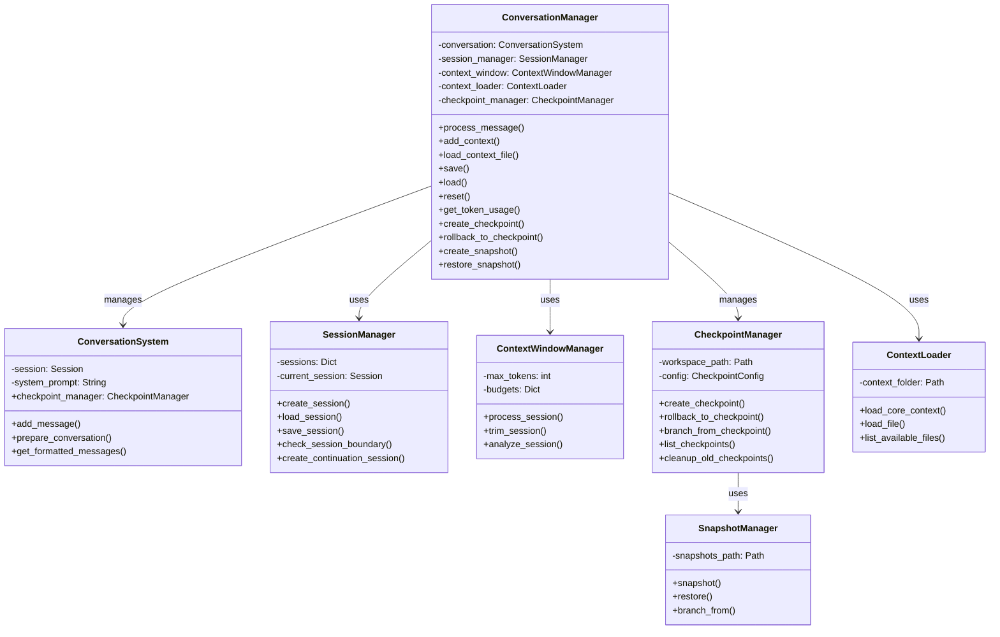
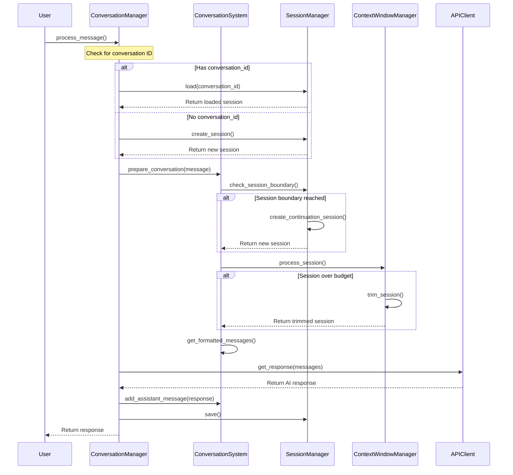
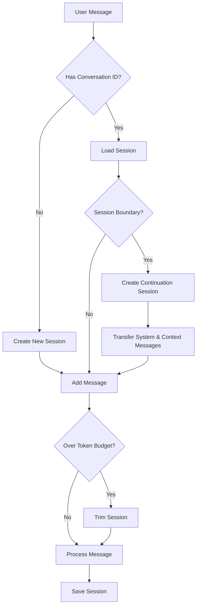

# Conversation Manager

The `ConversationManager` v0.3.1 is a high-level coordinator that manages conversation state, handles message exchanges, and provides advanced checkpoint and snapshot capabilities for conversation management.

## Overview

The ConversationManager coordinates between:

1. **ConversationSystem** - Core message handling
2. **ContextWindowManager** - Token budgeting and trimming
3. **SessionManager** - Session persistence and boundaries
4. **ContextLoader** - Context file management
5. **CheckpointManager** - Conversation state snapshots and branching

## Architecture



## Message Flow



## Session Management



## Initialization

```python
def __init__(
    self,
    model_config=None,
    api_client=None,
    workspace_path: Optional[Path] = None,
    system_prompt: str = "",
    max_messages_per_session: int = 5000,
    max_sessions_in_memory: int = 20,
    auto_save_interval: int = 60,
    checkpoint_config: Optional[CheckpointConfig] = None
)
```

### Configuration Resolution

The ConversationManager automatically resolves configuration from multiple sources:

1. **Model Configuration**: `model_config` for API settings
2. **Live Config**: `config_obj` from PenguinCore for runtime updates
3. **Default Values**: Sensible defaults for all parameters
4. **Checkpoint Config**: Automatic checkpoint configuration if not provided

### Parameters

- `model_config`: Configuration for the AI model with provider-specific settings
- `api_client`: Client for API interactions with enhanced streaming support
- `workspace_path`: Path to workspace directory for conversation storage
- `system_prompt`: Initial system prompt with advanced template support
- `max_messages_per_session`: Maximum messages before creating a new session (default: 5000)
- `max_sessions_in_memory`: Maximum sessions to keep in memory cache (default: 20)
- `auto_save_interval`: Seconds between auto-saves (default: 60, 0 to disable)
- `checkpoint_config`: Configuration for checkpoint system with retention policies

### Automatic Component Initialization

- **Session Manager**: Created with optimized caching and persistence
- **Context Window**: Initialized with provider-aware token counting
- **Checkpoint Manager**: Lazy initialization with automatic worker startup
- **Context Loader**: Pre-loads core context files on startup

## Key Methods

### Message Processing

```python
async def process_message(
    self,
    message: str,
    conversation_id: Optional[str] = None,
    image_path: Optional[str] = None,
    streaming: bool = False,
    stream_callback: Optional[Callable[[str], None]] = None,
    context_files: Optional[List[str]] = None
) -> Union[str, AsyncGenerator[str, None]]
```

Processes a user message:
- **Conversation Loading**: Automatic conversation ID resolution
- **Context File Integration**: Loads specified context files before processing
- **Image Support**: Handles multimodal content with automatic token counting
- **Streaming Support**: Real-time response streaming with callback handling
- **Error Recovery**: Comprehensive error handling with fallback mechanisms

## Checkpoint and Snapshot System

The ConversationManager includes checkpoint and snapshot capabilities for conversation state management.

### Checkpoint Management

```python
async def create_manual_checkpoint(
    self,
    name: Optional[str] = None,
    description: Optional[str] = None
) -> Optional[str]
```

Creates a manual checkpoint of the current conversation state with optional metadata.

```python
async def rollback_to_checkpoint(self, checkpoint_id: str) -> bool
```

Rollbacks conversation to a specific checkpoint, restoring the exact state.

```python
async def branch_from_checkpoint(
    self,
    checkpoint_id: str,
    name: Optional[str] = None,
    description: Optional[str] = None
) -> Optional[str]
```

Creates a new conversation branch from a checkpoint for experimental conversations.

```python
def list_checkpoints(
    self,
    session_id: Optional[str] = None,
    checkpoint_type: Optional[CheckpointType] = None,
    limit: int = 50
) -> List[Dict[str, Any]]
```

Lists available checkpoints with filtering and pagination support.

### Snapshot Management

```python
def create_snapshot(self, *, meta: Optional[Dict[str, Any]] = None) -> Optional[str]
```

Creates a lightweight snapshot of the current conversation for quick restoration.

```python
def restore_snapshot(self, snapshot_id: str) -> bool
```

Restores conversation from a snapshot with minimal overhead.

```python
def branch_from_snapshot(self, snapshot_id: str, *, meta: Optional[Dict[str, Any]] = None) -> Optional[str]
```

Creates a new conversation branch from a snapshot for parallel experimentation.

### Automatic Checkpointing

The system automatically creates checkpoints based on the configured policy:

- **Auto Checkpoints**: Created every N messages (configurable frequency)
- **Manual Checkpoints**: Created on-demand with custom metadata
- **Branch Checkpoints**: Created when branching from existing checkpoints
- **Retention Management**: Automatic cleanup of old checkpoints based on policies

### Checkpoint Configuration

```python
@dataclass
class CheckpointConfig:
    enabled: bool = True
    frequency: int = 1  # Checkpoint every message
    planes: Dict[str, bool] = field(default_factory=lambda: {"conversation": True, "tasks": False, "code": False})
    retention: Dict[str, Any] = field(default_factory=lambda: {
        "keep_all_hours": 24,
        "keep_every_nth": 10,
        "max_age_days": 30
    })
    max_auto_checkpoints: int = 1000
```

### Context Management

```python
def add_context(self, content: str, source: Optional[str] = None) -> Message
```

Adds context information to the conversation.

```python
def load_context_file(self, file_path: str) -> bool
```

Loads a context file into the conversation.

```python
def list_context_files(self) -> List[Dict[str, Any]]
```

Lists available context files.

### Conversation State

```python
def save(self) -> bool
```

Saves the current conversation state.

```python
def load(self, conversation_id: str) -> bool
```

Loads a specific conversation by ID.

```python
def list_conversations(
    self, 
    limit: int = 100,
    offset: int = 0,
    search_term: Optional[str] = None
) -> List[Dict]
```

Lists available conversations with search and pagination.

```python
def reset(self) -> None
```

Resets the conversation state.

### Token Management

```python
def get_token_usage(self) -> Dict[str, Any]
```

Gets token usage statistics for the current conversation across all sessions.

## Advanced Usage Examples

### Basic Setup with Enhanced Features

```python
from penguin.system.conversation_manager import ConversationManager
from penguin.system.checkpoint_manager import CheckpointConfig

# Initialize with checkpoint configuration
checkpoint_config = CheckpointConfig(
    enabled=True,
    frequency=1,  # Checkpoint every message
    retention={
        "keep_all_hours": 24,
        "keep_every_nth": 10,
        "max_age_days": 30
    }
)

conversation_manager = ConversationManager(
    model_config=model_config,
    api_client=api_client,
    workspace_path=Path("./workspace"),
    system_prompt="You are a helpful assistant.",
    checkpoint_config=checkpoint_config
)
```

### Checkpoint and Snapshot Management

```python
# Create a checkpoint before major changes
checkpoint_id = await conversation_manager.create_manual_checkpoint(
    name="Before refactoring",
    description="Saving state before major code changes"
)

# Continue conversation
response = await conversation_manager.process_message("Please refactor this code...")
print(response)

# If something goes wrong, rollback to the checkpoint
success = await conversation_manager.rollback_to_checkpoint(checkpoint_id)
if success:
    print("Successfully rolled back to previous state")

# Create a branch for experimental conversation
branch_id = await conversation_manager.branch_from_checkpoint(
    checkpoint_id,
    name="Experimental approach",
    description="Testing alternative refactoring strategy"
)
```

### Snapshot-Based Quick Save/Restore

```python
# Create a lightweight snapshot
snapshot_id = conversation_manager.create_snapshot(
    meta={"purpose": "quick_backup", "timestamp": datetime.now().isoformat()}
)

# Continue working
await conversation_manager.process_message("Make this code more efficient...")

# Quick restore if needed
success = conversation_manager.restore_snapshot(snapshot_id)
if success:
    print("Restored from snapshot")
```

## Key Features

- **Session Management**: Automatically handles transitions between sessions when the context window fills up
- **Token Budgeting**: Ensures conversations don't exceed model limits through intelligent trimming
- **Streaming Support**: Works with both streaming and non-streaming response modes
- **Multimodal Content**: Handles text, images, and structured content
- **Context Loading**: Integrates external files into conversation context
- **Conversation Persistence**: Automatically saves state and allows resuming conversations
- **Checkpoint & Snapshot System**: Full conversation state management with branching
- **Context Loading**: Smart integration of external files and documentation
- **Conversation Persistence**: Automatic state saving with metadata preservation
- **Error Recovery**: Robust error handling with emergency checkpoint creation
- **Performance Monitoring**: Real-time token usage and performance tracking 