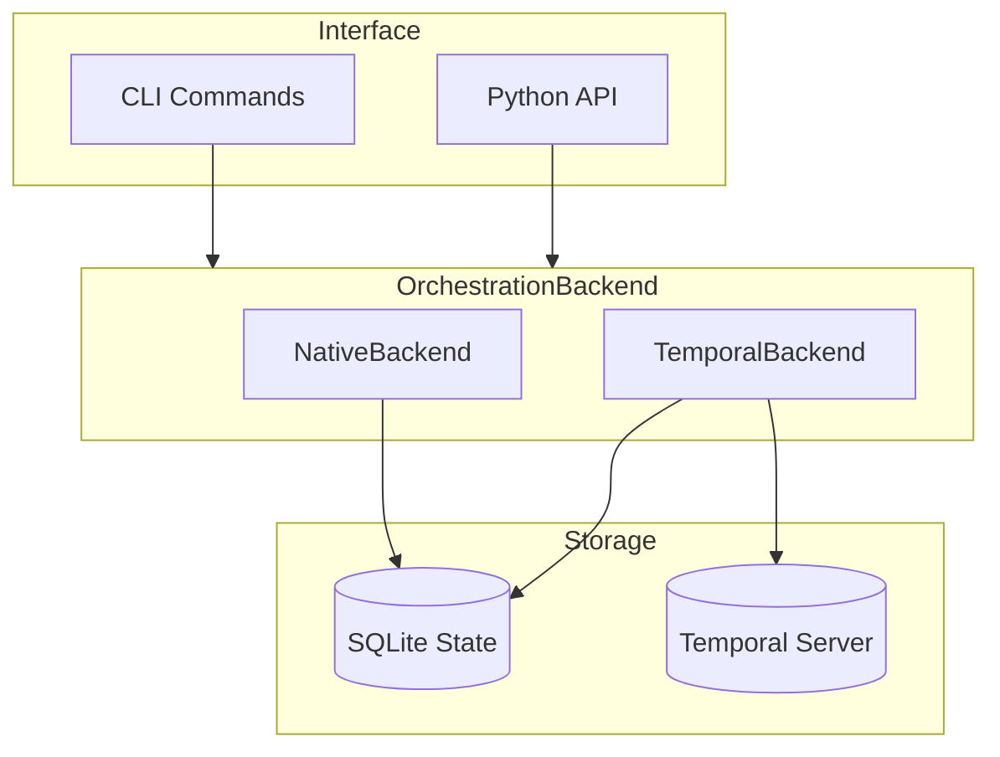
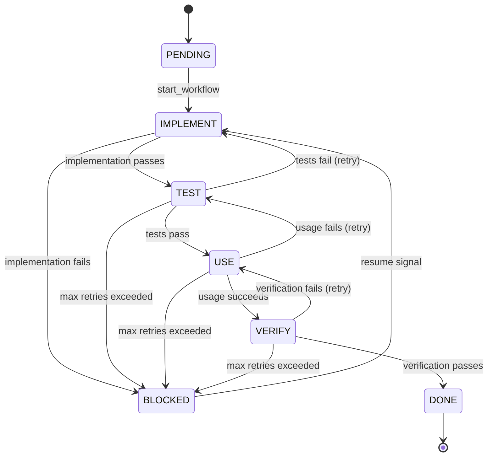
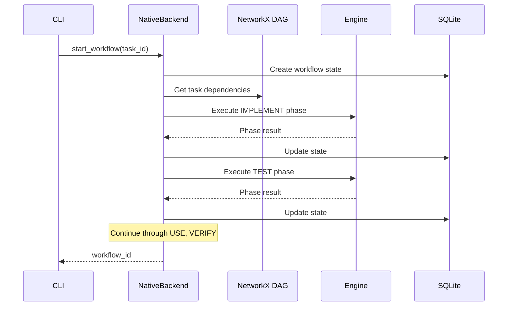
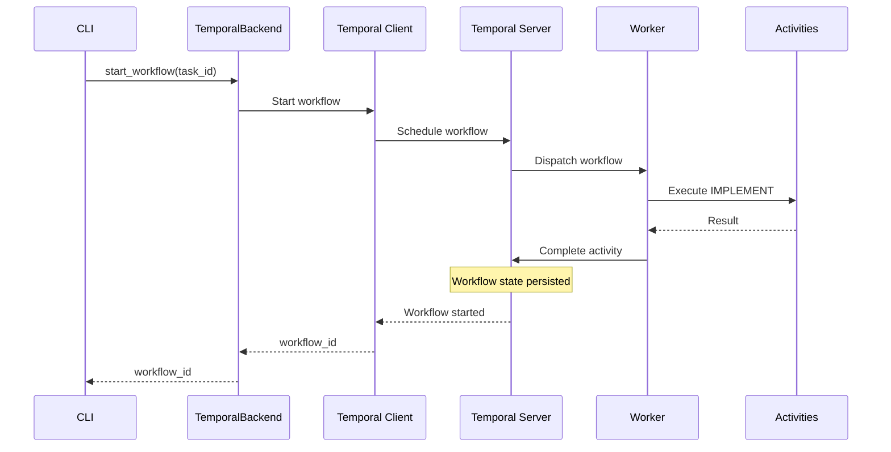

# Orchestration

Penguin's orchestration system provides durable workflow execution for the ITUV (Implement, Test, Use, Verify) lifecycle. It supports multiple backends for different reliability and scalability requirements.

## Overview

The orchestration layer provides:

- **ITUV workflow execution** with phase gates and timeouts
- **Multiple backends** (Native, Temporal) with a unified interface
- **Durable state** that survives restarts
- **Signals and queries** for workflow control
- **Conversation history persistence** for long-running tasks



## ITUV Workflow

Each task executes through four phases:



### Phase Descriptions

| Phase | Purpose | Typical Actions |
|-------|---------|-----------------|
| **IMPLEMENT** | Create the solution | Write code, create files, modify configs |
| **TEST** | Validate correctness | Run unit tests, linting, type checks |
| **USE** | Verify usability | Execute usage recipes, integration tests |
| **VERIFY** | Confirm acceptance | Check acceptance criteria, review output |

### Phase Configuration

```yaml
orchestration:
  phase_timeouts:
    implement: 600   # 10 minutes
    test: 300        # 5 minutes
    use: 180         # 3 minutes
    verify: 120      # 2 minutes
  
  retry:
    max_attempts: 3
    backoff_multiplier: 2
    initial_delay_sec: 5
```

## Backends

### Native Backend

The default backend uses NetworkX for DAG management and SQLite for state persistence. Best for:

- Single-machine deployments
- Development and testing
- Simple workflows without external dependencies

```python
from penguin.orchestration import get_backend

# Uses native backend by default
backend = get_backend(workspace_path="/path/to/project")

# Start a workflow
workflow_id = await backend.start_workflow(task_id="auth-user-model")
```

### Temporal Backend

For production deployments requiring durability and scalability:

- **Durable execution** - Survives process restarts
- **Automatic retries** - Configurable retry policies
- **Visibility** - Query workflow state at any time
- **Scalability** - Distributed worker execution

```yaml
orchestration:
  backend: temporal
  temporal:
    address: localhost:7233
    namespace: penguin
    task_queue: penguin-ituv
    auto_start: true  # Auto-start local server in dev
```

## CLI Commands

### Start Workflow

```bash
# Start ITUV workflow for a task
/workflow start task-123

# Output:
# Started ITUV workflow for task task-123
# workflow_id: ituv-task-123-abc123
```

### Check Status

```bash
# Get workflow status
/workflow status ituv-task-123-abc123

# Output:
# Workflow ituv-task-123-abc123
# Status: RUNNING
# Phase: TEST
# Progress: 50%
# Started: 2024-01-15 10:30:00
```

### Control Workflows

```bash
# Pause a running workflow
/workflow pause ituv-task-123-abc123

# Resume a paused workflow
/workflow resume ituv-task-123-abc123

# Cancel a workflow
/workflow cancel ituv-task-123-abc123
```

### List Workflows

```bash
# List all workflows
/workflow list

# Filter by project
/workflow list project-456
```

## Python API

### Basic Usage

```python
from penguin.orchestration import get_backend, OrchestrationConfig

# Get backend with custom config
config = OrchestrationConfig(
    backend="native",
    phase_timeouts={
        "implement": 900,
        "test": 300,
        "use": 180,
        "verify": 120,
    }
)
backend = get_backend(config=config, workspace_path="./project")

# Start workflow
workflow_id = await backend.start_workflow(
    task_id="auth-user-model",
    blueprint_id="auth-system",
)

# Check status
info = await backend.get_workflow_status(workflow_id)
print(f"Phase: {info.phase}, Status: {info.status}")

# Control workflow
await backend.pause_workflow(workflow_id)
await backend.resume_workflow(workflow_id)
await backend.cancel_workflow(workflow_id)
```

### Workflow Info

```python
from penguin.orchestration.backend import WorkflowStatus, WorkflowPhase

info = await backend.get_workflow_status(workflow_id)

# Status enum
info.status  # WorkflowStatus.RUNNING, PAUSED, COMPLETED, FAILED, CANCELLED

# Phase enum
info.phase  # WorkflowPhase.IMPLEMENT, TEST, USE, VERIFY, DONE

# Metadata
info.workflow_id
info.task_id
info.blueprint_id
info.started_at
info.updated_at
info.error_message  # If failed
info.artifacts      # List of output paths
```

### Listing Workflows

```python
# List all workflows
workflows = await backend.list_workflows()

# Filter by project
workflows = await backend.list_workflows(project_id="my-project")

# Filter by status
from penguin.orchestration.backend import WorkflowStatus
workflows = await backend.list_workflows(
    status_filter=WorkflowStatus.RUNNING,
    limit=10
)
```

## Signals and Queries

### Signals (Temporal Backend)

Signals allow external input to running workflows:

```python
# Pause workflow
await backend.signal_workflow(workflow_id, "pause")

# Resume workflow
await backend.signal_workflow(workflow_id, "resume")

# Cancel workflow
await backend.signal_workflow(workflow_id, "cancel")

# Inject feedback mid-workflow
await backend.signal_workflow(
    workflow_id, 
    "inject_feedback",
    payload={"message": "Use async/await pattern"}
)
```

### Queries (Temporal Backend)

Queries retrieve workflow state without modifying it:

```python
# Get current status
status = await backend.query_workflow(workflow_id, "get_status")

# Get progress percentage
progress = await backend.query_workflow(workflow_id, "get_progress")

# Get artifacts produced
artifacts = await backend.query_workflow(workflow_id, "get_artifacts")

# Get phase results
results = await backend.query_workflow(workflow_id, "get_phase_results")
```

## State Persistence

### Workflow State

Workflow state is persisted to SQLite for durability:

```python
from penguin.orchestration.state import WorkflowStateStore

store = WorkflowStateStore(db_path="./penguin.db")

# State is automatically saved during workflow execution
# On restart, workflows can be recovered:
active_workflows = store.list_active_workflows()
```

### Context Snapshots

Conversation history is stored separately to avoid payload limits:

```python
from penguin.orchestration.state import ContextSnapshot

# Save conversation snapshot
snapshot = ContextSnapshot(
    snapshot_id="snap-123",
    workflow_id="ituv-task-123",
    conversation_history=[...],
    created_at=datetime.now()
)
store.save_context_snapshot(snapshot)

# Load snapshot
snapshot = store.get_context_snapshot("snap-123")
```

## Configuration

### Full Configuration Reference

```yaml
orchestration:
  # Backend selection: "native" or "temporal"
  backend: native
  
  # Phase timeouts in seconds
  phase_timeouts:
    implement: 600
    test: 300
    use: 180
    verify: 120
  
  # Retry configuration
  retry:
    max_attempts: 3
    initial_delay_sec: 5
    backoff_multiplier: 2
    max_delay_sec: 300
  
  # Temporal-specific settings
  temporal:
    address: localhost:7233
    namespace: penguin
    task_queue: penguin-ituv
    auto_start: true
    
    # TLS configuration (optional)
    tls:
      enabled: false
      cert_path: null
      key_path: null
      ca_path: null
```

### Environment Variables

```bash
# Override backend
export PENGUIN_ORCHESTRATION_BACKEND=temporal

# Temporal connection
export TEMPORAL_ADDRESS=localhost:7233
export TEMPORAL_NAMESPACE=penguin

# Disable auto-start for production
export TEMPORAL_AUTO_START=false
```

## Architecture

### Backend Interface

All backends implement `OrchestrationBackend`:

```python
from abc import ABC, abstractmethod
from typing import Optional, List

class OrchestrationBackend(ABC):
    @abstractmethod
    async def start_workflow(
        self,
        task_id: str,
        blueprint_id: Optional[str] = None,
        config: Optional[dict] = None,
    ) -> str:
        """Start ITUV workflow, return workflow_id."""
        
    @abstractmethod
    async def get_workflow_status(
        self, 
        workflow_id: str
    ) -> Optional[WorkflowInfo]:
        """Get current workflow status."""
        
    @abstractmethod
    async def pause_workflow(self, workflow_id: str) -> bool:
        """Pause a running workflow."""
        
    @abstractmethod
    async def resume_workflow(self, workflow_id: str) -> bool:
        """Resume a paused workflow."""
        
    @abstractmethod
    async def cancel_workflow(self, workflow_id: str) -> bool:
        """Cancel a workflow."""
        
    @abstractmethod
    async def list_workflows(
        self,
        project_id: Optional[str] = None,
        status_filter: Optional[WorkflowStatus] = None,
        limit: int = 100,
    ) -> List[WorkflowInfo]:
        """List workflows with optional filters."""
```

### Native Backend Flow



### Temporal Backend Flow



## Monitoring

### Health Checks

```python
# Check backend health
health = await backend.health_check()
print(f"Backend: {health['backend']}")
print(f"Connected: {health['connected']}")
print(f"Active workflows: {health['active_count']}")
```

### Metrics (Temporal)

When using Temporal, metrics are available via Prometheus:

- `temporal_workflow_started_total`
- `temporal_workflow_completed_total`
- `temporal_workflow_failed_total`
- `temporal_activity_execution_latency`

## Error Handling

### Workflow Failures

```python
try:
    workflow_id = await backend.start_workflow(task_id)
except WorkflowError as e:
    print(f"Failed to start workflow: {e}")

# Check for failed workflows
info = await backend.get_workflow_status(workflow_id)
if info.status == WorkflowStatus.FAILED:
    print(f"Workflow failed: {info.error_message}")
    
    # Retry from last checkpoint
    new_id = await backend.retry_workflow(workflow_id)
```

### Phase Failures

Individual phases can fail and trigger retries:

```python
# Phase failure handling is automatic
# After max retries, workflow enters BLOCKED state

info = await backend.get_workflow_status(workflow_id)
if info.status == WorkflowStatus.BLOCKED:
    # Inject feedback and resume
    await backend.signal_workflow(
        workflow_id,
        "inject_feedback",
        {"fix": "Add missing import statement"}
    )
    await backend.resume_workflow(workflow_id)
```

## Best Practices

### Workflow Design

1. **Idempotent activities** - Activities should be safe to retry
2. **Reasonable timeouts** - Set phase timeouts based on task complexity
3. **Clear acceptance criteria** - Define what "done" means for each task
4. **Graceful degradation** - Handle partial failures appropriately

### Production Deployment

1. **Use Temporal** for production workloads
2. **External Temporal cluster** - Don't rely on auto-start
3. **Monitor workflows** - Set up alerting for failures
4. **Backup state** - Regular SQLite backups for context snapshots

### Development

1. **Native backend** for local development
2. **Auto-start Temporal** for integration testing
3. **Mock activities** for unit tests

## See Also

- [Blueprints](./blueprints.md) - Task specification format
- [Run Mode](./run-mode.md) - Autonomous task execution
- [Project Management](../usage/project_management.md) - Task and project APIs

