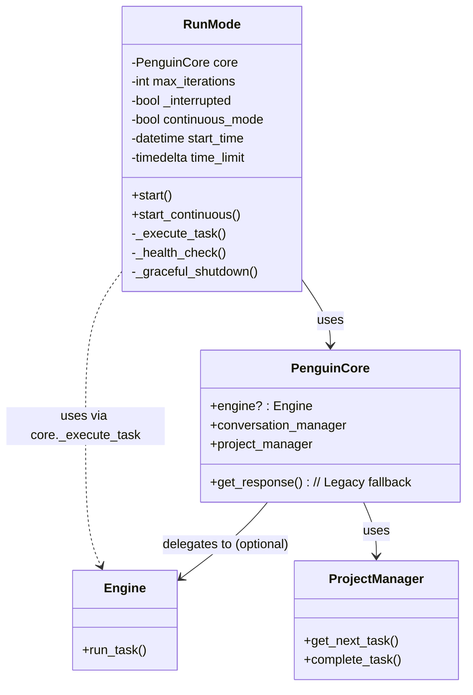
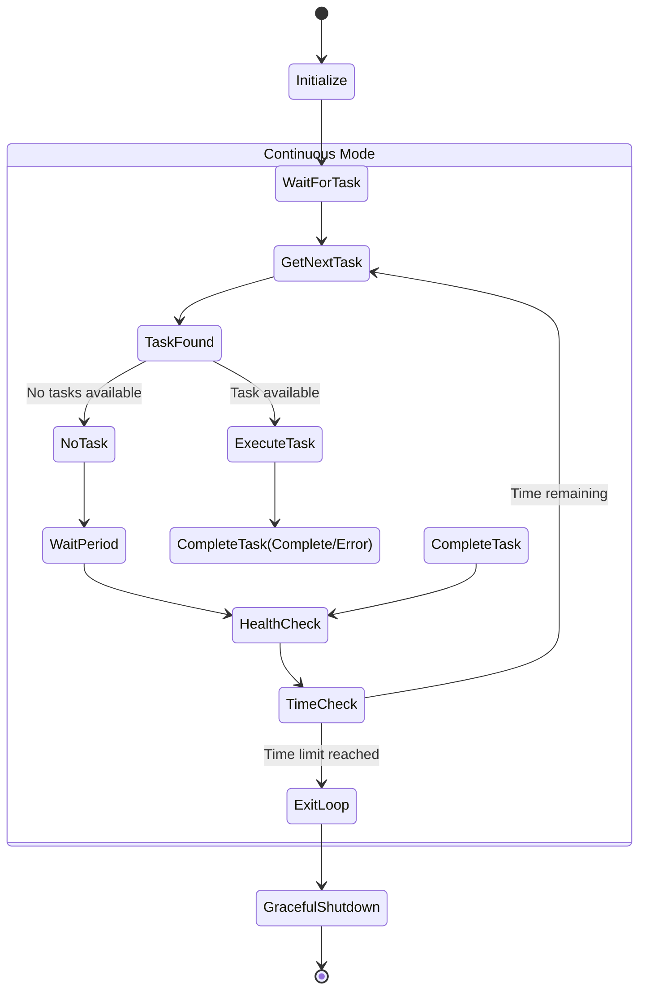

# Run Mode

The `RunMode` provides autonomous operation capabilities for the Penguin AI assistant, allowing it to switch from interactive conversation to task-driven execution mode.

## Overview

Run Mode enables Penguin to:
- Execute specific tasks with defined goals
- Run continuously to process multiple tasks
- Maintain workspace state across tasks
- Operate with time limits and graceful shutdowns



## Task Execution Flow (`_execute_task`)

The core logic for executing a task within `RunMode` resides in the `_execute_task` method.

1.  **Check for Engine:** It first checks if the `PenguinCore` instance has an initialized `Engine`.
2.  **Delegate to Engine (Preferred):** If the `Engine` exists, `_execute_task` delegates the entire multi-step reasoning and action loop to `Engine.run_task(task_prompt_full, max_iterations=self.max_iterations)`. The `Engine` handles the iterations, LLM calls, action execution, and stop conditions.
3.  **Legacy Fallback:** If the `Engine` is *not* available (e.g., failed initialization), `_execute_task` falls back to its internal legacy loop:
    *   It prepares the initial task prompt and adds it to the conversation.
    *   It iterates up to `max_iterations`:
        *   Calls `PenguinCore.get_response()` to get the next LLM response and potential actions based on the *current* conversation state.
        *   Displays assistant output and action results.
        *   Checks for completion or stop phrases in the response.
        *   Continues the loop, building upon the conversation history.
4.  **Handle Completion/Error:** Returns the final status (completed, interrupted, error) and message.

```mermaid
flowchart TD
    StartExecute[Start _execute_task] --> CheckEngine{Engine Available?}

    CheckEngine -- Yes --> DelegateToEngine[Delegate to Engine.run_task]
    DelegateToEngine --> EngineHandlesLoop[Engine Manages Iteration Loop]
    EngineHandlesLoop --> GetEngineResult[Get Final Result from Engine]

    CheckEngine -- No --> StartLegacyLoop[Start Legacy Iteration Loop]
    subgraph LegacyLoop[Legacy RunMode Loop (Fallback)]
        direction TB
        PrepPrompt[Prepare Initial Prompt] --> Iter[Iteration Check]
        Iter -- Iter < Max --> CallCore[Call core.get_response]
        CallCore --> DisplayResults[Display Results]
        DisplayResults --> CheckComplete{Completion Phrase?}
        CheckComplete -- No --> Iter
        CheckComplete -- Yes --> ExitLegacyLoop[Exit Legacy Loop]
        Iter -- Iter >= Max --> ExitLegacyLoop
    end
    StartLegacyLoop --> PrepPrompt
    ExitLegacyLoop --> GetLegacyResult[Get Final Result from Loop]

    GetEngineResult --> EndExecute[Return Result]
    GetLegacyResult --> EndExecute

    style LegacyLoop fill:#fff3e0,stroke:#ff9800
```

## Continuous Mode Operation



## Initialization

```python
def __init__(
    self,
    core,
    max_iterations: int = MAX_TASK_ITERATIONS,
    time_limit: Optional[int] = None,
):
```

Parameters:
- `core`: `PenguinCore` instance to use for operations. `RunMode` will use `core.engine` if available.
- `max_iterations`: Maximum iterations per task (used primarily in legacy fallback loop). Default from config.
- `time_limit`: Optional time limit in minutes for continuous mode.

## Key Methods

### Start Single Task

```python
async def start(
    self,
    name: str,
    description: Optional[str] = None,
    context: Optional[Dict[str, Any]] = None,
) -> None
```

Starts autonomous execution for a specific task by calling `_execute_task`.

### Start Continuous Mode

```python
async def start_continuous(self, specified_task_name: Optional[str] = None, task_description: Optional[str] = None) -> None:
```

Starts continuous operation mode that processes tasks sequentially, calling `_execute_task` for each task.

### Task Execution (`_execute_task`)

```python
async def _execute_task(
    self,
    name: str,
    description: Optional[str] = None,
    context: Optional[Dict[str, Any]] = None,
) -> Dict[str, Any]
```

Executes a task. **Crucially, this method now attempts to delegate the entire execution loop to `PenguinCore.engine.run_task` if the `Engine` is available.** If not, it falls back to its internal iterative loop using `PenguinCore.get_response`. Returns a dictionary with the task status and final message.

## Task Completion & Control Phrases

RunMode uses special phrases, typically checked within the `Engine` loop or the legacy fallback loop, to manage task flow:

-   `TASK_COMPLETION_PHRASE` (e.g., "TASK_COMPLETED"): Signals that a specific task's objective has been met.
-   `CONTINUOUS_COMPLETION_PHRASE` (e.g., "CONTINUOUS_MODE_COMPLETE"): Signals the end of the entire continuous mode session (not just one task).
-   `NEED_USER_CLARIFICATION_PHRASE` (e.g., "NEED_USER_CLARIFICATION"): Indicates the AI needs more input from the user to proceed with the current task. This typically pauses the continuous mode.
-   `EMERGENCY_STOP_PHRASE`: Signals immediate termination of operations.

## Task Flow Summary

When running a task (`start` or within `start_continuous`), `RunMode` primarily:

1.  Retrieves or prepares task details (name, description, context).
2.  Calls `_execute_task`.
3.  `_execute_task` checks for `core.engine`.
4.  **If Engine exists:** Delegates to `Engine.run_task` to handle the multi-step process until completion, stop condition, or error.
5.  **If Engine *doesn't* exist:** Initiates its own loop, calling `core.get_response` iteratively, checking for completion phrases itself.
6.  Handles the result (success, error, interruption, clarification needed).
7.  In continuous mode, loops to get the next task.

## Continuous Mode

In continuous mode, RunMode:

1. Initializes with a time limit if specified
2. Enters a loop that:
   - Gets the next highest priority task from project manager
   - Executes the task
   - Marks task as complete when finished
   - Performs health checks periodically
   - Handles interruptions gracefully
3. Monitors for shutdown requests
4. Performs graceful shutdown when time limit is reached or shutdown requested

## Health Monitoring

RunMode periodically checks system health:

```python
async def _health_check(self) -> None
```

This monitors memory usage, CPU usage, and other diagnostic metrics to ensure stable operation.

## Graceful Shutdown

```python
async def _graceful_shutdown(self) -> None
```

Ensures clean shutdown by:
- Completing current task if possible
- Saving state information
- Cleaning up resources
- Logging shutdown information

## Example Usage

```python
# Create a RunMode instance
run_mode = RunMode(core, time_limit=60)  # 60 minute limit

# Run a specific task
await run_mode.start(
    name="build_data_parser",
    description="Create a parser for CSV data files"
)

# Run in continuous mode to process tasks automatically
await run_mode.start_continuous()
```

## Command Line Usage

RunMode can be triggered from the CLI:

```bash
# Run a specific task
penguin task run build_data_parser

# Run in continuous mode for 2 hours
penguin run --247 --time 120
```

## Integration with Task Manager

RunMode integrates with the `ProjectManager` to:
1. Retrieve task details by name
2. Mark tasks as complete when finished
3. Get the next highest priority task in continuous mode
4. Track metadata for completed tasks

This allows for a seamless workflow where tasks can be created interactively and then executed autonomously. 