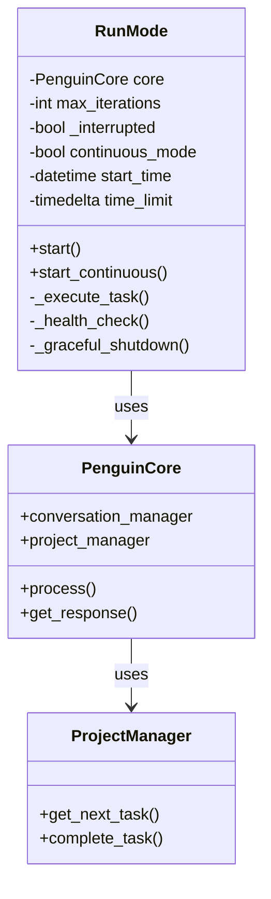
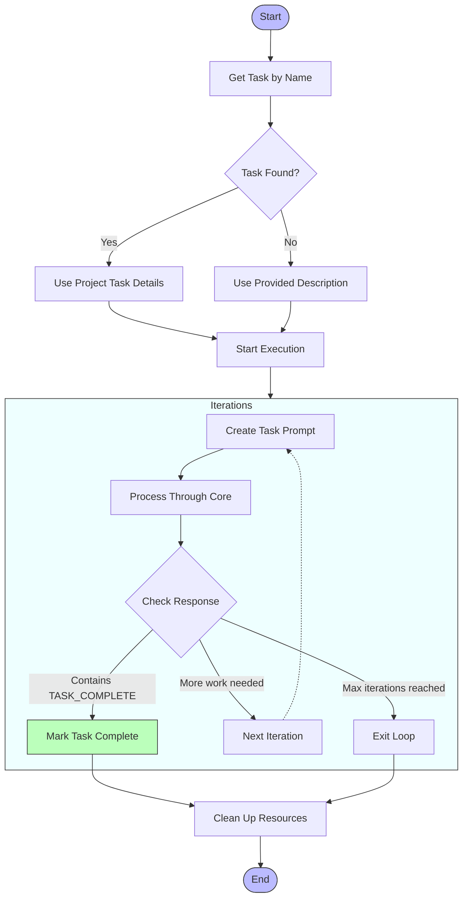
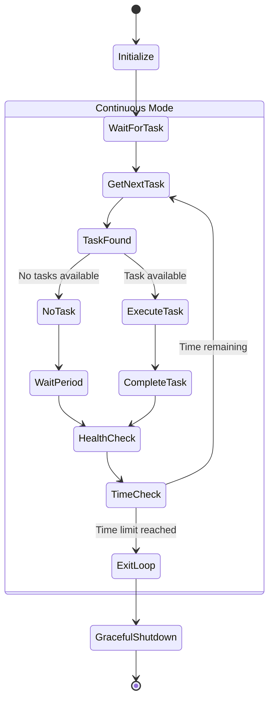

# Run Mode

The `RunMode` provides autonomous operation capabilities for the Penguin AI assistant, allowing it to switch from interactive conversation to task-driven execution mode.

## Overview

Run Mode enables Penguin to:
- Execute specific tasks with defined goals
- Run continuously to process multiple tasks
- Maintain workspace state across tasks
- Operate with time limits and graceful shutdowns



## Task Execution Flow



## Continuous Mode Operation



## Initialization

```python
def __init__(
    self,
    core,
    max_iterations: int = MAX_TASK_ITERATIONS,
    time_limit: Optional[int] = None,
):
```

Parameters:
- `core`: PenguinCore instance to use for operations
- `max_iterations`: Maximum iterations per task (default from config)
- `time_limit`: Optional time limit in minutes

## Key Methods

### Start Single Task

```python
async def start(
    self,
    name: str,
    description: Optional[str] = None,
    context: Optional[Dict[str, Any]] = None,
) -> None
```

Starts autonomous execution for a specific task.

### Start Continuous Mode

```python
async def start_continuous(self) -> None
```

Starts continuous operation mode that processes tasks sequentially.

### Task Execution

```python
async def _execute_task(
    self,
    name: str,
    description: Optional[str] = None,
    context: Optional[Dict[str, Any]] = None,
) -> Dict[str, Any]
```

Executes a task with proper completion handling.

## Task Completion Phrases

RunMode uses special phrases to detect when tasks are finished:

- `TASK_COMPLETE`: Signals that a specific task is complete
- `CONTINUOUS_COMPLETION_PHRASE`: Signals the end of continuous mode
- `EMERGENCY_STOP_PHRASE`: Signals immediate termination of operations

## Task Flow

When running a task, RunMode follows this flow:

1. Retrieve task details from the project manager if available
2. Display task information and start execution
3. For each iteration (up to max_iterations):
   - Create task prompt
   - Process through PenguinCore
   - Display assistant's response and action results
   - Check for completion phrases
   - Update for next iteration if needed
4. Handle completion or time limits
5. Clean up resources

## Continuous Mode

In continuous mode, RunMode:

1. Initializes with a time limit if specified
2. Enters a loop that:
   - Gets the next highest priority task from project manager
   - Executes the task
   - Marks task as complete when finished
   - Performs health checks periodically
   - Handles interruptions gracefully
3. Monitors for shutdown requests
4. Performs graceful shutdown when time limit is reached or shutdown requested

## Health Monitoring

RunMode periodically checks system health:

```python
async def _health_check(self) -> None
```

This monitors memory usage, CPU usage, and other diagnostic metrics to ensure stable operation.

## Graceful Shutdown

```python
async def _graceful_shutdown(self) -> None
```

Ensures clean shutdown by:
- Completing current task if possible
- Saving state information
- Cleaning up resources
- Logging shutdown information

## Example Usage

```python
# Create a RunMode instance
run_mode = RunMode(core, time_limit=60)  # 60 minute limit

# Run a specific task
await run_mode.start(
    name="build_data_parser",
    description="Create a parser for CSV data files"
)

# Run in continuous mode to process tasks automatically
await run_mode.start_continuous()
```

## Command Line Usage

RunMode can be triggered from the CLI:

```bash
# Run a specific task
penguin task run build_data_parser

# Run in continuous mode for 2 hours
penguin run --247 --time 120
```

## Integration with Task Manager

RunMode integrates with the ProjectManager to:
1. Retrieve task details by name
2. Mark tasks as complete when finished
3. Get the next highest priority task in continuous mode
4. Track metadata for completed tasks

This allows for a seamless workflow where tasks can be created interactively and then executed autonomously. 