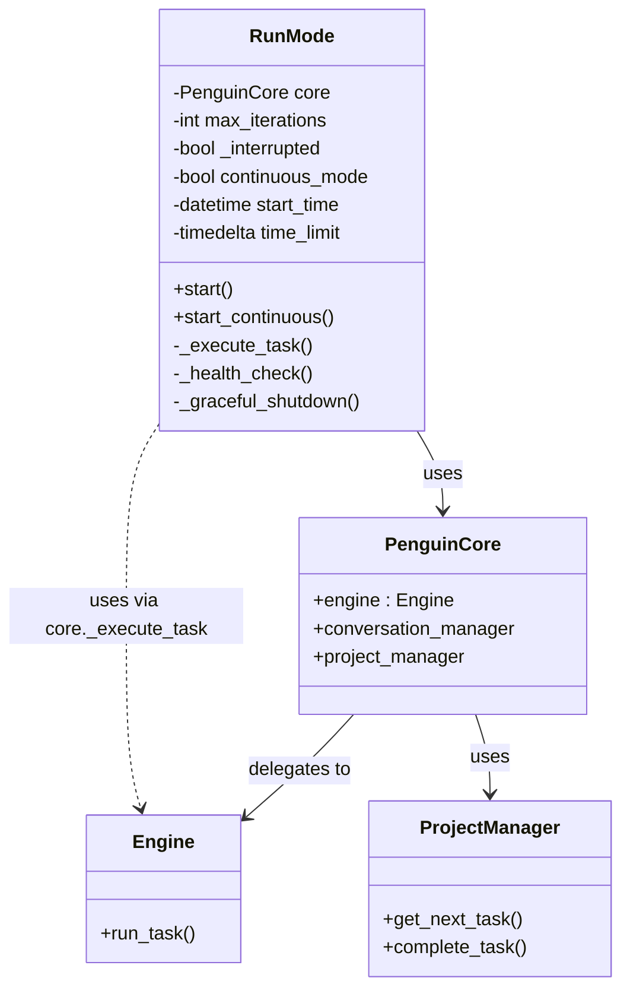
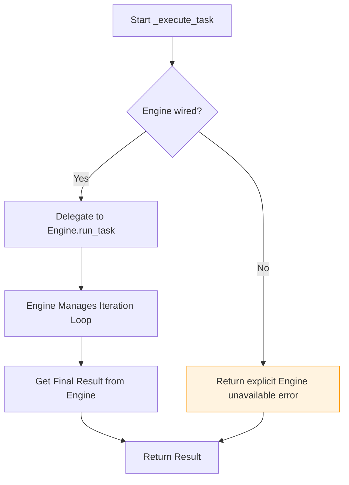
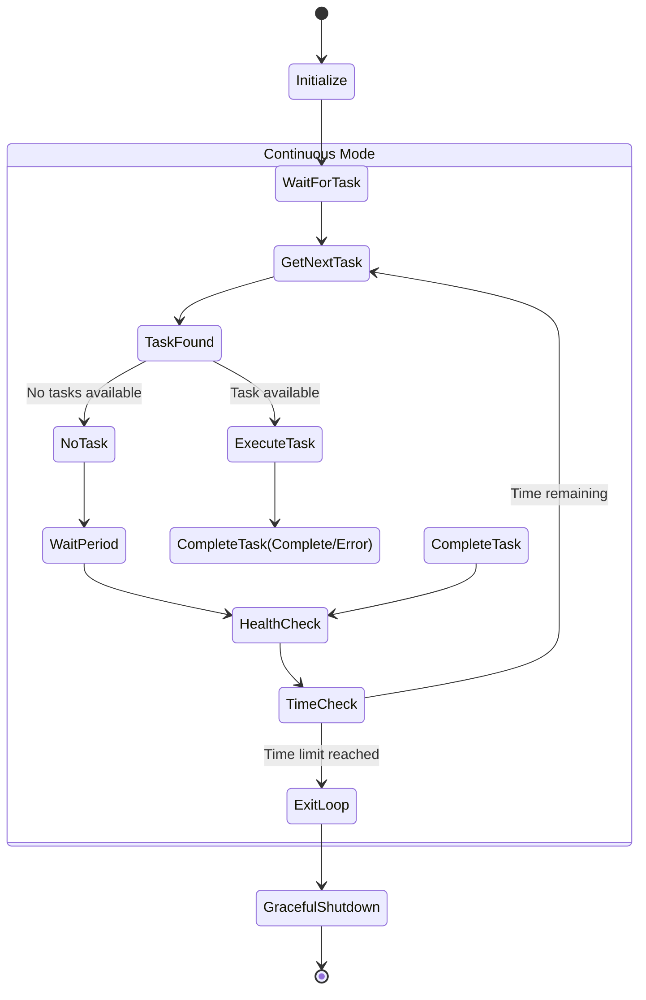
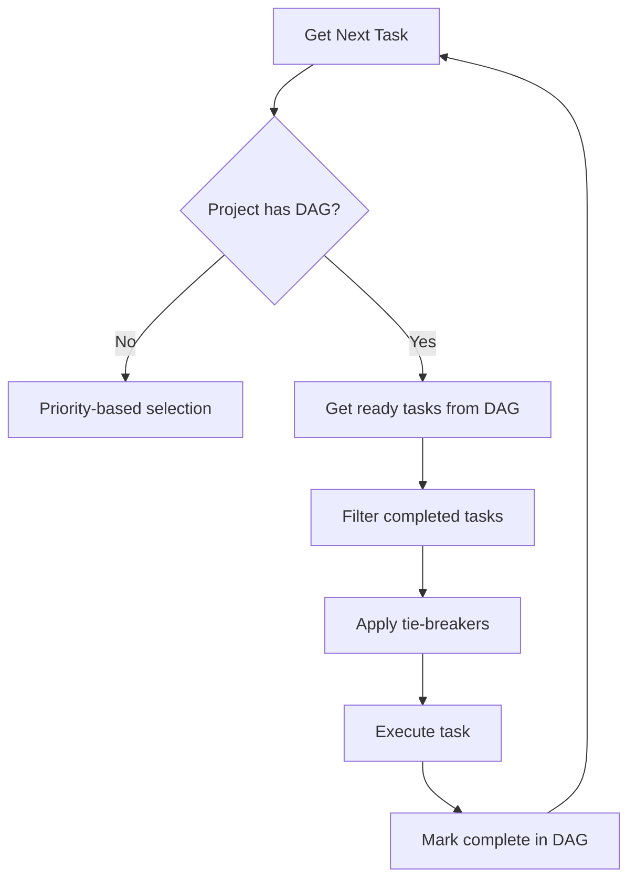
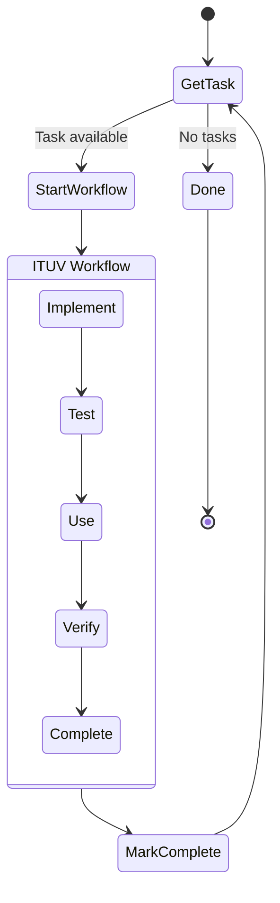

# Run Mode

`RunMode` provides autonomous operation capabilities for Penguin, allowing it to switch from interactive conversation to task-driven execution mode.

## Overview

Run Mode enables Penguin to:
- Execute specific tasks with defined goals
- Run continuously to process multiple tasks
- Maintain workspace state across tasks
- Operate with time limits and graceful shutdowns


```mermaid
classDiagram
    class RunMode {
        -PenguinCore core
        -int max_iterations
        -bool _interrupted
        -bool continuous_mode
        -datetime start_time
        -timedelta time_limit
        +start()
        +start_continuous()
        -_execute_task()
        -_health_check()
        -_graceful_shutdown()
    }

    class Engine {
        +run_task()
    }

    class PenguinCore {
        +engine : Engine
        +conversation_manager
        +project_manager
    }

    class ProjectManager {
        +get_next_task()
        +complete_task()
    }

    RunMode --> PenguinCore : uses
    PenguinCore --> Engine : delegates to
    PenguinCore --> ProjectManager : uses
    RunMode ..> Engine : uses via core._execute_task
```

## Task Execution Flow (`_execute_task`)

The core logic for executing a task within `RunMode` resides in the `_execute_task` method.

1. **Prepare task prompt and context:** RunMode resolves the task name, description, metadata, optional `agent_id`, and optional `agent_role`.
2. **Delegate to Engine:** `_execute_task` delegates the multi-step reasoning and action loop to `Engine.run_task(...)`. The Engine handles iterations, LLM calls, action execution, stop conditions, and MessageBus routing.
3. **Bridge runtime events:** RunMode forwards assistant/reasoning chunks and tool events through PenguinCore's streaming/event methods so CLI, web, and TUI consumers see one coherent stream.
4. **Handle completion/error:** Returns the final status, non-terminal clarification state, cancellation, or error payload.

If Engine is unavailable, RunMode fails closed with an explicit error instead of silently running an alternate legacy loop.


```mermaid
flowchart TD
    StartExecute[Start _execute_task] --> CheckEngine{Engine wired?}

    CheckEngine -- Yes --> DelegateToEngine[Delegate to Engine.run_task]
    DelegateToEngine --> EngineHandlesLoop[Engine Manages Iteration Loop]
    EngineHandlesLoop --> GetEngineResult[Get Final Result from Engine]

    CheckEngine -- No --> FailClosed[Return explicit Engine unavailable error]

    GetEngineResult --> EndExecute[Return Result]
    FailClosed --> EndExecute

    style FailClosed fill:#fff3e0,stroke:#ff9800
```

## Continuous Mode Operation


```mermaid
stateDiagram-v2
    [*] --> Initialize
    Initialize --> WaitForTask
    
    state "Continuous Mode" as ContinuousMode {
        WaitForTask --> GetNextTask
        GetNextTask --> TaskFound
        
        state TaskFound <<choice>>
        TaskFound --> NoTask: No tasks available
        TaskFound --> ExecuteTask: Task available
        
        NoTask --> WaitPeriod
        WaitPeriod --> HealthCheck
        
        ExecuteTask --> CompleteTask(Complete/Error)
        CompleteTask --> HealthCheck
        
        HealthCheck --> TimeCheck
        
        state TimeCheck <<choice>>
        TimeCheck --> GetNextTask: Time remaining
        TimeCheck --> ExitLoop: Time limit reached
    }
    
    ExitLoop --> GracefulShutdown
    GracefulShutdown --> [*]
```

## Initialization

```python
def __init__(
    self,
    core,
    max_iterations: int = MAX_TASK_ITERATIONS,
    time_limit: Optional[int] = None,
):
```

Parameters:
- `core`: `PenguinCore` instance to use for operations. `RunMode` delegates task execution to `core.engine`.
- `max_iterations`: Maximum iterations per task. Default from config.
- `time_limit`: Optional time limit in minutes for continuous mode.

## Key Methods

### Start Single Task

```python
async def start(
    self,
    name: str,
    description: Optional[str] = None,
    context: Optional[Dict[str, Any]] = None,
) -> None
```

Starts autonomous execution for a specific task by calling `_execute_task`.

### Start Continuous Mode

```python
async def start_continuous(self, specified_task_name: Optional[str] = None, task_description: Optional[str] = None) -> None:
```

Starts continuous operation mode that processes tasks sequentially, calling `_execute_task` for each task.

### Task Execution (`_execute_task`)

```python
async def _execute_task(
    self,
    name: str,
    description: Optional[str] = None,
    context: Optional[Dict[str, Any]] = None,
) -> Dict[str, Any]
```

Executes a task by delegating the reasoning/action loop to `PenguinCore.engine.run_task`. If Engine is unavailable, RunMode returns an explicit error. Returns a dictionary with the task status, final message, and any non-terminal state such as clarification requests.

## Task Completion & Control Phrases

RunMode and Engine still recognize legacy control phrases for compatibility, but new task completion should prefer the structured task tools where available:

-   `TASK_COMPLETION_PHRASE` (e.g., "TASK_COMPLETED"): Signals that a specific task's objective has been met.
-   `CONTINUOUS_COMPLETION_PHRASE` (e.g., "CONTINUOUS_MODE_COMPLETE"): Signals the end of the entire continuous mode session (not just one task).
-   `NEED_USER_CLARIFICATION_PHRASE` (e.g., "NEED_USER_CLARIFICATION"): Indicates the AI needs more input from the user to proceed with the current task. This typically pauses the continuous mode.
-   `EMERGENCY_STOP_PHRASE`: Signals immediate termination of operations.

## Task Flow Summary

When running a task (`start` or within `start_continuous`), `RunMode` primarily:

1.  Retrieves or prepares task details (name, description, context).
2.  Calls `_execute_task`.
3.  `_execute_task` checks for `core.engine`.
4.  Delegates to `Engine.run_task` to handle the multi-step process until completion, stop condition, clarification, cancellation, or error.
5.  Handles the result (success, error, interruption, clarification needed).
6.  In continuous mode, loops to get the next task.

## Continuous Mode

In continuous mode, RunMode:

1. Initializes with a time limit if specified
2. Enters a loop that:
   - Gets the next highest priority task from project manager
   - Executes the task
   - Marks task as complete when finished
   - Performs health checks periodically
   - Handles interruptions gracefully
3. Monitors for shutdown requests
4. Performs graceful shutdown when time limit is reached or shutdown requested

## Health Monitoring

RunMode periodically checks system health:

```python
async def _health_check(self) -> None
```

This monitors memory usage, CPU usage, and other diagnostic metrics to ensure stable operation.

## Graceful Shutdown

```python
async def _graceful_shutdown(self) -> None
```

Ensures clean shutdown by:
- Completing current task if possible
- Saving state information
- Cleaning up resources
- Logging shutdown information

## Example Usage

```python
# Create a RunMode instance
run_mode = RunMode(core, time_limit=60)  # 60 minute limit

# Run a specific task
await run_mode.start(
    name="build_data_parser",
    description="Create a parser for CSV data files"
)

# Run in continuous mode to process tasks automatically
await run_mode.start_continuous()
```

## Command Line Usage

RunMode is activated through slash commands inside the Penguin CLI:

```bash
penguin               # start the CLI
/run task build_data_parser "Create a parser for CSV files"

# Start continuous mode for 2 hours
/run --247 --time 120
```

## Integration with Task Manager

RunMode integrates with the `ProjectManager` to:
1. Retrieve task details by name
2. Mark tasks as complete when finished
3. Get the next highest priority task in continuous mode
4. Track metadata for completed tasks

This allows for a seamless workflow where tasks can be created interactively and then executed autonomously.

## DAG-Based Task Selection

When a project has tasks created from a [Blueprint](./blueprints.md), RunMode uses DAG-based scheduling instead of simple priority ordering:


```mermaid
flowchart TD
    GetNext[Get Next Task] --> HasDAG{Project has DAG?}
    HasDAG -- No --> Priority[Priority-based selection]
    HasDAG -- Yes --> Ready[Get ready tasks from DAG]
    Ready --> Filter[Filter completed tasks]
    Filter --> TieBreak[Apply tie-breakers]
    TieBreak --> Execute[Execute task]
    Execute --> Complete[Mark complete in DAG]
    Complete --> GetNext
```

### Tie-Breaker Order

When multiple tasks are ready (no pending dependencies), selection uses:

1. **Priority** - `critical` > `high` > `medium` > `low`
2. **Value/Effort ratio** - Higher value, lower effort wins (WSJF)
3. **Risk** - Higher risk first (fail fast principle)
4. **Sequence** - Explicit ordering from blueprint

### Example

```python
# In continuous mode with a Blueprint-synced project
await run_mode.start_continuous()

# RunMode will:
# 1. Check if project has a DAG
# 2. Get tasks with no pending dependencies
# 3. Apply tie-breakers to select next task
# 4. Execute task through ITUV workflow
# 5. Mark task complete, update DAG
# 6. Repeat until no tasks remain
```

## ITUV Workflow Integration

RunMode can execute tasks through the ITUV (Implement, Test, Use, Verify) lifecycle when orchestration is enabled:


```mermaid
stateDiagram-v2
    [*] --> GetTask
    GetTask --> StartWorkflow: Task available
    GetTask --> Done: No tasks
    
    state "ITUV Workflow" as ITUV {
        Implement --> Test
        Test --> Use
        Use --> Verify
        Verify --> Complete
    }
    
    StartWorkflow --> ITUV
    ITUV --> MarkComplete
    MarkComplete --> GetTask
    
    Done --> [*]
```

### Enabling ITUV

```yaml
# config.yml
orchestration:
  backend: native  # or "temporal" for durability
  phase_timeouts:
    implement: 600
    test: 300
    use: 180
    verify: 120
```

### Workflow Commands

```bash
# Start ITUV workflow for a specific task
/workflow start task-123

# Check workflow status
/workflow status ituv-task-123-abc

# Pause/resume/cancel
/workflow pause ituv-task-123-abc
/workflow resume ituv-task-123-abc
/workflow cancel ituv-task-123-abc
```

See [Orchestration](./orchestration.md) for detailed workflow documentation.

## See Also

- [Blueprints](./blueprints.md) - Spec-driven task creation
- [Orchestration](./orchestration.md) - ITUV workflow execution
- [Project Management](../usage/project_management.md) - Task and project APIs
