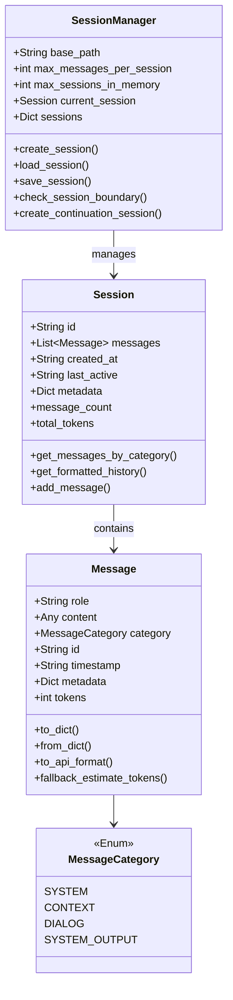
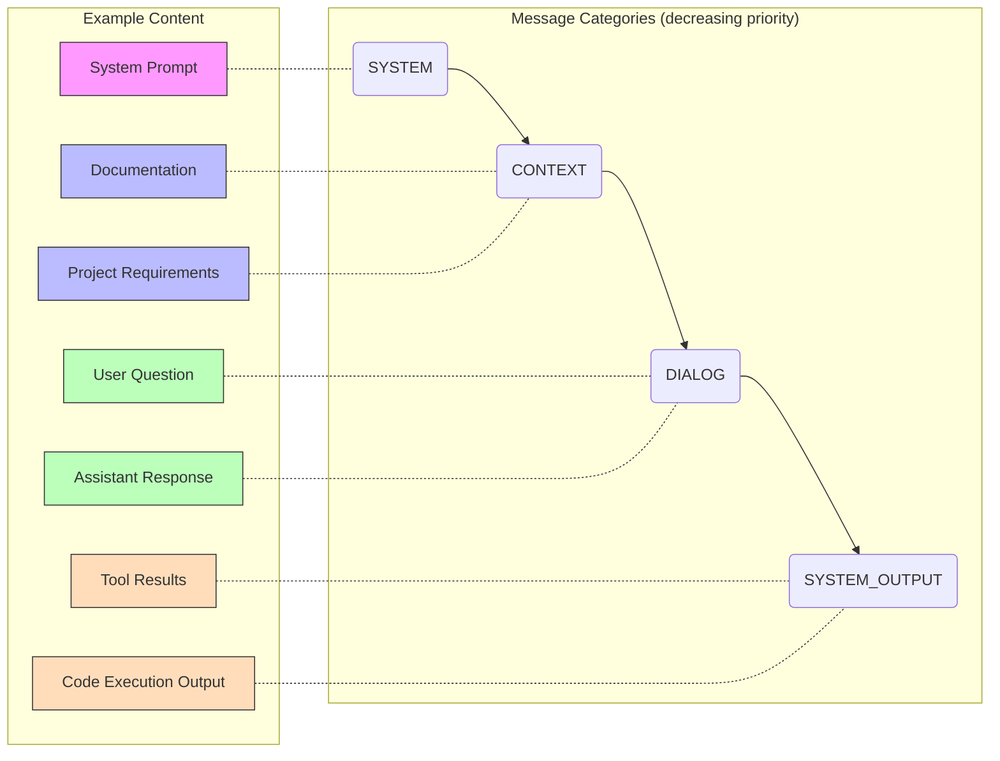
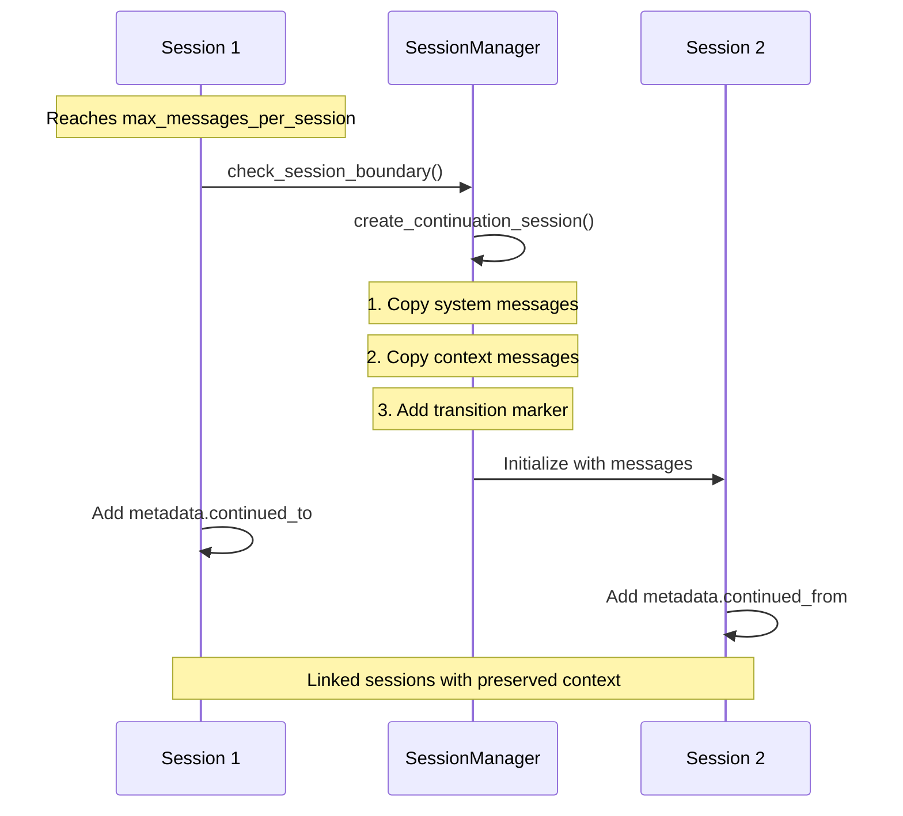
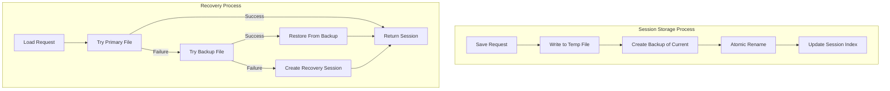

# State Management

The Penguin State System manages conversation state across sessions and provides structured message handling.

## Core Components



### MessageCategory Enum

```python
class MessageCategory(Enum):
    SYSTEM = 1      # System instructions, never truncated
    CONTEXT = 2     # Important reference information 
    DIALOG = 3      # Main conversation between user and assistant
    SYSTEM_OUTPUT = 4   # Results from tool executions
```

Message categories determine importance for context window management and provide a structured way to handle different types of content.



### Message Class

```python
@dataclass
class Message:
    role: str
    content: Any
    category: MessageCategory
    id: str = field(default_factory=lambda: f"msg_{uuid.uuid4().hex[:8]}")
    timestamp: str = field(default_factory=lambda: datetime.now().isoformat())
    metadata: Dict[str, Any] = field(default_factory=dict)
    tokens: int = 0
```

Represents a single message in a conversation. The `content` field can be:
- Plain text (str)
- Structured content for multimodal messages (list/dict)
- Images via OpenAI format `{"type": "image_url", "image_url": {...}}`
- Other adapter-specific formats like audio or file attachments

### Session Class

```python
@dataclass
class Session:
    id: str = field(default_factory=lambda: f"session_{datetime.now().strftime('%Y%m%d_%H%M%S')}_{uuid.uuid4().hex[:8]}")
    messages: List[Message] = field(default_factory=list)
    created_at: str = field(default_factory=lambda: datetime.now().isoformat())
    last_active: str = field(default_factory=lambda: datetime.now().isoformat())
    metadata: Dict[str, Any] = field(default_factory=dict)
```

Represents a conversation session containing multiple messages. Sessions have their own identity and metadata, managing a collection of messages.

## Session Boundaries and Transition



## Session Manager

The SessionManager handles session lifecycle operations including:

```python
class SessionManager:
    def __init__(
        self, 
        base_path: str = CONVERSATIONS_PATH,
        max_messages_per_session: int = 5000,
        max_sessions_in_memory: int = 20,
        format: str = "json",
        auto_save_interval: int = 60
    )
```

### Session Persistence



### Key Features

1. **Session Creation and Loading**
   ```python
   def create_session(self) -> Session
   def load_session(self, session_id: str) -> Optional[Session]
   ```

2. **Session Boundary Management**  
   ```python
   def check_session_boundary(self, session: Optional[Session] = None) -> bool
   def create_continuation_session(self, source_session: Optional[Session] = None) -> Session
   ```

3. **Persistence with Safety**
   ```python
   def save_session(self, session: Optional[Session] = None) -> bool
   ```

4. **Session Listing and Management**
   ```python
   def list_sessions(self, limit: int = 100, offset: int = 0) -> List[Dict]
   def delete_session(self, session_id: str) -> bool
   ```

## Usage Example

```python
# Initialize session manager
session_manager = SessionManager(
    base_path="/path/to/conversations",
    max_messages_per_session=5000,
    max_sessions_in_memory=20,
    auto_save_interval=60
)

# Create a new session
session = session_manager.create_session()

# Add a message
message = Message(
    role="user",
    content="Hello, how are you?",
    category=MessageCategory.DIALOG
)
session.add_message(message)

# Save the session
session_manager.save_session(session)

# Load a session
session = session_manager.load_session("session_20230401_123456")

# Check if session boundary reached
if session_manager.check_session_boundary(session):
    # Create continuation session
    new_session = session_manager.create_continuation_session(session)
```

## Automatic Session Continuation

When a session reaches the `max_messages_per_session` boundary, the system automatically:

1. Saves the current session
2. Creates a new continuation session
3. Transfers all SYSTEM and CONTEXT messages to maintain continuity
4. Updates metadata to track the relationship between sessions

This ensures seamless conversation continuity for users while managing system resources efficiently.

## Transaction Safety

Sessions are saved with transaction safety mechanisms:

1. Write to temporary file first
2. Create backup of current file if it exists
3. Atomic rename of temp to target
4. Recovery from backup if primary is corrupted

## Error Recovery

If a session fails to load due to corruption:

1. The system attempts to load from a backup
2. If backup fails, it creates a recovery session
3. The recovery session includes a notice about the original session ID

## Relationship Tracking

Sessions maintain relationships with continuation sessions through metadata:

- `continued_from`: ID of the previous session
- `continued_to`: ID of the next session
- `continuation_index`: Number of continuations from the original session

This allows accurate token tracking and navigation across session boundaries.

## Immutability Pattern

Session and Message objects follow an immutability pattern:
- Operations create new instances rather than modifying existing ones
- This provides safer code and predictable state transitions
- When trimming, a new Session is returned instead of modifying the original 