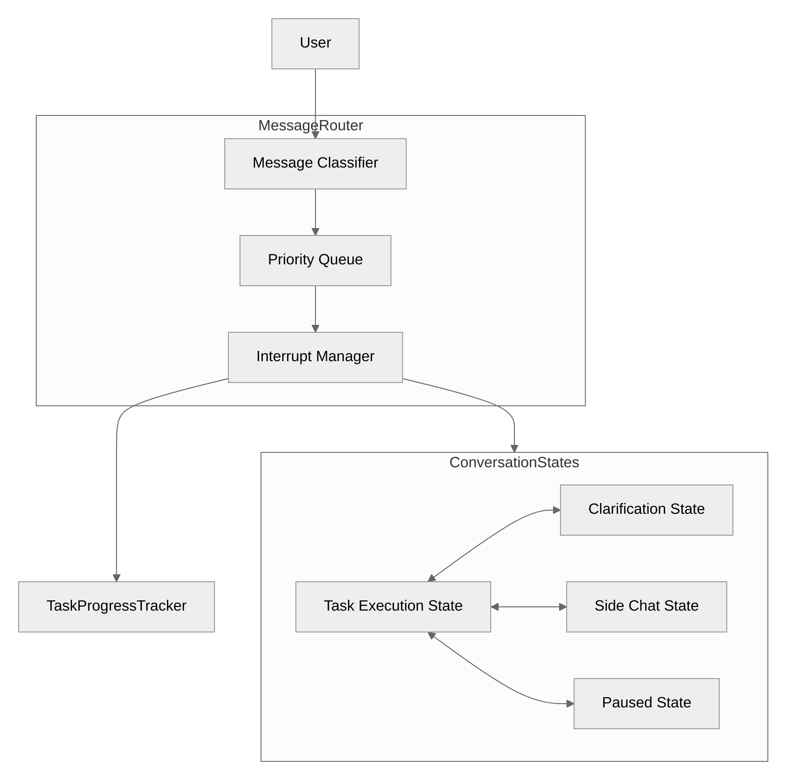
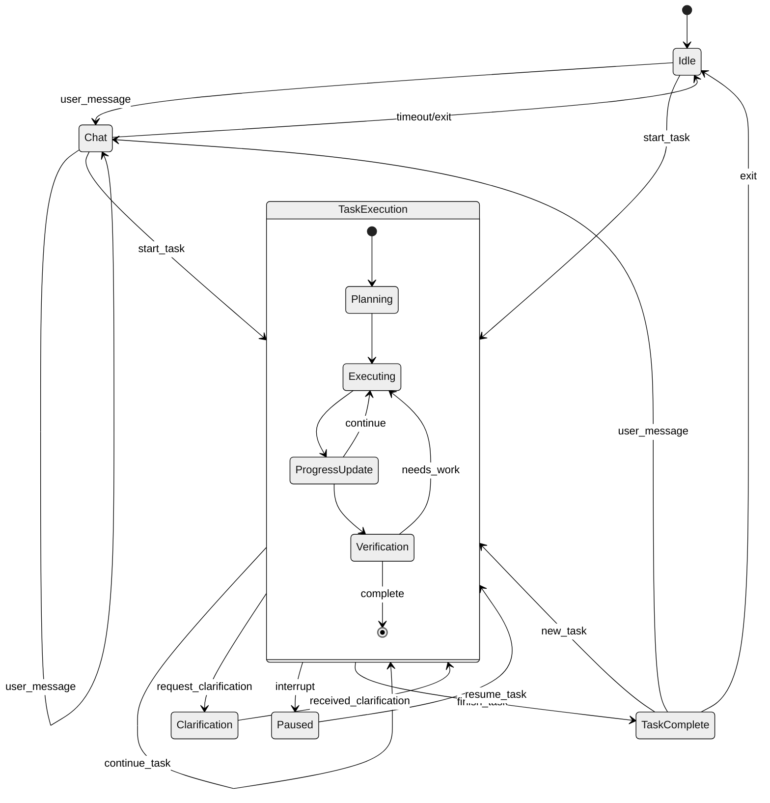
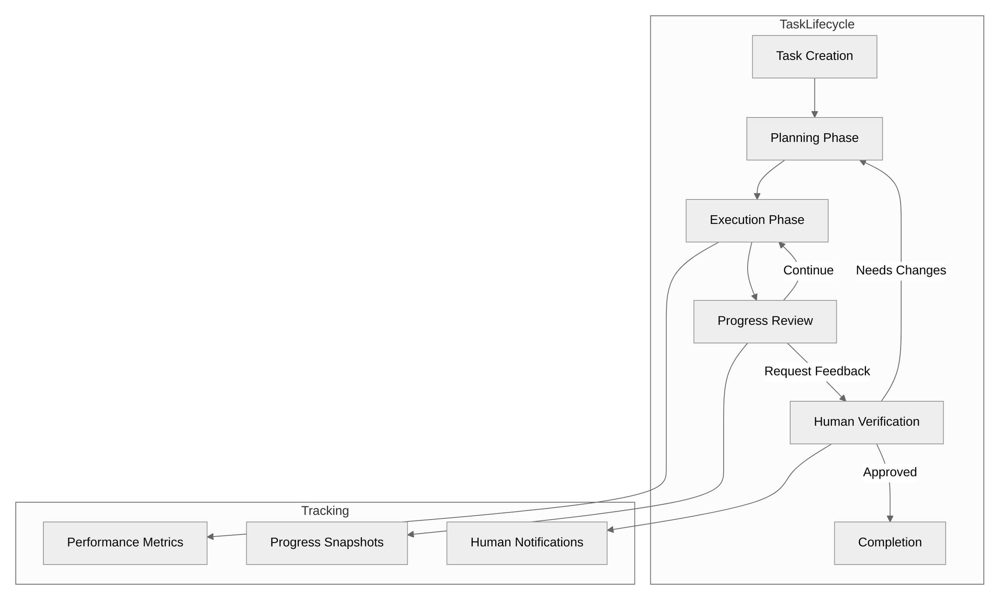

# Ideas for Improved Chat and Work Systems

## Introduction

This document outlines proposed improvements for Penguin's messaging system and project/task management capabilities, expanding on the state/conversation refactor. These improvements aim to support the user stories in `stories.md` and follow the roadmap in `roadmap.md`, enabling more natural and effective human-AI collaboration.

## Messaging System Improvements

### 1. Interruptible Conversations

#### Concept
Enable users to interrupt ongoing task execution with questions or clarifications without losing context or progress. This mirrors natural human collaboration where teammates can pause, clarify, and resume tasks.

#### Key Features
- **Conversation Thread Management**: Support multiple active conversation threads
- **Message Priority Queue**: Classify and prioritize incoming messages
- **State Preservation & Resumption**: Save execution context for later resumption
- **Clarification Protocol**: Standardized format for requesting/providing clarification

#### Implementation Sketch



```python
# Core components of interrupt handling system

class MessageClassifier:
    def classify_message(self, message: str) -> MessageType:
        """Determine if message is task-related, clarification, interrupt, etc."""
        # Analyze message content and context to classify intent
        # Return appropriate MessageType enum value

class InterruptManager:
    def __init__(self, task_manager, conversation_manager):
        self.task_manager = task_manager
        self.conversation_manager = conversation_manager
        self.execution_contexts = {}  # Stores paused tasks for resumption
        
    def handle_interrupt(self, message: Message, current_task_id: str) -> Response:
        """Pause current task and handle interrupt message"""
        # Save current execution context
        self.execution_contexts[current_task_id] = self.task_manager.capture_context()
        
        # Process interrupt message
        response = self.conversation_manager.process_message(message)
        
        # Return response with status indicating interrupted state
        return Response(content=response, status=Status.INTERRUPTED)
        
    def resume_task(self, task_id: str) -> None:
        """Resume previously interrupted task"""
        # Restore execution context
        context = self.execution_contexts.get(task_id)
        if context:
            self.task_manager.restore_context(context)
```

### 2. Multi-Modal Message Architecture

#### Concept
Create a unified messaging architecture that handles various content types (text, images, files) consistently across different LLM providers, allowing rich interaction modalities.

#### Key Features
- **Provider-Agnostic Content Representation**: Unified internal format for different content types
- **File Upload Pipeline**: Standardized handling across providers
- **Content Transformation System**: Convert between provider-specific formats
- **Message Relationship Tracking**: Link related messages (replies, threads)

#### Implementation Sketch

```python
class Message:
    id: str
    timestamp: datetime
    thread_id: str
    content: Union[TextContent, ImageContent, FileContent, MultipartContent]
    metadata: Dict[str, Any]
    relationship: Optional[MessageRelationship]  # For threading/linking

class MessageRelationship:
    type: RelationshipType  # REPLY, INTERRUPT, CLARIFICATION, THREAD_CONTINUATION
    parent_id: Optional[str]
    root_id: Optional[str]
    context: Dict[str, Any]  # Context about relationship
    
class MessageContentAdapter:
    """Adapts between Penguin unified format and provider-specific formats"""
    
    def to_provider_format(self, content: Any, provider: str) -> Any:
        """Convert Penguin format to provider format"""
        if provider == "openai":
            return self._to_openai_format(content)
        elif provider == "anthropic":
            return self._to_anthropic_format(content)
        # Add support for other providers
        
    def from_provider_format(self, content: Any, provider: str) -> Any:
        """Convert provider format to Penguin format"""
        if provider == "openai":
            return self._from_openai_format(content)
        elif provider == "anthropic":
            return self._from_anthropic_format(content)
        # Add support for other providers
```

### 3. Conversation State Machine

#### Concept
Implement a formal state machine for conversation management, defining clear states and transitions between chat/work modes, enabling more predictable behavior and better error recovery.

#### Key Features
- **Explicit Conversation States**: Define clear states (Chat, Work, Clarification, etc.)
- **Clear Transition Rules**: Define when and how state transitions occur
- **Mode-Specific Behavior**: Different processing rules in different states
- **Error Recovery Paths**: Handle unexpected inputs and errors gracefully

#### Implementation Sketch



```python
# Example state transitions for message handling
class ConversationStateMachine:
    def __init__(self):
        self.current_state = State.IDLE
        self.context = {}  # Stores state-specific context
        
    def process_message(self, message: Message) -> Response:
        """Process a message based on current state"""
        if self.current_state == State.TASK_EXECUTION:
            if self._is_interrupt(message):
                return self._handle_task_interrupt(message)
            elif self._is_clarification_request(message):
                return self._handle_clarification_request(message)
            else:
                return self._continue_task_execution(message)
                
        elif self.current_state == State.CHAT:
            if self._is_task_command(message):
                return self._transition_to_task_execution(message)
            else:
                return self._handle_chat_message(message)
                
        # Handle other states...
    
    def _transition_to(self, new_state: State) -> None:
        """Handle transition to a new state"""
        # Perform any cleanup needed for current state
        # Initialize any required context for new state
        self.current_state = new_state
        
    def _is_interrupt(self, message: Message) -> bool:
        """Determine if a message should interrupt current task"""
        # Analyze message characteristics to decide if it's an interrupt
```

## Project Management & Task Execution Improvements

### 1. Interactive Task Management System

#### Concept
Create a task management system with built-in feedback loops, allowing humans to review, provide feedback, and guide task execution.

#### Key Features
- **Human-in-the-Loop Verification**: Critical checkpoints for human review
- **Progress Snapshots**: Capture state at key milestones
- **Bidirectional Feedback**: Allow both human→AI and AI→human feedback
- **Task Dependency Management**: Handle complex task relationships

#### Implementation Sketch



```python
class Task:
    id: str
    title: str
    description: str
    status: TaskStatus
    verification_points: List[VerificationPoint]
    progress: float  # 0.0 - 1.0
    artifacts: List[Artifact]  # Code, documents, etc. produced
    dependencies: List[str]  # IDs of tasks this depends on
    feedback: List[Feedback]  # Comments from human or AI
    
class VerificationPoint:
    id: str
    description: str
    criteria: List[str]  # What to verify
    stage: float  # At what % of task to trigger (0.0 - 1.0)
    required: bool  # Is human verification required?
    status: VerificationStatus
    
class TaskManager:
    def create_task(self, title: str, description: str) -> Task:
        """Create a new task with verification points"""
        
    def execute_task(self, task_id: str) -> AsyncGenerator[ProgressUpdate, None]:
        """Execute a task, yielding progress updates"""
        
    def request_verification(self, task_id: str, point_id: str) -> VerificationRequest:
        """Request human verification at a specific point"""
        
    def provide_feedback(self, task_id: str, feedback: Feedback) -> None:
        """Record feedback on a task"""
        
    def get_task_status(self, task_id: str) -> TaskStatus:
        """Get current status of a task"""
```

### 2. Collaborative Project Planning

#### Concept
Enable AI and humans to jointly plan projects, with the AI suggesting task breakdowns and the human refining them, combining AI's analytical capabilities with human domain expertise.

#### Key Features
- **Task Breakdown Generation**: AI suggests initial task structure
- **Resource Estimation**: Predict time/resource requirements
- **Risk Assessment**: Identify potential challenges
- **Interactive Refinement**: Human feedback incorporated into plans

#### Implementation Sketch

```python
class CollaborativeTaskPlanner:
    def suggest_task_breakdown(self, project_description: str) -> List[Task]:
        """Generate suggested task breakdown based on project description"""
        
    def incorporate_human_feedback(self, suggestions: List[Task], feedback: str) -> List[Task]:
        """Refine task suggestions based on human feedback"""
        
    def estimate_resources(self, tasks: List[Task]) -> Dict[str, Resource]:
        """Estimate resources needed for tasks"""
        
    def identify_risks(self, tasks: List[Task]) -> List[Risk]:
        """Identify potential risks in the task plan"""
        
    def generate_plan_explanation(self, tasks: List[Task]) -> str:
        """Generate human-readable explanation of planning rationale"""
```

### 3. Real-time Monitoring Dashboard

#### Concept
Provide visibility into AI task execution with real-time progress tracking, enabling humans to monitor progress without constant interaction.

#### Key Features
- **Live Progress Tracking**: Real-time updates on task execution
- **Event Notifications**: Alert humans about key events or blockers
- **Resource Utilization Monitoring**: Track compute and context usage
- **Performance Metrics**: Measure task completion efficiency

#### Implementation Sketch

```python
class MonitoringDashboard:
    def register_task(self, task_id: str) -> None:
        """Register a task for monitoring"""
        
    def update_progress(self, task_id: str, progress: float, status: str) -> None:
        """Update progress for a task"""
        
    def add_event(self, task_id: str, event: TaskEvent) -> None:
        """Add a significant event to the task timeline"""
        
    def report_blocker(self, task_id: str, blocker: Blocker) -> None:
        """Report a blocking issue that needs attention"""
        
    def generate_summary_report(self) -> StatusReport:
        """Generate a summary report of all active tasks"""
```

### 4. Learning and Improvement System

#### Concept
Implement a system for recording task execution patterns and outcomes, enabling the AI to learn from past experiences and continuously improve its performance.

#### Key Features
- **Execution Pattern Recording**: Store approaches and outcomes
- **Success Pattern Mining**: Identify what works well
- **Failure Analysis**: Learn from unsuccessful approaches
- **Performance Trend Tracking**: Monitor improvement over time

#### Implementation Sketch

```python
class ContinuousImprovementSystem:
    def record_execution_pattern(self, task: Task, approach: Approach, outcome: Outcome) -> None:
        """Record details of task execution for learning"""
        
    def analyze_performance_trends(self) -> List[Trend]:
        """Analyze trends in task execution performance"""
        
    def suggest_improvements(self, task_type: str) -> List[Improvement]:
        """Suggest improvements based on past performance data"""
        
    def update_knowledge_base(self, domain: str, knowledge: Knowledge) -> None:
        """Update domain-specific knowledge base with new information"""
        
    def generate_learning_report(self) -> LearningReport:
        """Generate report on what has been learned over time"""
```

## Implementation Approach

### Guiding Principles

1. **Incremental Development**: Build core components first, then expand
   - Start with conversation state machine and interrupt handling
   - Add verification points to task execution
   - Introduce more advanced features as foundation matures

2. **Service-Based Architecture**: 
   - Independent, loosely-coupled components
   - Well-defined interfaces between systems
   - Message-based communication for flexibility

3. **State-Based Design**:
   - Explicit state modeling for all components
   - Clear transition rules between states
   - Context preservation during transitions

4. **Event-Driven Communication**:
   - Event bus for component communication
   - Subscription-based updates for dashboard
   - Asynchronous processing where appropriate

5. **Extensible Schema**:
   - Forward-compatible data models
   - Provider-agnostic content formats
   - Flexible metadata for future extension

### Implementation Phases

1. **Phase 1: Core Message Threading**
   - Message classification system
   - Basic interrupt handling
   - Conversation state machine

2. **Phase 2: Task Verification Framework**
   - Task lifecycle with verification points
   - Human feedback integration
   - Basic progress monitoring

3. **Phase 3: Multi-Modal Enhancement**
   - Unified content representation
   - File upload pipeline
   - Provider adaptation layer

4. **Phase 4: Advanced Project Planning**
   - Collaborative planning tools
   - Resource estimation
   - Risk assessment

5. **Phase 5: Monitoring & Learning**
   - Real-time dashboard
   - Execution pattern recording
   - Performance analysis 