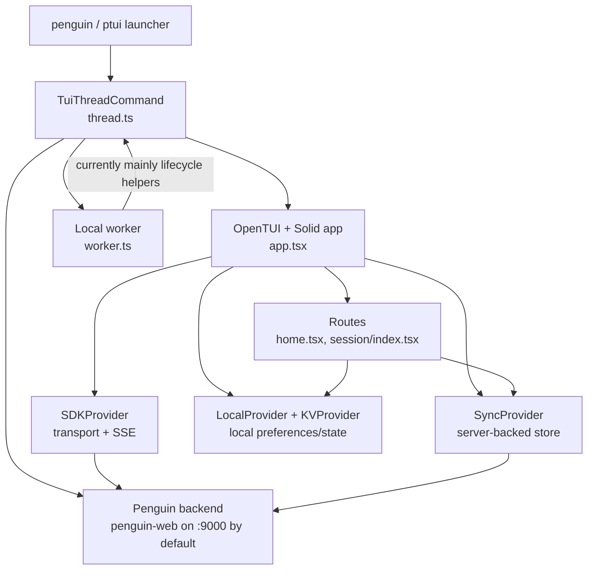

# Penguin TUI Architecture

## Purpose

This document describes how the `penguin-tui/` fork works today.

It is intentionally a **current-state architecture map**, not a target design.
The long-term cleanup direction lives in
[`context/tasks/tui-opencode-fork-alignment-plan.md`](../context/tasks/tui-opencode-fork-alignment-plan.md).

The most important framing:

- `penguin-tui` is still structurally an OpenCode repo.
- The active terminal UI mostly lives in `packages/opencode/src/cli/cmd/tui/`.
- Penguin support is not just branding. It changes transport, bootstrap, session
  creation, prompt submission, and event reconciliation.
- The main architectural tension is that some Penguin adaptation lives at the
  transport boundary, but some has leaked upward into TUI state and prompt code.

## High-Level Topology

## Code Map

The files that matter most when reading the current TUI:

- `packages/opencode/src/cli/cmd/tui/thread.ts`
  - CLI entrypoint for Penguin TUI mode.
- `packages/opencode/src/cli/cmd/tui/app.tsx`
  - App shell and provider composition.
- `packages/opencode/src/cli/cmd/tui/context/sdk.tsx`
  - Transport layer, auth header injection, SSE subscription, event batching.
- `packages/opencode/src/cli/cmd/tui/context/sync.tsx`
  - Main client-side store and event reconciliation logic.
- `packages/opencode/src/cli/cmd/tui/context/sync-bootstrap.ts`
  - Bootstrap fetch helper with graceful degradation.
- `packages/opencode/src/cli/cmd/tui/context/session-hydration.ts`
  - Full-session reload/hydration helpers and optimistic-message reconciliation.
- `packages/opencode/src/cli/cmd/tui/component/prompt/index.tsx`
  - Prompt editor, attachments/extmarks, session creation, optimistic send flow.
- `packages/opencode/src/cli/cmd/tui/component/prompt/penguin-send.ts`
  - Failure recovery for Penguin prompt sends.
- `packages/opencode/src/cli/cmd/tui/routes/session/index.tsx`
  - Main transcript/session screen.
- `packages/opencode/src/cli/cmd/tui/util/session-family.ts`
  - Parent/child session grouping used by the UI.

## Runtime Layers

### 1. Entry and process model

`thread.ts` is the Penguin TUI command entrypoint. It:

- resolves the working directory
- reads CLI args like `--model`, `--session`, `--continue`, and `--url`
- defaults the backend URL to `http://127.0.0.1:9000`
- starts the TUI in `penguin: true` mode

One important current-state detail: `thread.ts` still starts the upstream-style
worker (`worker.ts`), but for Penguin mode it does **not** currently route app
network traffic through worker-backed `fetch`/event adapters. The TUI talks to
the Penguin backend URL directly through `SDKProvider`.

In practice, the worker is mainly still used for lifecycle helpers such as:

- `checkUpgrade`
- `shutdown`
- shared cleanup scaffolding inherited from OpenCode

### 2. App shell and providers

`app.tsx` builds the UI as a stack of context providers:

1. `ArgsProvider`
2. `ExitProvider`
3. `KVProvider`
4. `ToastProvider`
5. `RouteProvider`
6. `SDKProvider`
7. `SyncProvider`
8. `ThemeProvider`
9. `LocalProvider`
10. keybind, prompt history, stash, dialog, and prompt-ref providers

This split matters:

- `SDKProvider` owns transport and raw events.
- `SyncProvider` owns server-backed application state.
- `KVProvider` and `LocalProvider` own local-only UI preferences and selections.
- routes/components mostly read from those providers rather than owning backend
  state themselves.

## Startup and Bootstrap Flow

Penguin bootstrap is mostly in `context/sync.tsx`, behind the `sdk.penguin`
branch.

### Startup sequence

1. `thread.ts` calls `tui(...)` with `penguin: true`.
2. `app.tsx` mounts the provider tree.
3. `SDKProvider` creates the generated SDK client and Penguin-aware `fetch`.
4. `SyncProvider` runs `bootstrap()` on mount.
5. The home route or requested session route renders once enough state exists.

### Bootstrap responsibilities

For Penguin mode, `bootstrap()` manually fetches and normalizes data from
multiple backend endpoints instead of relying entirely on upstream typed client
calls:

- `/config/providers`
- `/provider`
- `/config`
- `/provider/auth`
- `/session?directory=...&limit=50`
- `/api/v1/agents`
- `/lsp`
- `/formatter`
- `/vcs`
- `/path`

This is one of the main divergences from upstream OpenCode. The TUI is doing
more backend-shape adaptation itself.

`fetchBootstrapJson()` in `sync-bootstrap.ts` is a defensive helper used here:

- successful responses are parsed as JSON
- optional failures degrade to fallbacks and log a warning
- required failures throw

### Bootstrap output

`SyncProvider` normalizes the fetched data into a single store with slices for:

- providers and provider auth
- agents
- commands
- sessions
- session status and token usage
- messages and parts
- todos and diffs
- LSP/formatter/VCS/path state
- permission and question queues

The resulting store is the TUI's effective source of truth.

## Transport and Event Flow

`SDKProvider` in `context/sdk.tsx` is the transport boundary.

### What it does

- creates the generated `createOpencodeClient(...)` client
- injects Penguin auth headers from:
  - `PENGUIN_LOCAL_AUTH_TOKEN`
  - `PENGUIN_AUTH_STARTUP_TOKEN`
- uses `X-API-Key` for Penguin local auth
- opens a Penguin SSE stream from `/api/v1/events/sse`
- scopes that SSE stream by `session_id` and/or `directory`
- batches incoming events before emitting them into the app

### Penguin-specific behavior

Two details are worth calling out:

- streamed `message.part.updated` text is sanitized to remove
  `finish_response` tags before the rest of the UI sees it
- when the active route/session changes, the SSE stream is torn down and
  recreated so the client does not keep consuming the wrong session stream

### Why `SyncProvider` is so large

`SyncProvider` is not just a cache. It also:

- filters incoming events by session and directory
- translates partial Penguin payloads into the shapes the UI expects
- updates session/message/part/todo/diff state incrementally
- refreshes session usage opportunistically when work completes

That makes it the central orchestration layer for live state.

## Session Hydration and Reopen Semantics

Live events are not enough when the user opens an existing session. The TUI also
has a full hydration path in `session-hydration.ts`.

`sync.session.sync(sessionID)` calls `hydrateSessionSnapshot(...)`, which loads:

- session metadata
- recent messages
- todos
- file diffs

This is used when:

- the user navigates into a session
- bootstrap needs to populate the active session
- a session must be force-refreshed after reset/disposal

### Optimistic-message reconciliation

Penguin prompt sending is optimistic. The TUI may show a local user message
before the backend history round-trips back through hydration.

`mergeHydratedMessages(...)` exists to avoid duplicate user messages when that
happens. It preserves optimistic messages temporarily, then drops them when a
server message with equivalent normalized text and a nearby timestamp appears.

This reconciliation helper is one of the key pieces that makes the current
Penguin send path feel responsive without permanently corrupting history.

## Prompt and Submission Architecture

`component/prompt/index.tsx` is the other major divergence point.

### What the prompt component owns

It is not just a textbox. It owns:

- prompt text
- prompt-mode state (`normal` vs `shell`)
- inline extmarks for virtual prompt parts
- image/file/text attachments
- prompt history and stash integration
- agent mode cycling for Penguin (`build` vs `plan`)
- session creation for first message sends
- optimistic UI updates for Penguin sends

### Prompt parts and extmarks

Prompt input supports more than plain text:

- large pasted text can be summarized inline as `[Pasted ~N lines]`
- pasted images or local image paths become file parts
- virtual placeholders are tracked with extmarks
- before submit, virtual text is expanded or stripped as needed

This lets the editor stay readable while still sending structured payload parts.

### Penguin send flow

For Penguin mode, `submit()` does this:

1. Create a session with `POST /session` if one does not exist yet.
2. Expand/normalize prompt text and collect non-text parts.
3. Handle a few client-local slash commands:
   - `/config`
   - `/settings`
   - `/tool_details`
   - `/thinking`
4. Emit optimistic local events:
   - `message.updated`
   - `message.part.updated`
   - `session.status = busy`
5. Clear the prompt UI immediately.
6. POST the actual prompt to `/api/v1/chat/message`.

The request body includes:

- `text`
- `model`
- `session_id`
- `agent_id`
- `agent_mode`
- `directory`
- `streaming`
- `variant`
- `client_message_id`
- `parts`

### Busy state model

Penguin busy state is partly server-driven and partly local:

- `session.status` events are server truth
- `store.pending` is local optimistic truth
- `pendingSeenBusy` helps the prompt know whether the server ever confirmed the
  optimistic transition

On failure, `recoverPenguinPromptFailure()` clears pending state and emits a
synthetic idle event so the prompt does not get stuck.

This is effective, but it is also exactly the kind of UI-side protocol logic the
alignment plan wants to shrink later.

## Session Screen Architecture

`routes/session/index.tsx` is the main conversation screen.

### Core responsibilities

- requests hydration when the route's `sessionID` changes
- renders transcript rows from `sync.data.message` + `sync.data.part`
- switches between user and assistant renderers
- manages scrolling, timeline jump, transcript export, undo/redo, fork, share,
  rename, and compact actions
- shows permission/question prompts ahead of the normal prompt when required

### Session families

Penguin sessions are treated as parent/child families via `parentID`.

`util/session-family.ts` provides the grouping rules used across the UI:

- roots sort by family recency
- children render under their root
- search results can be expanded with cached parents for context
- child sessions stay visually attached to their family instead of being
  promoted to standalone roots

The session route also aggregates permission and question queues across the
whole family when the current route is the parent/root session.

### Prompt visibility

The prompt is intentionally hidden when viewing a child session. Root sessions
own the active prompt, while child sessions are treated more like derived
conversation branches/subagent runs.

## Local State and Persistence

Not all state comes from the backend.

### `KVProvider`

`context/kv.tsx` stores lightweight UI preferences in `kv.json`, such as:

- thinking visibility
- tool detail visibility
- timestamps
- sidebar visibility
- animations

### `LocalProvider`

`context/local.tsx` stores current local selections and resolves defaults for:

- active agent
- active model
- recent/favorite models
- model variants

Model selections are persisted in `model.json`.

### Prompt history and stash

Prompt-local persistence lives in:

- `prompt-history.jsonl`
- `prompt-stash.jsonl`

Those files let the TUI restore previous prompts and stashed drafts across runs.

## Current Architectural Shape

The cleanest way to understand the current fork is:

- `SDKProvider` is the transport seam.
- `SyncProvider` is the state/reconciliation seam.
- `Prompt` is the submission seam.
- `Session` is the transcript/read-model seam.

The main current complexity comes from Penguin-specific behavior living in both:

- the lower boundary
  - auth
  - SSE transport
  - manual bootstrap
- and the upper boundary
  - optimistic event emission
  - client-side command handling
  - session creation inside the prompt
  - UI-side recovery/reconciliation logic

That split is why the fork works, but also why it is harder to reason about than
upstream OpenCode.

## Relationship to the Alignment Plan

The alignment plan is best read as a response to the architecture above.

The important current-state observations it is reacting to are:

- `sync.tsx` owns too much Penguin-specific bootstrap and event adaptation
- `prompt/index.tsx` owns too much Penguin-specific send/session logic
- the TUI sometimes synthesizes state that ideally should come from the backend
- typed SDK boundaries are thinner in the OpenCode path than in the Penguin path

So if you want to understand the current system, focus on:

1. `sdk.tsx`
2. `sync.tsx`
3. `session-hydration.ts`
4. `prompt/index.tsx`
5. `routes/session/index.tsx`

If you want to understand why a future refactor is planned, compare those same
files against the goals in
[`context/tasks/tui-opencode-fork-alignment-plan.md`](../context/tasks/tui-opencode-fork-alignment-plan.md).
